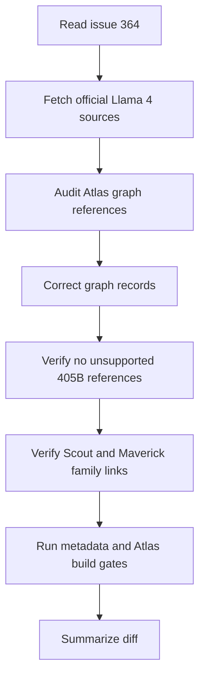

```mermaid
flowchart TD
  A[Read issue 364] --> B[Fetch official Llama 4 sources]
  B --> C[Audit Atlas graph references]
  C --> D[Correct graph records]
  D --> E[Verify no unsupported 405B references]
  E --> F[Verify Scout and Maverick family links]
  F --> G[Run metadata and Atlas build gates]
  G --> H[Summarize diff]
```
