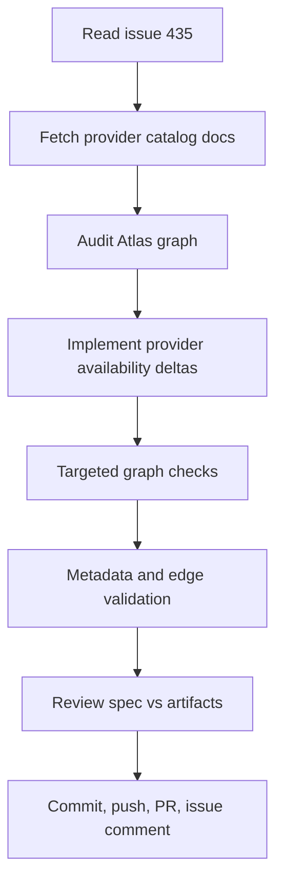

```mermaid
flowchart TD
  A[Read issue 435] --> B[Fetch provider catalog docs]
  B --> C[Audit Atlas graph]
  C --> D[Implement provider availability deltas]
  D --> E[Targeted graph checks]
  E --> F[Metadata and edge validation]
  F --> G[Review spec vs artifacts]
  G --> H[Commit, push, PR, issue comment]
```
