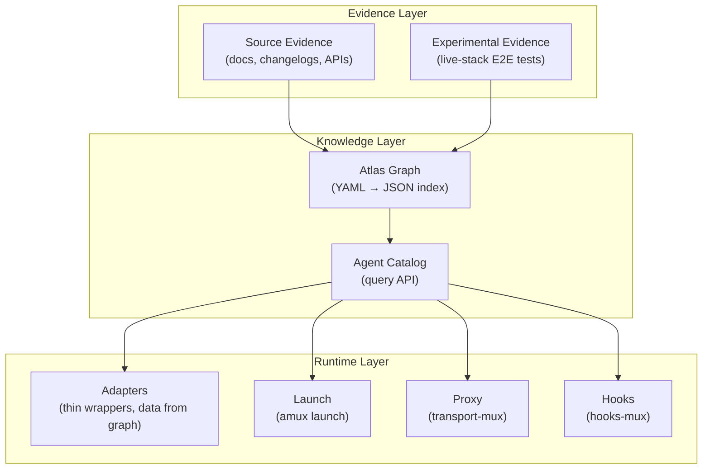
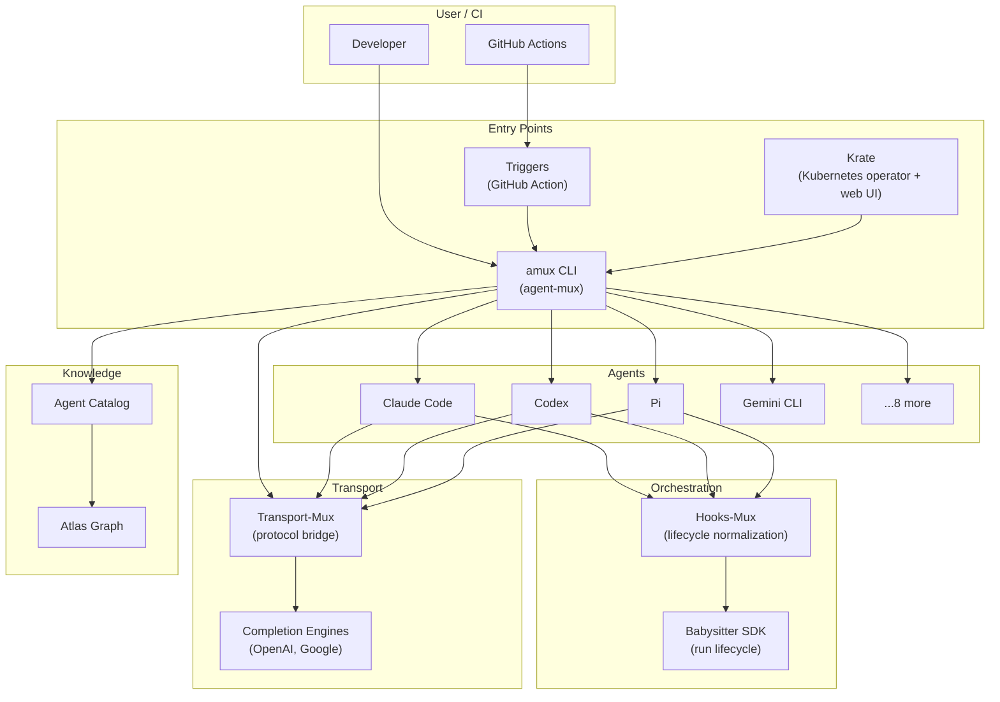

# a5c: Overview & Development Philosophy

## What is a5c?

a5c is an agent orchestration platform that enables any coding agent (Claude Code, Codex, Pi, Gemini CLI, Copilot CLI, etc.) to execute structured processes — from simple CI tasks to complex multi-phase development workflows. It unifies the fragmented landscape of coding agents behind a single launch, orchestration, and observability surface.

## Core Principle: Ontology-Driven Development

The platform is built on a knowledge graph (atlas) that models every agent, capability, provider, transport, hook surface, and plugin target as interconnected nodes with typed edges. Development decisions are driven by the graph, not by hardcoded if/else chains:



### Evidence Types

Every capability claim in the graph is backed by evidence:

| Evidence Type | Source | Example |
|---------------|--------|---------|
| **Source** | Documentation, changelogs, API specs | "Claude Code supports MCP" → link to docs |
| **Experimental** | Live-stack E2E tests | "Claude Code + Foundry proxy works" → CI run artifacts |
| **Inferred** | Derived from other evidence | "If supports MCP, likely supports tool use" |
| **Gap** | Known missing evidence | "Pi hook support — no docs found" |

### How the Graph Drives Code

Instead of each adapter hardcoding its capabilities:

```typescript
// OLD: hardcoded in adapter
readonly capabilities = { canResume: true, supportsMCP: true, ... };

// NEW: derived from graph
get capabilities() {
  const flags = getCapabilityFlags(this.agent);
  return { canResume: Boolean(flags.canResume), ... };
}
```

Adding a new harness means adding a YAML file to the atlas graph — not writing adapter code for every capability.

## Architecture Overview



## Package Map

| Package | Role |
|---------|------|
| `packages/atlas` | Knowledge graph: YAML definitions → JSON index |
| `packages/agent-catalog` | Query API over the atlas graph |
| `packages/agent-mux/cli` | `amux` CLI: launch, install, run |
| `packages/agent-mux/adapters` | Per-harness thin wrappers (data from graph) |
| `packages/agent-mux/core` | Provider resolver, workspace service |
| `packages/transport-mux` | HTTP proxy: protocol translation between harness ↔ provider |
| `packages/hooks-mux` | Hook normalization: native events → canonical phases |
| `packages/sdk` | Babysitter SDK: run lifecycle, session binding, MCP tools |
| `packages/triggers` | GitHub Action: trigger evaluation + agent dispatch |
| `packages/krate` | Kubernetes operator + web UI for cloud deployment |
| `packages/agent-plugins-mux` | Plugin generator: unified source → per-harness distributions |
| `packages/babysitter-agent` | Standalone babysitter agent (internal harness) |

## Development Workflow

1. **Model in the graph** — Add YAML nodes/edges to `packages/atlas/graph/`
2. **Query via catalog** — Use `getAgentVersion()`, `getCapabilityFlags()`, etc.
3. **Test via live-stack** — E2E tests validate real API calls through the full stack
4. **Evidence loop** — Test results feed back into the graph as experimental evidence
