# Babysitter Plugin Architecture

How the babysitter orchestration system works across coding agent harnesses, from plugin generation through session lifecycle to run completion.

## Table of Contents

1. [System Overview](#system-overview)
2. [The Three Muxes](#the-three-muxes)
3. [Plugin Generation](#plugin-generation)
4. [Activation Modes](#activation-modes)
5. [Session Lifecycle](#session-lifecycle)
6. [Run Orchestration](#run-orchestration)
7. [Harness-Specific Flows](#harness-specific-flows)

---

## System Overview

The babysitter plugin installs into any supported coding agent (Claude Code, Codex, Pi, Gemini CLI, etc.) and provides orchestrated process execution. Three "mux" layers compensate for the differences between harnesses:

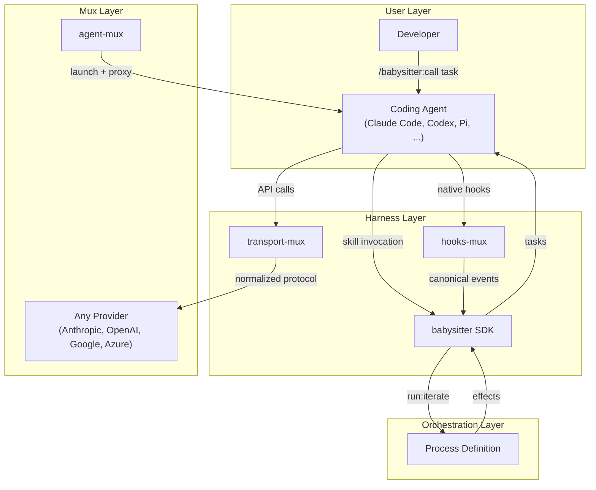

Each layer solves a specific interoperability problem:

| Mux | Problem | Solution |
|-----|---------|----------|
| **hooks-mux** | Each harness has different hook event names, payloads, output formats | Normalizes native events to canonical phases, runs unified handlers, renders results back to harness format |
| **transport-mux** | Harnesses speak different API protocols (Anthropic, OpenAI, Google) | HTTP proxy translates between the harness's native protocol and any upstream provider |
| **agent-mux** | Harnesses have different CLI surfaces, capabilities, plugin loading | Unified `amux launch` resolves provider config, starts proxy if needed, spawns harness with correct args |

---

## The Three Muxes

### hooks-mux: Hook Surface Normalization

Each harness fires lifecycle hooks differently. hooks-mux normalizes them into a canonical interface:

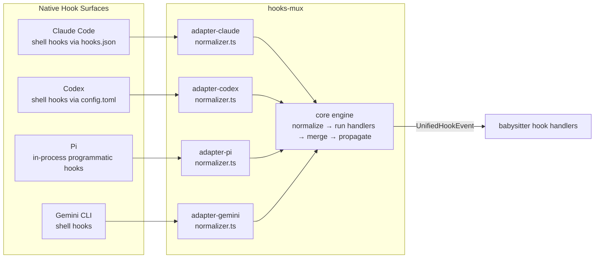

**Adapter families:**
- **shell-hook** (Claude Code, Codex, Cursor, Gemini CLI): Hook handlers are shell scripts invoked via subprocess. stdin receives JSON event, stdout returns JSON result.
- **programmatic** (Pi, OpenCode): Hook handlers are in-process functions. No subprocess overhead.

**Canonical phases:** `sessionStart`, `stop`, `sessionEnd`, `preToolUse`, `postToolUse`, `userPromptSubmit`, `notification`, `preCompact`, `beforePromptBuild`

Each adapter maps native event names → canonical phases via `mappings.ts` sourced from the atlas graph.

### transport-mux: Provider Protocol Bridge

When a harness needs to talk to a provider it doesn't support natively, transport-mux runs as a local HTTP proxy:

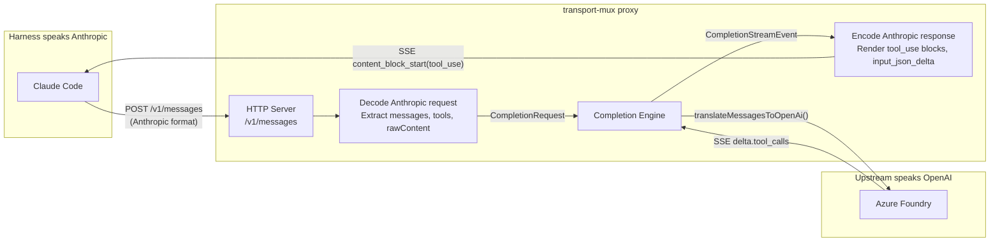

**Engines:**
- `createOpenAICompletionEngine()` — Foundry/Azure path. Handles `input_schema → parameters` tool normalization, streaming `delta.tool_calls` accumulation, `tool_result → role:"tool"` message translation.
- `createGoogleCompletionEngine()` — Vertex/Gemini path. Handles `functionCall/functionResponse` translation, `thoughtSignature` server-side store for multi-turn preservation.

**When proxy is needed:** Determined by `translateForHarness()` — if the harness adapter declares `proxyRequired: true` for a given provider, transport-mux bridges the gap.

### agent-mux: Unified Launch Surface

`amux launch` resolves provider config, decides if a proxy is needed, prepares harness automation state, and spawns the harness:

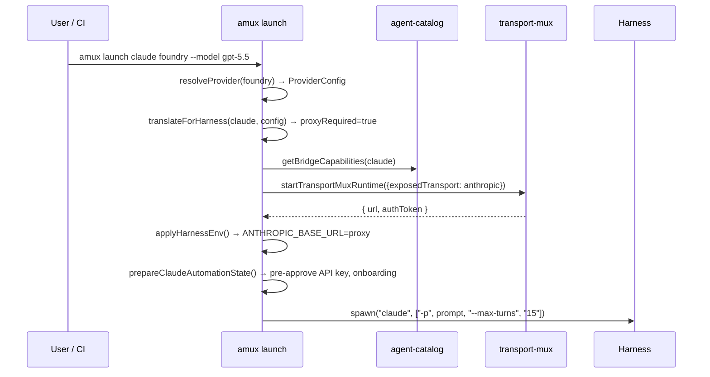

---

## Plugin Generation

`npm run generate:plugins` compiles unified plugin source into harness-specific distributions via the `extension-mux` compiler:

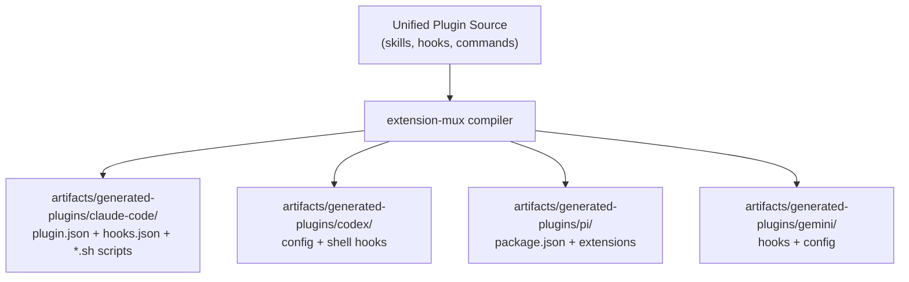

**Per-harness output structure:**

| Harness | Plugin Format | Hook Mechanism |
|---------|---------------|----------------|
| Claude Code | `plugin.json` + `hooks/hooks.json` + shell scripts | Shell hooks: `babysitter-proxied-session-start.sh` → `a5c-hooks-mux invoke --adapter claude` |
| Codex | `config.toml` hooks section | Shell hooks via config registration |
| Pi | `package.json` with `pi.extensions` | In-process programmatic hooks |
| Gemini CLI | Gemini-native hook config | Shell hooks via adapter |

**Installation:**
- Claude Code: `claude plugin marketplace add a5c-ai/babysitter-claude && claude plugin install --scope project babysitter@a5c.ai`
- Others: `babysitter harness:install-plugin <harness> --workspace <cwd>`

---

## Activation Modes

The babysitter plugin activates differently depending on how the harness is launched:

### Hook-Driven (Interactive)

The harness runs interactively with native hook support. Hooks drive the orchestration loop — the stop hook decides whether to continue or yield.

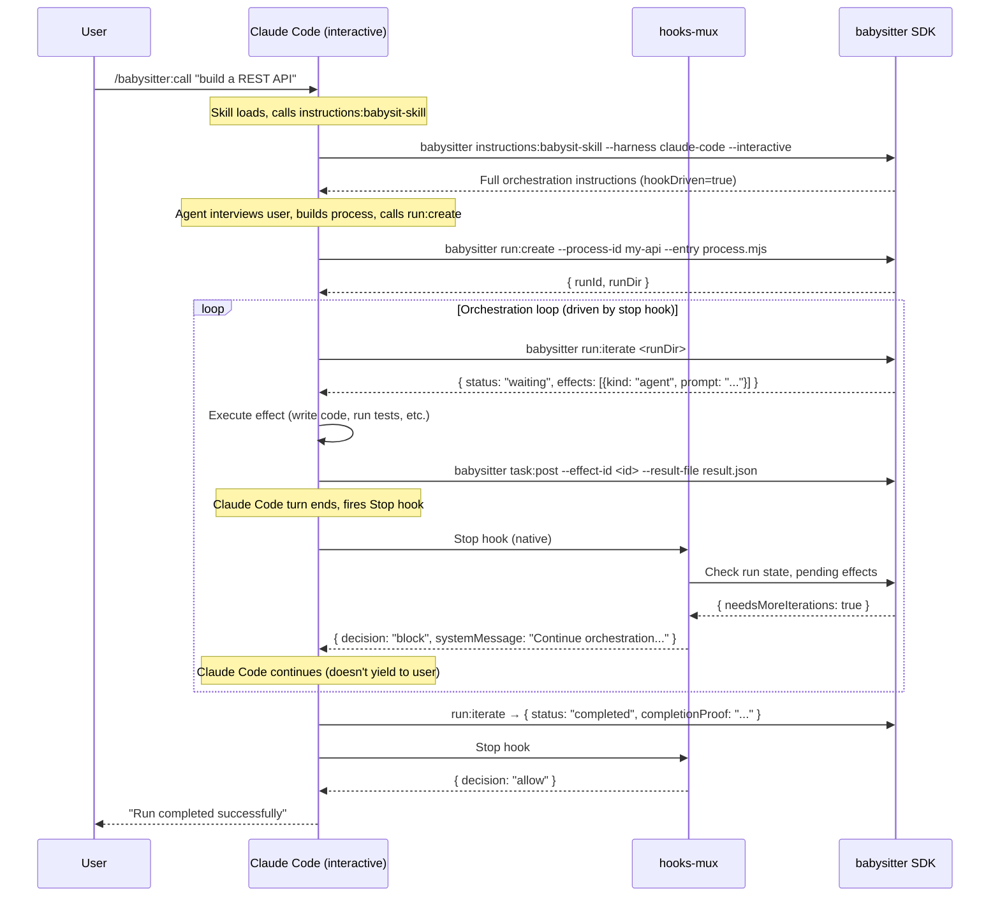

**Key: `hookDriven=true`** — The stop hook controls the loop. When the agent finishes a turn, Claude Code fires the stop hook. The hook checks if the babysitter run needs more iterations and returns `decision: "block"` (continue) or `"allow"` (stop).

### Agent-Driven (Non-Interactive)

The harness runs headless with `-p` or `exec`. No native hooks fire. The agent drives the loop in-turn by calling `run:iterate` repeatedly.

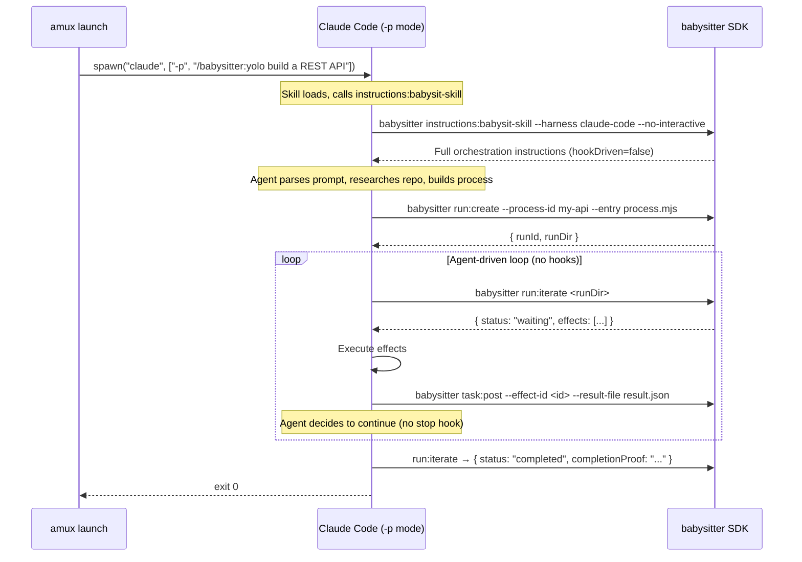

**Key: `hookDriven=false`** — The agent owns the loop. It calls `run:iterate`, executes effects, posts results, and loops until completion. No hooks needed.

### Bridge-Hooks (Emulated)

When the harness is non-interactive but the babysitter lifecycle needs hooks, `amux launch --bridge-hooks` emulates them via CLI calls:

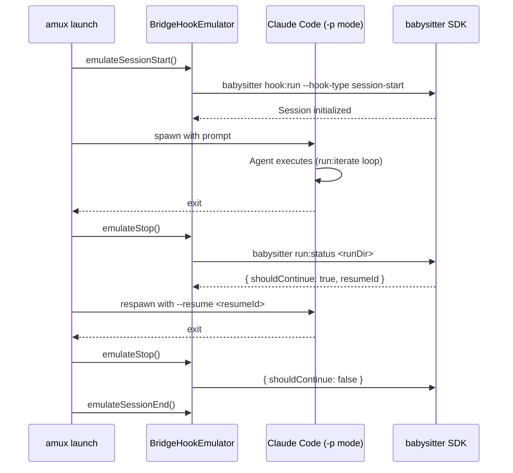

### Bridge-Interactive (PTY Bridge)

The harness runs interactively via PTY but presents structured NDJSON output externally. Used when the harness needs TTY for tool use but the caller wants machine-readable output:

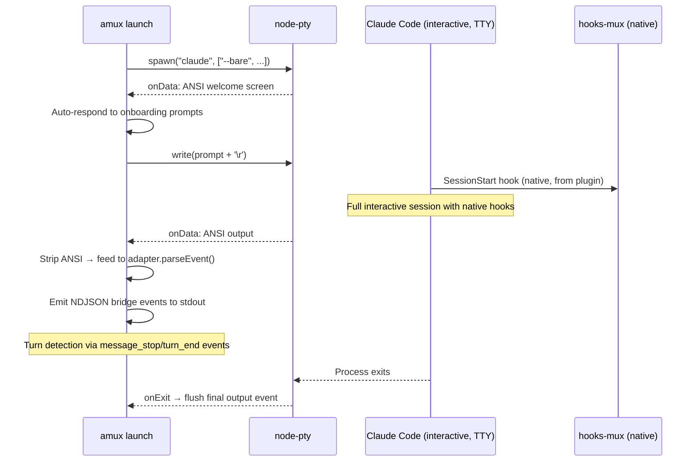

---

## Session Lifecycle

### The `instructions:babysit-skill` Command

When the babysitter skill activates (via `/babysitter:call` or equivalent), it first calls `instructions:babysit-skill` to get orchestration guidance:

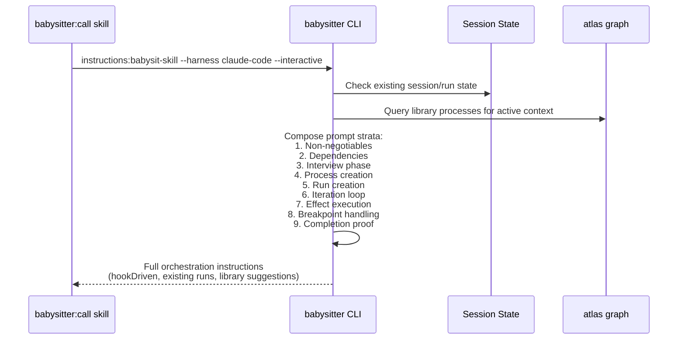

**Context detection:**
- CI vs local, trigger type, repo info
- Existing session state from `~/.a5c/state/hooks/sessions/`
- Active run state from `.a5c/runs/`
- Library process suggestions matching active capabilities

### Stop Hook Decision Logic

The stop hook is the key control point in hook-driven mode:

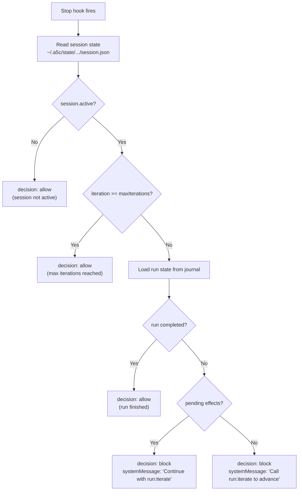

---

## Run Orchestration

### Run Lifecycle

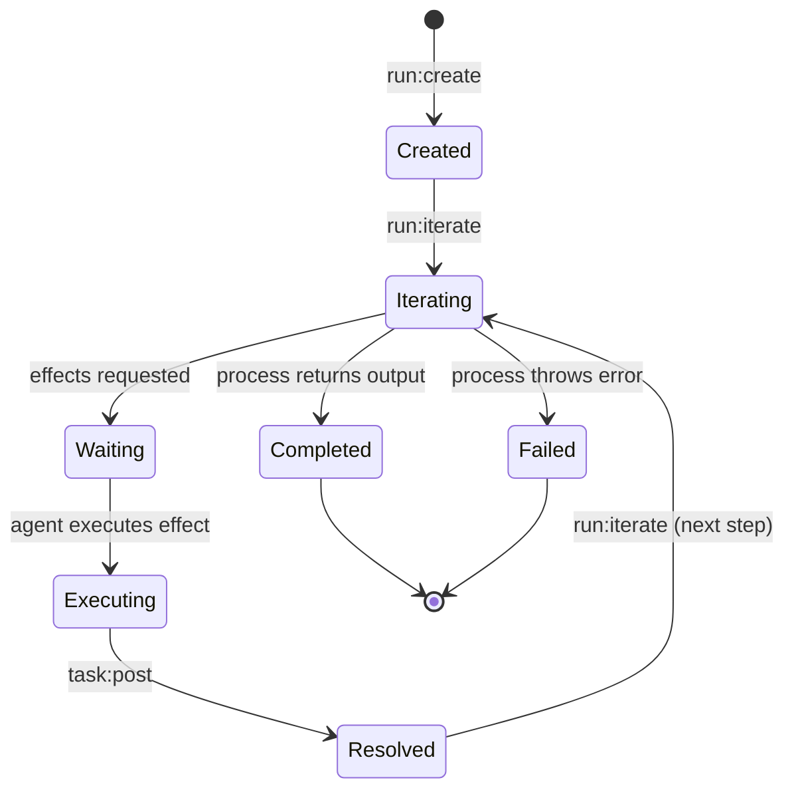

### Effect Types

Processes emit effects via `ctx.task()`:

| Effect Kind | Executed By | Example |
|-------------|-------------|---------|
| `agent` | The coding agent (Claude Code, Codex, etc.) | "Write unit tests for the API module" |
| `skill` | A babysitter skill | "Run the TDD triplet skill" |
| `shell` | Direct shell command | "npm test", "git commit", "eslint --fix" |

### Journal Event Flow

Every state change is recorded in the run journal (`.a5c/runs/<runId>/journal/`):

```
RUN_CREATED → EFFECT_REQUESTED → EFFECT_RESOLVED → EFFECT_REQUESTED → EFFECT_RESOLVED → RUN_COMPLETED
```

The replay engine reconstructs state from journal events, enabling resumption after crashes or session switches.

---

## Harness-Specific Flows

### Claude Code

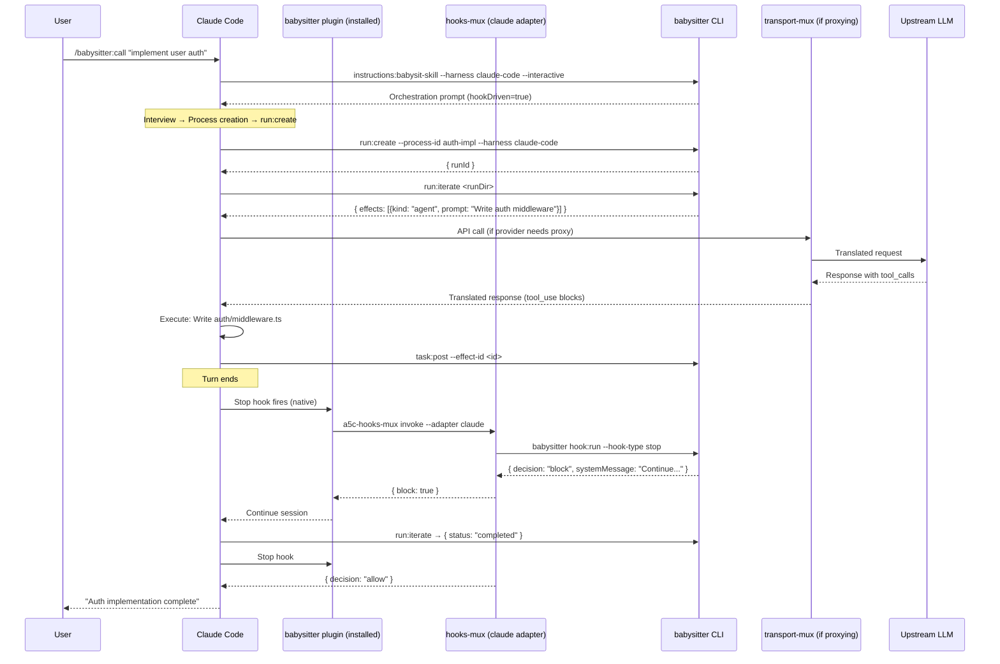

### Codex

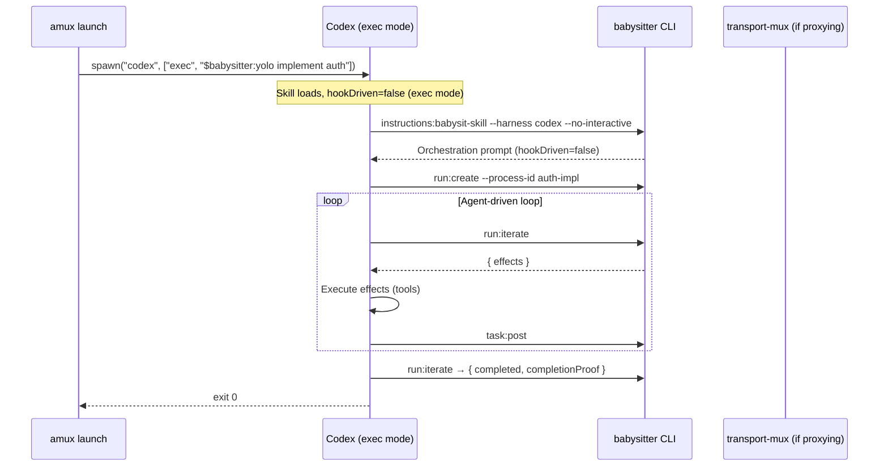

### Pi

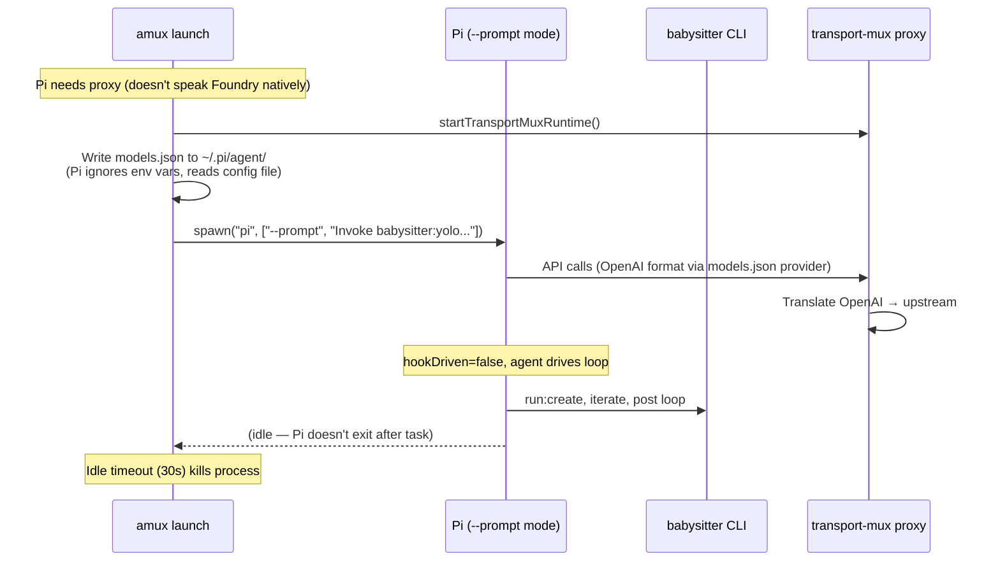

---

## Provider Path Details

When a harness speaks a different protocol than the upstream provider, transport-mux bridges the gap:

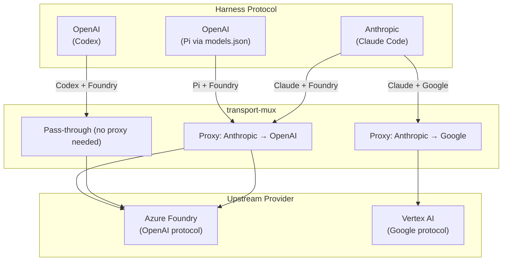

**Message translation details:**

| Direction | From | To | Key Translation |
|-----------|------|----|-----------------|
| Request | Anthropic `tool_use` | OpenAI `role:"assistant"` + `tool_calls` | `input` → `arguments`, `id` → `tool_call_id` |
| Request | Anthropic `tool_result` | OpenAI `role:"tool"` | `tool_use_id` → `tool_call_id`, `content` → `content` |
| Request | Anthropic `tool_use` | Google `functionCall` | `input` → `args`, `thoughtSignature` from server-side store |
| Request | Anthropic `tool_result` | Google `functionResponse` | `tool_use_id` → name lookup via `toolIdToName` map |
| Response | OpenAI `delta.tool_calls` | Anthropic `tool_use` stream | Accumulate chunks → `content_block_start` + `input_json_delta` |
| Response | Google `functionCall` | Anthropic `tool_use` stream | Extract `thoughtSignature` → store server-side |
