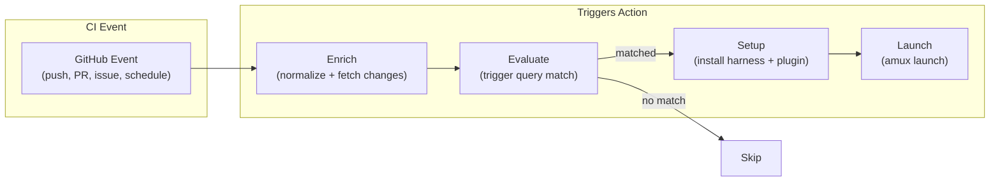

# Triggers & CI Integration

The `@a5c-ai/triggers` package provides a GitHub Action and CLI for running coding agents from CI pipelines.

## Architecture

## Invocation Modes

| Mode | Flags | Use Case |
|------|-------|----------|
| `non-interactive` | `--no-interactive` | Simple one-shot tasks |
| `bridged-hooks` | `--no-interactive --bridge-hooks` | Babysitter orchestrated tasks |
| `bridged-interactive` | `--no-interactive --bridge-interactive` | Tool-heavy tasks needing PTY |

## Supported Harnesses

All harnesses from the atlas graph: claude, codex, pi, gemini, copilot, cursor, opencode, hermes.

## Babysitter Plugin Integration

When `babysitter-plugin: true`, the action:
1. Generates per-harness plugins
2. Installs babysitter SDK
3. Installs plugin into harness
4. Copies process file to `.a5c/processes/`
5. Launches with bridge flags

See [triggers README](../../packages/triggers/README.md) for full input reference and examples.
