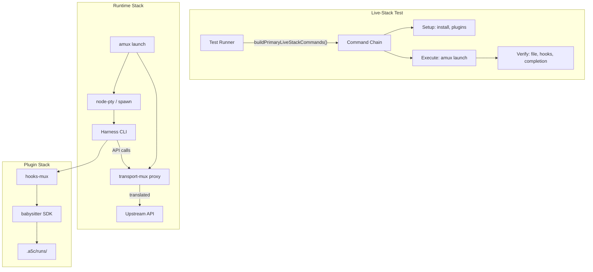
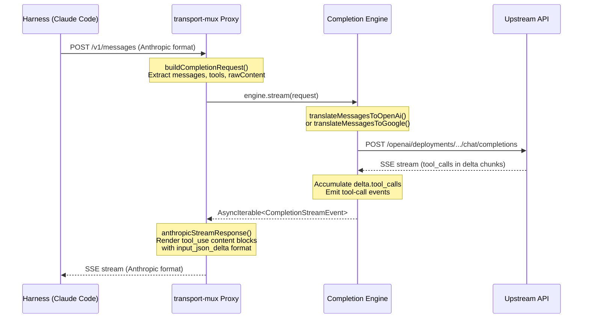
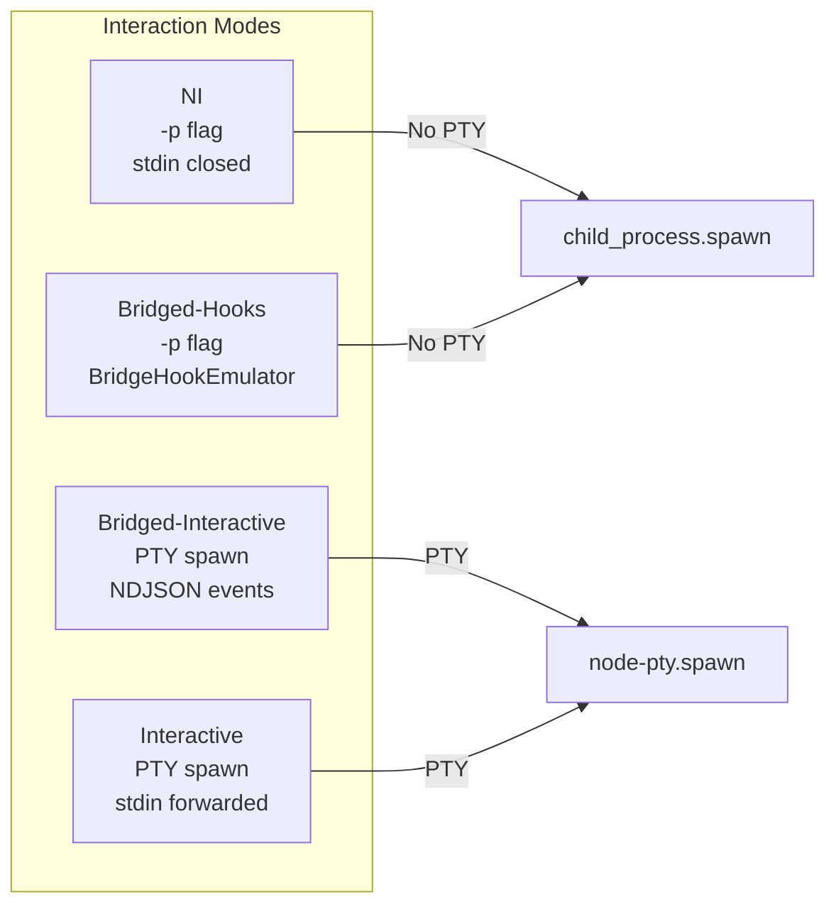
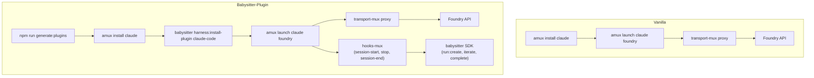
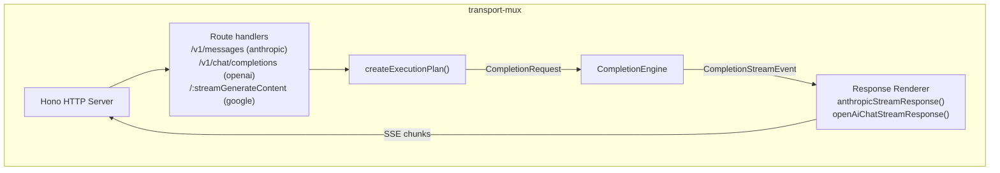
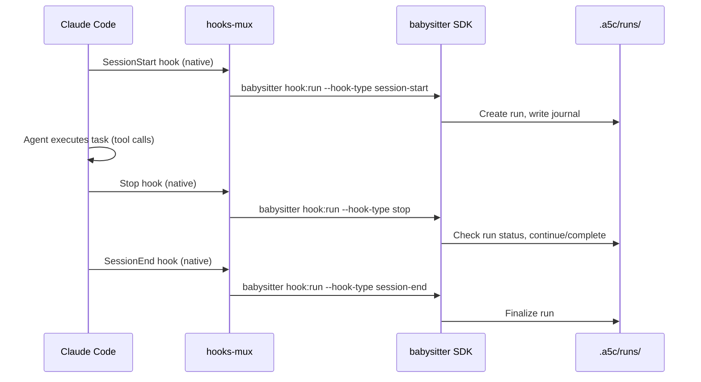
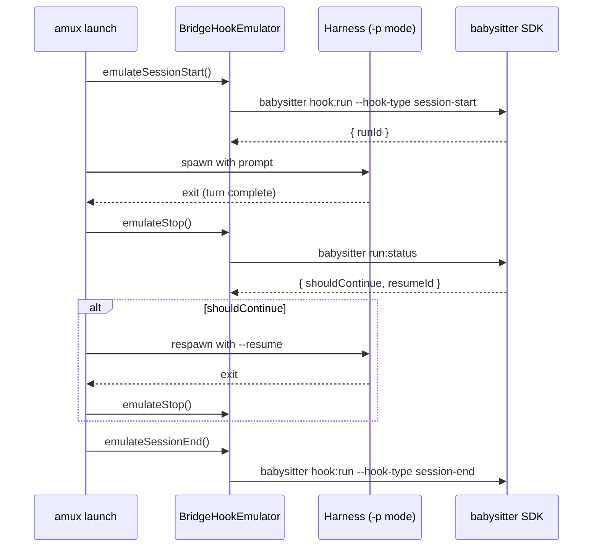

# Live-Stack Architecture

End-to-end architecture for the live-stack CI matrix that validates the full agent-mux → transport-mux → provider pipeline with real model calls.

## Table of Contents

1. [Overview](#overview)
2. [Component Map](#component-map)
3. [Request Flow](#request-flow)
4. [Interaction Modes](#interaction-modes)
5. [Install Modes](#install-modes)
6. [Provider Paths](#provider-paths)
7. [Harness Specifics](#harness-specifics)
8. [Transport-Mux Proxy](#transport-mux-proxy)
9. [Hooks-Mux Lifecycle](#hooks-mux-lifecycle)
10. [Babysitter SDK Integration](#babysitter-sdk-integration)
11. [Verification Checks](#verification-checks)
12. [Matrix Structure](#matrix-structure)

---

## Overview

The live-stack tests validate that the entire harness → proxy → upstream pipeline works end-to-end with real API calls. Each scenario exercises a specific combination of:

- **Harness** (Claude Code, Codex, Pi, etc.) — the coding agent CLI
- **Provider** (Foundry/Azure, Google/Vertex) — the upstream model API
- **Interaction mode** (NI, bridged-hooks, bridged-interactive, interactive) — how the harness is launched
- **Install mode** (vanilla, babysitter-plugin) — whether babysitter hooks are active

The test dispatches the agent with a concrete task ("Write a 12-paragraph Odyssey summary + Greek translation"), verifies the output file was created, and checks that all intermediate layers (proxy, hooks, babysitter lifecycle) functioned correctly.



---

## Component Map

| Package | Role | Key File |
|---------|------|----------|
| `agent-mux/cli` | Orchestrates launch: provider resolution, proxy startup, harness spawn | `src/commands/launch.ts` |
| `agent-mux/adapters` | Per-harness provider translation (env vars, CLI args) | `src/translations/*.ts` |
| `agent-mux/core` | Provider resolver, workspace service | `src/provider-resolver.ts` |
| `transport-mux` | HTTP proxy: accepts harness requests, translates, forwards to upstream | `src/server.ts`, `src/engines/*.ts` |
| `hooks-mux/core` | Hook normalization, merge engine, env propagation | `src/normalizer/`, `src/merge-engine/` |
| `hooks-mux/adapter-*` | Per-harness hook mapping (native event → canonical phase) | `src/mappings.ts` |
| `agent-catalog` | Runtime graph queries: bridge capabilities, hook support | `src/sdk.ts` |
| `atlas/graph` | YAML knowledge graph: agent versions, capabilities, transports | `graph/agent-stack/versions/*.yaml` |
| `sdk` | Babysitter run lifecycle: create, iterate, effects, completion | `src/runtime/`, `src/storage/` |

---

## Request Flow

A single API call from the harness through the proxy:



### Message Translation

The proxy translates between the harness's native protocol and the upstream's:

| Exposed Transport | Direction | Upstream Transport | Translation |
|---|---|---|---|
| Anthropic | → | OpenAI (Foundry) | `tool_use` → `tool_calls`, `tool_result` → `role: "tool"` |
| Anthropic | → | Google (Vertex) | `tool_use` → `functionCall`, `tool_result` → `functionResponse` |
| Anthropic | ← | OpenAI | `delta.tool_calls` → `content_block_start(tool_use)` + `input_json_delta` |
| Anthropic | ← | Google | `functionCall` → `tool_use`, `thoughtSignature` preserved via server-side store |

---

## Interaction Modes

### Non-Interactive (NI)

```
amux launch claude foundry --no-interactive -p "Write a summary..."
```

- Claude Code runs with `-p` flag (autonomous multi-turn execution)
- stdout piped through for output capture
- Process exits on completion or max-turns

### Bridged-Hooks

```
amux launch claude foundry --no-interactive --bridge-hooks -p "Write a summary..."
```

- Same as NI but with `BridgeHookEmulator` wrapping the harness
- Emulates session-start before spawn, stop/continue after each turn
- Uses `babysitter hook:run` CLI calls to drive the lifecycle
- Can respawn with `--resume` if `shouldContinue=true`

### Bridged-Interactive

```
amux launch claude foundry --no-interactive --bridge-interactive
```

- Spawns via `node-pty` (PTY) for full terminal emulation
- Parses PTY output through adapter's `parseEvent()` for structured events
- Emits NDJSON bridge events to stdout
- Auto-responds to onboarding prompts (API key, bypass permissions)
- Detects turn completion via `message_stop` / `turn_end` events
- Prompt injected after PTY output detected + stabilization delay

### Interactive

```
amux launch claude foundry
```

- Full PTY with human stdin forwarded
- Prompt passed as positional arg for autonomous execution
- Native hook support — Claude Code fires hooks from its plugin system
- Turn detection via adapter event parsing



---

## Install Modes

### Vanilla

- `amux install <harness>` — installs the harness CLI
- `amux launch <harness> <provider>` — launches directly
- No babysitter plugin, no hooks-mux
- Verification: file-creation only

### Babysitter-Plugin

- `npm run generate:plugins` — generates per-harness hook scripts
- `babysitter harness:install-plugin <harness>` — installs babysitter hooks into harness settings
- `amux launch <harness> <provider>` — launches with hooks active
- Hooks fire natively (interactive) or emulated (bridged-hooks)
- Verification: file-creation + hooks + babysitter run completion + completion proof



---

## Provider Paths

### Foundry (Azure OpenAI)

- **Provider ID**: `foundry`
- **Transport**: OpenAI Chat Completions
- **Auth**: `AZURE_API_KEY` + `AMUX_API_BASE`
- **Proxy**: Required for Claude Code and Pi (they don't speak OpenAI natively)
- **Engine**: `createOpenAICompletionEngine()` — handles tool normalization (`input_schema` → `parameters`), streaming `delta.tool_calls` accumulation
- **URL Pattern**: `${apiBase}/openai/deployments/${model}/chat/completions?api-version=2025-04-01-preview`

### Google (Gemini / Vertex AI)

- **Provider ID**: `google`
- **Transport**: Google Gemini API
- **Auth**: `GOOGLE_API_KEY` + auto-upgrade to Vertex when `GOOGLE_CLOUD_PROJECT` or `GOOGLE_GENAI_USE_VERTEXAI` set
- **Proxy**: Required for all harnesses (none speak Google natively)
- **Engine**: `createGoogleCompletionEngine()` — handles `functionCall`/`functionResponse` translation, `thoughtSignature` server-side store
- **URL Pattern**: Vertex: `aiplatform.googleapis.com/v1/projects/.../models/${model}:streamGenerateContent`

### Provider Resolution

`resolveProvider()` in `agent-mux-core` maps CLI flags to a `ProviderConfig`:

```typescript
ProviderConfig {
  provider: 'foundry' | 'google' | 'anthropic' | ...
  model: string
  transport: 'openai-chat' | 'anthropic' | 'google' | ...
  auth: { apiKey?: string, ... }
  params: { apiBase?, region?, project?, useVertexAi?, ... }
}
```

---

## Harness Specifics

### Claude Code

- **Adapter**: `packages/agent-mux/adapters/src/claude-adapter.ts`
- **Translation**: `translations/claude-translation.ts`
- **NI mode**: `-p <prompt>` — autonomous multi-turn with tools
- **Interactive mode**: positional prompt arg — autonomous within interactive session
- **Proxy exposed transport**: `anthropic`
- **Onboarding**: Requires `prepareClaudeAutomationState()` to pre-approve API keys, skip bypass prompt, configure permissions allow-list
- **Bridge capabilities**: `interactiveBridge: true`, `hookBridge: true`
- **Hook support**: All hooks native in interactive mode

### Codex

- **Adapter**: `packages/agent-mux/adapters/src/codex-adapter.ts`
- **NI mode**: `exec <prompt>` subcommand
- **Interactive mode**: stdin prompt injection
- **Proxy exposed transport**: `openai-chat` or `openai-responses`
- **Bridge capabilities**: `interactiveBridge: false` (exec mode has native tools)
- **Note**: Codex NI doesn't need a proxy for Foundry (speaks OpenAI natively) — only for non-OpenAI providers

### Pi

- **Adapter**: `packages/agent-mux/adapters/src/pi-adapter.ts`
- **NI mode**: `--prompt <prompt>` flag, stdin closed
- **Proxy exposed transport**: `openai-chat`
- **Special**: Proxy config written to `~/.pi/agent/models.json` (Pi ignores env vars)
- **Bridge capabilities**: `interactiveBridge: true`
- **Completion detection**: Idle timeout (30s) — Pi doesn't emit structured end events

---

## Transport-Mux Proxy

### Architecture



### Key Types

```typescript
CompletionRequest {
  model: string
  transport: TransportId
  messages: CompletionRequestMessage[]  // with rawContent for structured blocks
  tools?: unknown[]
  toolChoice?: unknown
  stream: boolean
  thoughtSignatureStore?: Map<string, string>  // server-side Gemini signature cache
}

CompletionStreamEvent =
  | { type: 'text-delta', text: string }
  | { type: 'tool-call', id: string, name: string, arguments: string, metadata?: Record<string, unknown> }
  | { type: 'done', finishReason?: string, usage?: CompletionUsage }
```

### Gemini thoughtSignature

Vertex AI requires `thoughtSignature` to be echoed back on `functionCall` parts in subsequent requests. Since Claude Code strips unknown fields from `tool_use` content blocks, the proxy stores signatures server-side:

1. Google engine response → `extractGoogleToolCalls()` captures `thoughtSignature` → stored in `thoughtSignatureStore` keyed by tool call ID
2. Anthropic streaming response → metadata included in `tool_use` blocks (may be stripped by client)
3. Next request → `translateMessagesToGoogle()` looks up signature from store by tool call ID → injects into `functionCall` part

---

## Hooks-Mux Lifecycle

### Native Hooks (Interactive Mode)

When Claude Code runs interactively with the babysitter plugin installed:



### Emulated Hooks (Bridged-Hooks Mode)

When the harness runs in NI mode with `--bridge-hooks`:



---

## Babysitter SDK Integration

### Run Lifecycle

```
run:create → RUN_CREATED journal event
  ↓
run:iterate → EFFECT_REQUESTED (tasks to execute)
  ↓
Agent executes tasks (Write file, Bash commands, etc.)
  ↓
task:post → EFFECT_RESOLVED (task result committed)
  ↓
run:iterate → RUN_COMPLETED + completionProof
```

### Session Binding

The `--harness claude-code` flag on `run:create` activates session binding:
- Resolves `BABYSITTER_SESSION_ID` from the Claude Code hook context
- Creates `.a5c/state/<sessionId>.md` with session metadata
- Links session → run for lifecycle tracking

### MCP Tools

The SDK exposes these tools via MCP for agents to use:

| Tool | Purpose |
|------|---------|
| `run_create` | Create a new babysitter run |
| `run_status` | Query run state |
| `run_iterate` | Execute one orchestration step |
| `task_post` | Commit task result |
| `task_list` | List pending tasks |
| `session_init` | Initialize session state |
| `session_associate` | Link session to run |
| `skill_discover` | Find available processes |

---

## Verification Checks

The test runner validates each scenario with these checks:

| Check | What it verifies | How |
|-------|-----------------|-----|
| `file-creation` | Agent created the Odyssey markdown file (>500 bytes) | `fs.stat(.a5c-live-test/<traceId>-odyssey.md)` |
| `stop-hooks` | Hooks-mux fired stop hooks | Log files in `.a5c/logs/hooks/` or `STOP` events in journal |
| `hooks-mux-session` | Session-level hook evidence | Same sources as stop-hooks |
| `babysitter-run-completion` | A babysitter run exists with journal events | Scan `.a5c/runs/` for directories with journal entries |
| `babysitter-completion-proof` | Run completed with `completionProof` and `RUN_COMPLETED` event | Parse `run.json` + scan journal for `RUN_COMPLETED` |

---

## Matrix Structure

### Babysitter-Plugin Matrix

| | bridged-hooks | interactive |
|---|---|---|
| Claude Code + Foundry | ✓ | ✓ |
| Claude Code + Gemini | ✓ | ✓ |
| Codex + Foundry | ✓ | ✓ |
| Pi + Foundry | skip | skip |
| Hermes + Foundry | skip | skip |
| Gemini CLI + Foundry | skip | skip |
| Copilot CLI + Foundry | skip | skip |
| Cursor CLI + Foundry | skip | skip |

### Vanilla Matrix

| | non-interactive | bridged-interactive | interactive |
|---|---|---|---|
| Claude Code + Foundry | ✓ | ✓ | ✓ |
| Claude Code + Gemini | ✓ | ✓ | ✓ |
| Codex + Foundry | ✓ | (excluded) | ✓ |
| Pi + Foundry | skip | skip | skip |
| Hermes + Foundry | skip | skip | skip |
| Gemini CLI + Foundry | skip | skip | skip |
| Copilot CLI + Foundry | skip | skip | skip |
| Cursor CLI + Foundry | skip | skip | skip |

**Exclusions:**
- Codex bridged-interactive: Codex exec mode has native tools, no PTY bridge needed
- Pi bridged-hooks: Pi hooks are programmatic, not shell-based

**Skipped harnesses** pass as green no-ops — all workflow steps gated by `matrix.scenario.skip != 'true'`.

---

## Key File Reference

| Component | File | Purpose |
|-----------|------|---------|
| Launch orchestration | `packages/agent-mux/cli/src/commands/launch.ts` | Provider resolution, proxy startup, harness spawn, PTY injection |
| Bridge hook emulation | `packages/agent-mux/cli/src/commands/launch-bridge-hooks.ts` | Session-start/stop/end emulation via babysitter CLI |
| Provider translation | `packages/agent-mux/adapters/src/translations/*.ts` | Per-harness env/args mapping |
| Proxy server | `packages/transport-mux/src/server.ts` | HTTP proxy with route handlers per transport |
| OpenAI engine | `packages/transport-mux/src/engines/openai.ts` | Tool normalization, streaming tool_calls |
| Google engine | `packages/transport-mux/src/engines/google.ts` | functionCall/Response, thoughtSignature |
| Proxy types | `packages/transport-mux/src/types.ts` | CompletionRequest, CompletionResult, stream events |
| Hook normalizer | `packages/hooks-mux/core/src/normalizer/` | Native event → canonical phase mapping |
| Claude hook adapter | `packages/hooks-mux/adapter-claude/` | Claude Code hook parsing/rendering |
| Graph queries | `packages/agent-catalog/src/sdk.ts` | getBridgeCapabilities(), getHookSupport() |
| Atlas YAML | `packages/atlas/graph/agent-stack/versions/*.yaml` | Agent capabilities, hook support levels |
| SDK runtime | `packages/sdk/src/runtime/orchestrateIteration.ts` | Run iteration loop |
| Session binding | `packages/sdk/src/harness/hooks/sessionBinding.ts` | Session ↔ run linkage |
| Test runner | `packages/agent-mux/cli/tests/live-stack/primary-live-runner.ts` | Scenario build, execute, verify |
| Scenario contract | `packages/agent-mux/cli/tests/live-stack/scenario-contract.ts` | Types, evidence bundle, discovery |
| Workflow YAML | `.github/workflows/live-stack.yml` | CI matrix definition |
