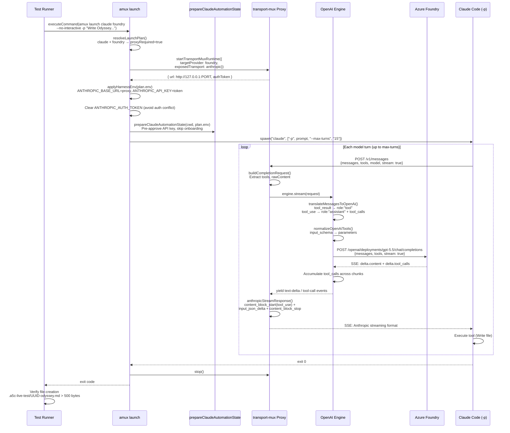
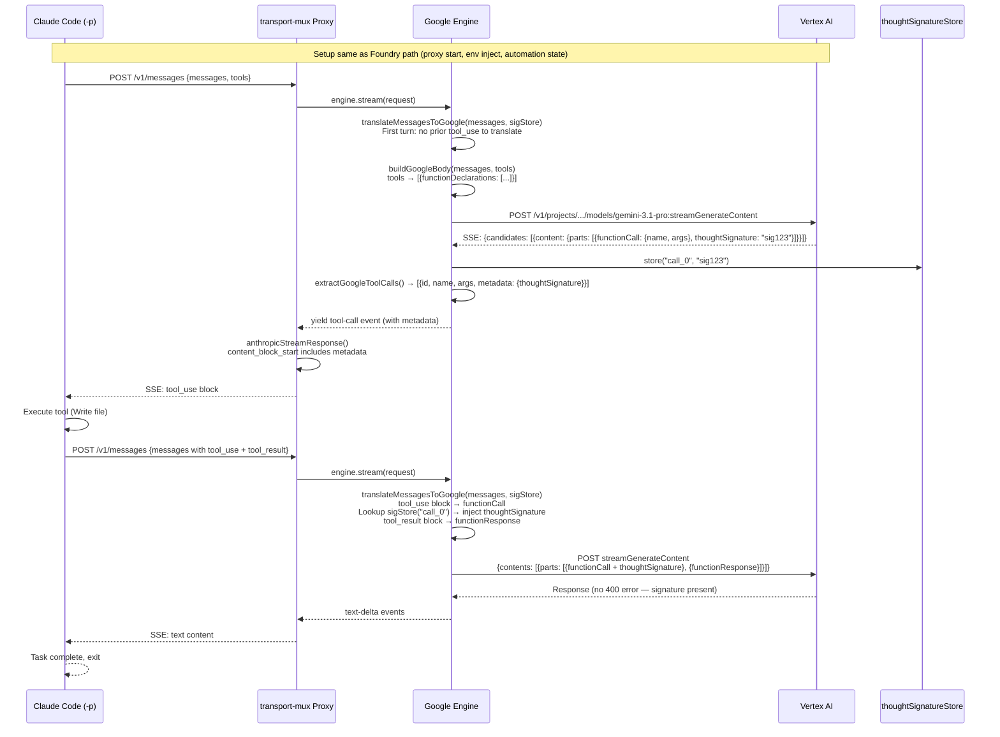
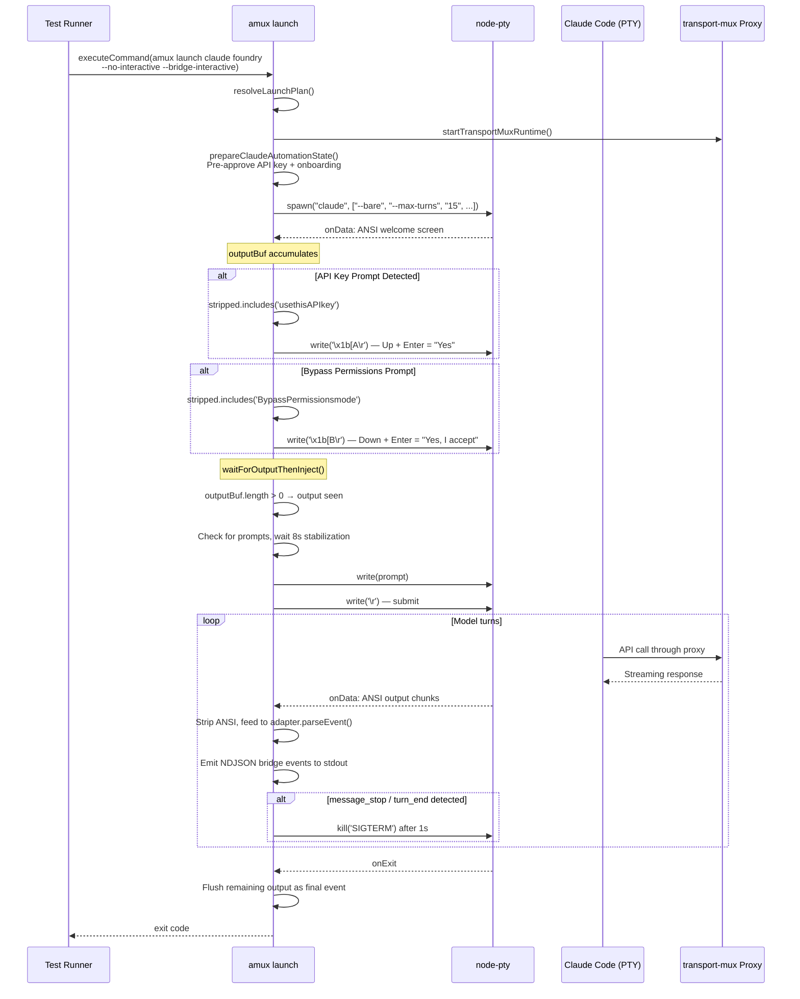
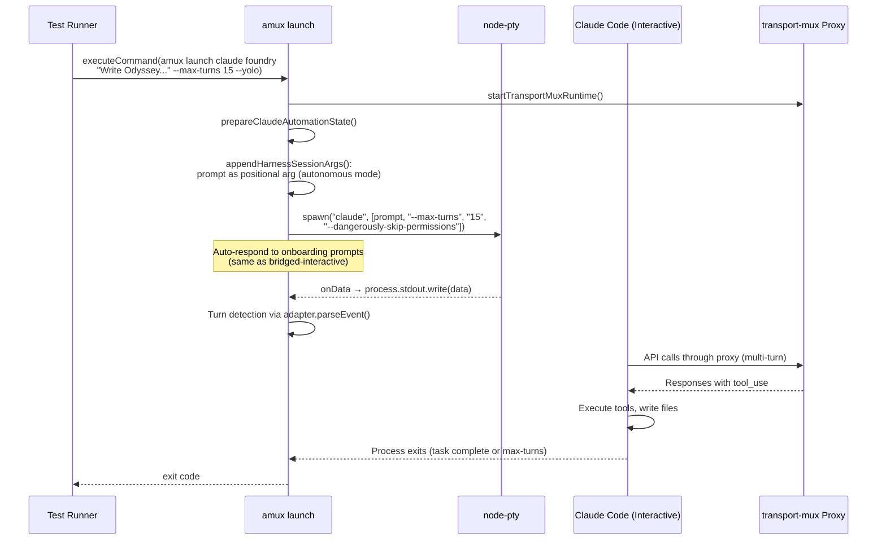
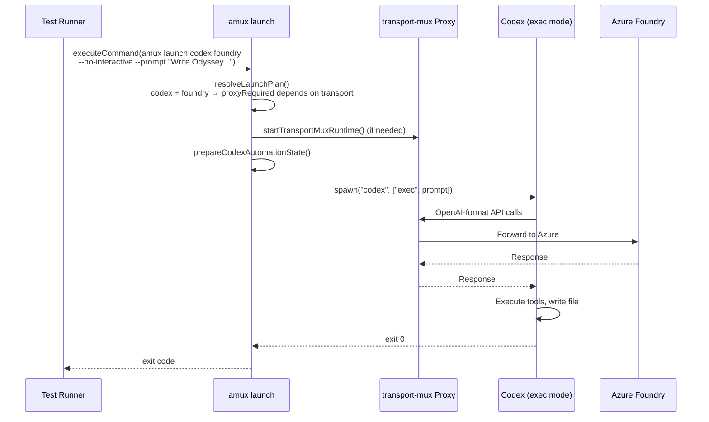
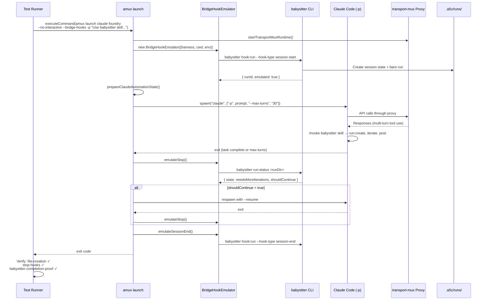
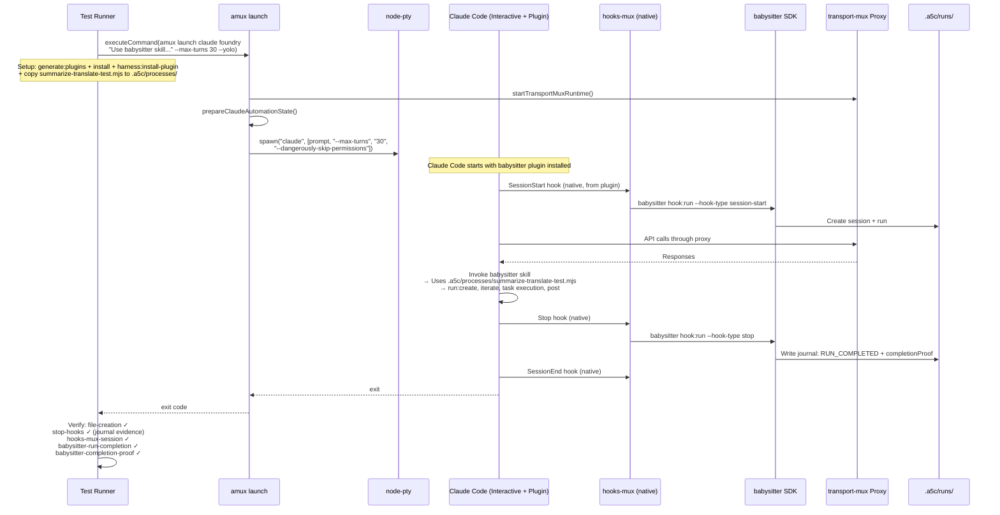
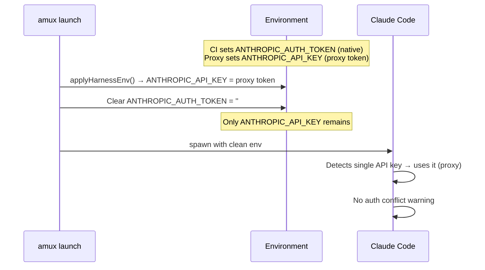

# Live-Stack Sequence Diagrams

Detailed sequence diagrams for each scenario the live-stack E2E matrix covers. Each diagram traces a complete request through all components.

See [live-stack-architecture.md](./live-stack-architecture.md) for component descriptions and the overall architecture.

## Table of Contents

1. [Vanilla NI: Claude Code + Foundry](#1-vanilla-ni-claude-code--foundry)
2. [Vanilla NI: Claude Code + Gemini](#2-vanilla-ni-claude-code--gemini)
3. [Vanilla Bridged-Interactive: Claude Code](#3-vanilla-bridged-interactive-claude-code)
4. [Vanilla Interactive: Claude Code](#4-vanilla-interactive-claude-code)
5. [Vanilla NI: Codex + Foundry](#5-vanilla-ni-codex--foundry)
6. [BP Bridged-Hooks: Claude Code + Foundry](#6-bp-bridged-hooks-claude-code--foundry)
7. [BP Interactive: Claude Code + Foundry](#7-bp-interactive-claude-code--foundry)

---

## 1. Vanilla NI: Claude Code + Foundry

The simplest proxy path. Claude Code runs with `-p` (autonomous), talks Anthropic protocol to the proxy, which translates to OpenAI and forwards to Azure Foundry.

---

## 2. Vanilla NI: Claude Code + Gemini

Same as Foundry but with Google/Vertex engine. Key difference: `thoughtSignature` must be preserved across turns.

---

## 3. Vanilla Bridged-Interactive: Claude Code

PTY-based bridge. Claude Code runs interactively but output is parsed into structured NDJSON events. Auto-responds to onboarding prompts.

---

## 4. Vanilla Interactive: Claude Code

Full interactive PTY with prompt as positional argument for autonomous execution.

---

## 5. Vanilla NI: Codex + Foundry

Codex uses `exec` subcommand for NI mode. May not need proxy if provider is OpenAI-compatible.

---

## 6. BP Bridged-Hooks: Claude Code + Foundry

Babysitter-plugin with hook emulation. The BridgeHookEmulator wraps the harness execution with lifecycle hooks.

---

## 7. BP Interactive: Claude Code + Foundry

Native hooks — Claude Code fires lifecycle hooks from its installed babysitter plugin.

---

## Auth Conflict Resolution

CI runners may have both `ANTHROPIC_AUTH_TOKEN` (native auth) and `ANTHROPIC_API_KEY` (from proxy). Claude Code shows an "Auth conflict" warning and exits confused.

