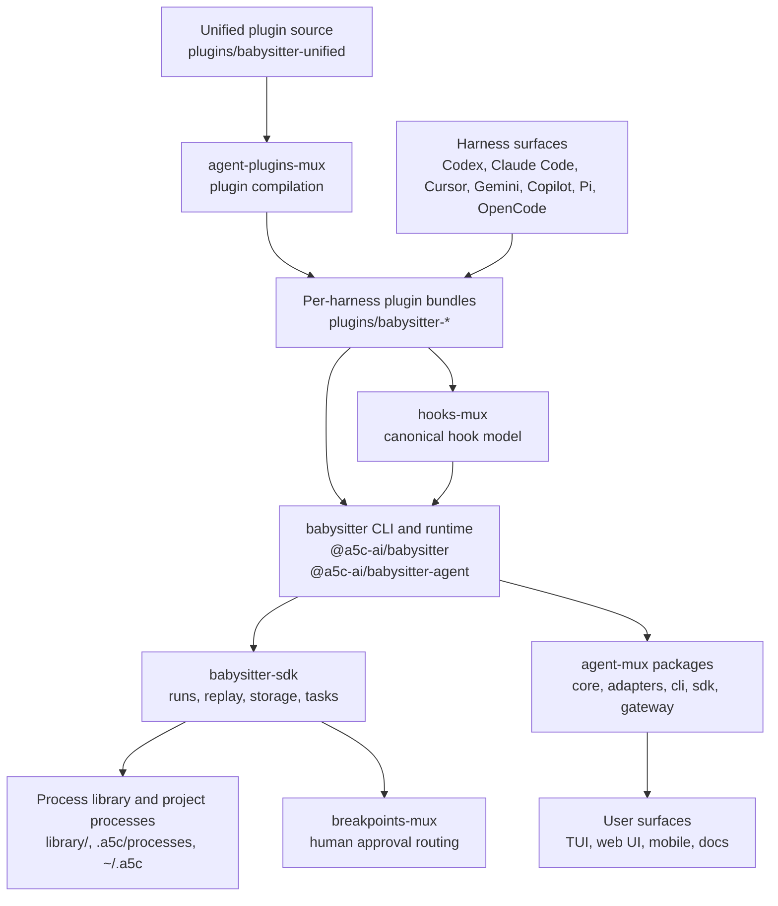

# Unified Stack Architecture

→ [Documentation Index](README.md) | Related: [Glossary](glossary.md) | [Stack Guide](stack-guide.md)

## Purpose

This document explains how the already-unified Babysitter and agent-mux stack fits together in the current monorepo. It is a map of today's executable system, not a promise of a larger future decomposition.

## Architecture Stance

The current stack has one strong center and several supporting seams:

- `@a5c-ai/babysitter-sdk` remains the orchestration core.
- `@a5c-ai/babysitter` and `@a5c-ai/babysitter-agent` provide the operational CLI and runtime surfaces.
- `packages/agent-mux/*` provide the dispatch layer for harness-facing agent execution.
- `@a5c-ai/hooks-mux`, `@a5c-ai/agent-plugins-mux`, and `@a5c-ai/breakpoints-mux` are focused support subsystems that normalize hooks, compile plugins, and route human approvals.
- `plugins/babysitter-unified/` is the canonical plugin source, while per-harness plugin bundles remain the user-installable outputs.

## End-To-End Shape

## Responsibility Map

### 1. Orchestration Core

Owned primarily by:

- `packages/sdk`
- `packages/babysitter`
- `packages/babysitter-agent`

This layer owns runs, replay, task definitions, journal/state handling, hooks dispatch, profiles, process-library bindings, and the CLI commands that operate on those concepts.

### 2. Dispatch Layer

Owned primarily by:

- `packages/agent-mux/core`
- `packages/agent-mux/adapters`
- `packages/agent-mux/cli`
- `packages/agent-mux/sdk`
- `packages/agent-mux/gateway`
- `packages/agent-mux/harness-mock`
- `packages/agent-mux/observability`

This layer knows how to talk to different harnesses and normalize them into a shared agent-running contract. It is complementary to Babysitter rather than a replacement for it: Babysitter orchestrates process execution; agent-mux dispatches and normalizes harness interaction.

### 3. Cross-Harness Support Systems

Owned primarily by:

- `packages/hooks-mux/*`
- `packages/agent-plugins-mux`
- `packages/breakpoints-mux`

These packages solve cross-cutting problems:

- `hooks-mux` normalizes hook events and adapter wiring.
- `agent-plugins-mux` compiles one canonical plugin description into harness-specific outputs.
- `breakpoints-mux` routes human approvals and structured breakpoint responses.

This support layer is part of the delivery path for metaplugins on legacy non-Babysitter agents, but it is not the metaplugin abstraction itself. Metaplugins sit one level higher: they package reusable capability concerns across plugin and hook surfaces. `agent-plugins-mux` emits the concrete bundles those concerns need, while unified plugin sources such as `plugins/babysitter-unified/` provide one first-party authoring surface for that delivery.

### 4. Distribution And Installation Surfaces

Owned primarily by:

- `plugins/babysitter-unified`
- `plugins/babysitter-*`

The important distinction is:

- `plugins/babysitter-unified/` is the canonical authoring surface.
- `plugins/babysitter-codex`, `plugins/babysitter-gemini`, and similar directories are the concrete installable bundles and compatibility surfaces.

### 5. User Experience Surfaces

Owned primarily by:

- `packages/agent-mux/tui`
- `packages/agent-mux/webui`
- `packages/agent-mux/ui`
- `packages/agent-mux/mobile-*`
- `packages/agent-mux/tv-*`
- `packages/agent-mux/watch-*`
- `docs/`, `docs-site/`, `packages/catalog`

These packages are consumers of the orchestration and dispatch layers. They are not the architectural center of V6, but they are part of the stack and need coherent ownership boundaries.

## Integration Contracts That Matter

### Babysitter ↔ Harnesses

Harnesses are reached through plugin bundles, lifecycle hooks, and session binding behavior. This is where `plugins/*`, `hooks-mux`, and harness-specific install surfaces matter.

### Babysitter ↔ Agent-Mux

The key boundary is orchestration versus dispatch:

- Babysitter owns process execution, runs, replay, and effect lifecycles.
- agent-mux owns adapter-level normalization, event streams, invocation modes, and harness interaction surfaces.

### Unified Plugin ↔ Per-Harness Bundles

The unified plugin is the authoring source. Per-harness bundles are the compatibility outputs. V6 should describe both, not collapse them into one concept.

### Orchestration ↔ Human Approval

Breakpoint routing is a distinct concern. `breakpoints-mux` should be discussed as a supporting subsystem for approvals rather than folded into generic hook or session language.

## What Is Normative Now

- The monorepo already contains Babysitter, agent-mux, hooks-mux, agent-plugins-mux, and breakpoints-mux.
- `packages/sdk` is still the main center of gravity.
- agent-mux is already integrated as repo content, workspace packages, and documentation.
- Unified plugin authoring coexists with per-harness plugin bundles.
- Metaplugins are a current capability-layer concept over plugin and hook surfaces, with `agent-plugins-mux` serving as the concrete bundle compiler for legacy non-Babysitter agents.

## What Is Deferred

- Any forced rename from current packages into a new runtime/platform/application stack.
- Any claim that the mux support packages must become a larger formal platform before their current seams are proven.
- Any architectural story that assumes remote, distributed, or strongly isolated plugin execution by default.

## Reading Rule

If a design discussion makes the stack sound cleaner than the current repo, check whether it is:

1. a real package/path in this monorepo,
2. a current V6 commitment, or
3. only deferred vocabulary.

If the answer is only "vocabulary", it is not yet architecture.

---

**Related Documents**: [System Overview](system-overview.md) | [Package Specifications](package-specs.md) | [Agent-Mux Integration](agent-mux-integration.md)
