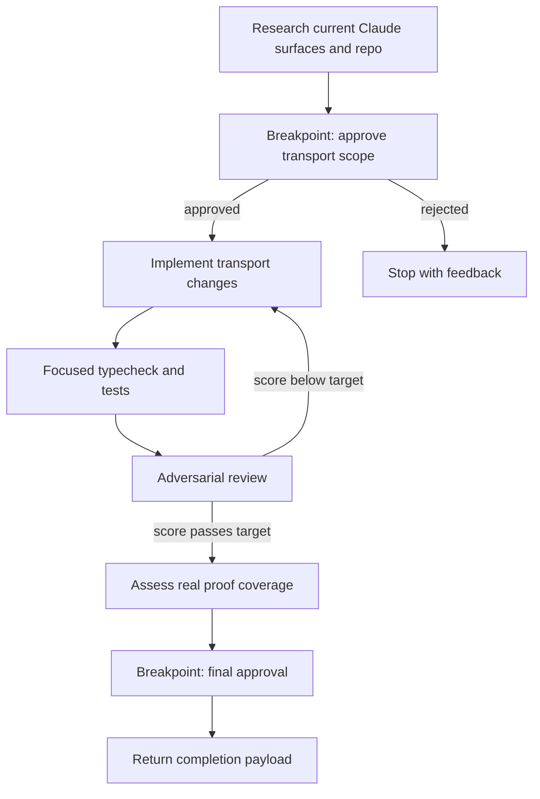

# claude-server-mode-transport

```mermaid
flowchart TD
    A[Research current Claude surfaces and repo] --> B[Breakpoint: approve transport scope]
    B -->|approved| C[Implement transport changes]
    B -->|rejected| Z[Stop with feedback]
    C --> D[Focused typecheck and tests]
    D --> E[Adversarial review]
    E -->|score below target| C
    E -->|score passes target| F[Assess real proof coverage]
    F --> G[Breakpoint: final approval]
    G --> H[Return completion payload]
```
