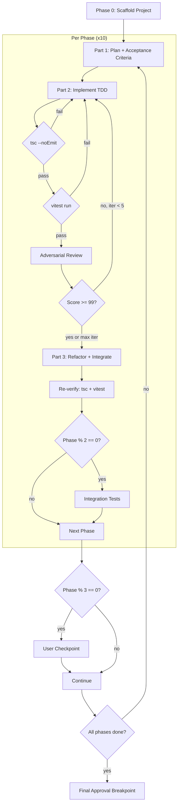

```mermaid
graph TD
    S[Phase 0: Scaffold Project] --> P1

    subgraph "Per Phase (x10)"
        P1[Part 1: Plan + Acceptance Criteria]
        P1 --> P2[Part 2: Implement TDD]
        P2 --> TSC{tsc --noEmit}
        TSC -->|fail| P2
        TSC -->|pass| VT{vitest run}
        VT -->|fail| P2
        VT -->|pass| AR[Adversarial Review]
        AR --> SC{Score >= 99?}
        SC -->|no, iter < 5| P2
        SC -->|yes or max iter| P3[Part 3: Refactor + Integrate]
        P3 --> VERIFY[Re-verify: tsc + vitest]
        VERIFY --> INT{Phase % 2 == 0?}
        INT -->|yes| IT[Integration Tests]
        INT -->|no| NEXT
        IT --> NEXT[Next Phase]
    end

    NEXT --> CP{Phase % 3 == 0?}
    CP -->|yes| BP[User Checkpoint]
    BP --> CONT[Continue]
    CP -->|no| CONT

    CONT --> DONE{All phases done?}
    DONE -->|no| P1
    DONE -->|yes| FINAL[Final Approval Breakpoint]
```
