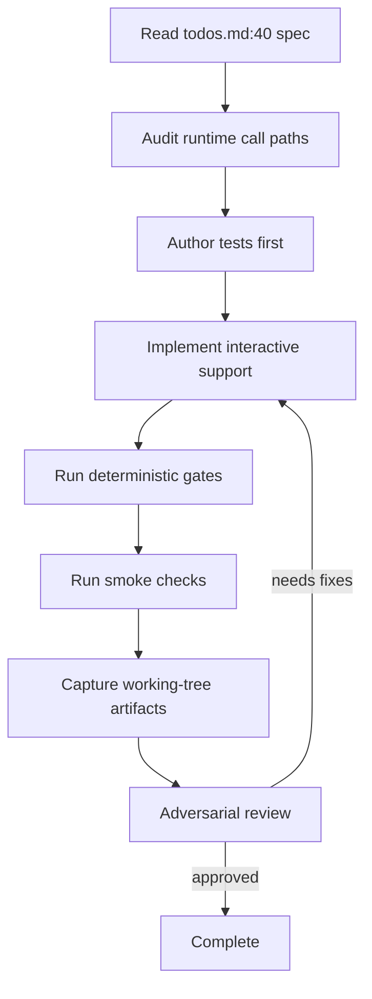

# Interactive Mode Support Process

```mermaid
flowchart TD
    A[Read todos.md:40 spec] --> B[Audit runtime call paths]
    B --> C[Author tests first]
    C --> D[Implement interactive support]
    D --> E[Run deterministic gates]
    E --> F[Run smoke checks]
    F --> G[Capture working-tree artifacts]
    G --> H[Adversarial review]
    H -->|approved| I[Complete]
    H -->|needs fixes| D
```
