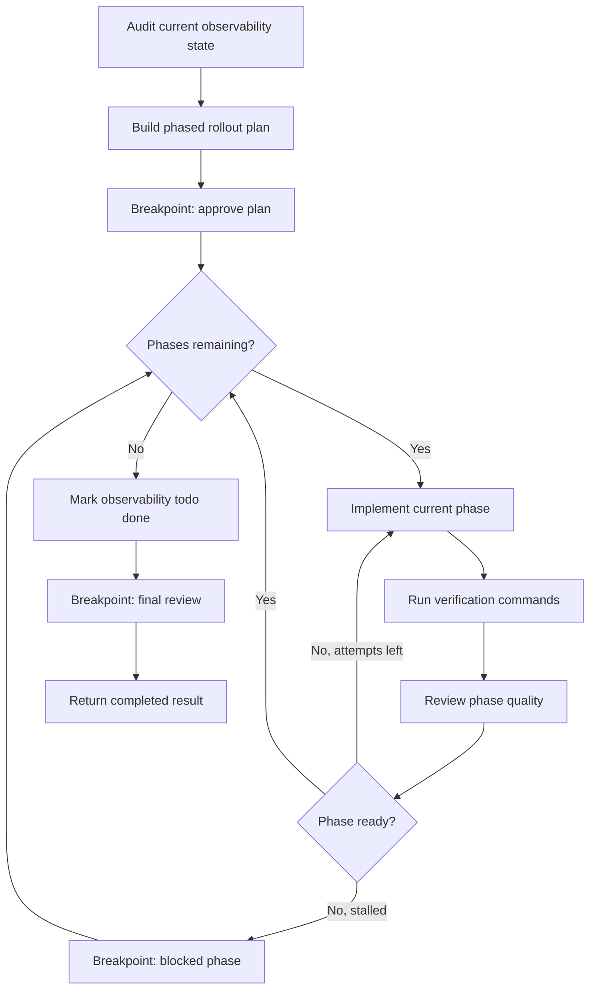

```mermaid
flowchart TD
    A[Audit current observability state] --> B[Build phased rollout plan]
    B --> C[Breakpoint: approve plan]
    C --> D{Phases remaining?}
    D -->|Yes| E[Implement current phase]
    E --> F[Run verification commands]
    F --> G[Review phase quality]
    G --> H{Phase ready?}
    H -->|No, attempts left| E
    H -->|No, stalled| I[Breakpoint: blocked phase]
    I --> D
    H -->|Yes| D
    D -->|No| J[Mark observability todo done]
    J --> K[Breakpoint: final review]
    K --> L[Return completed result]
```
