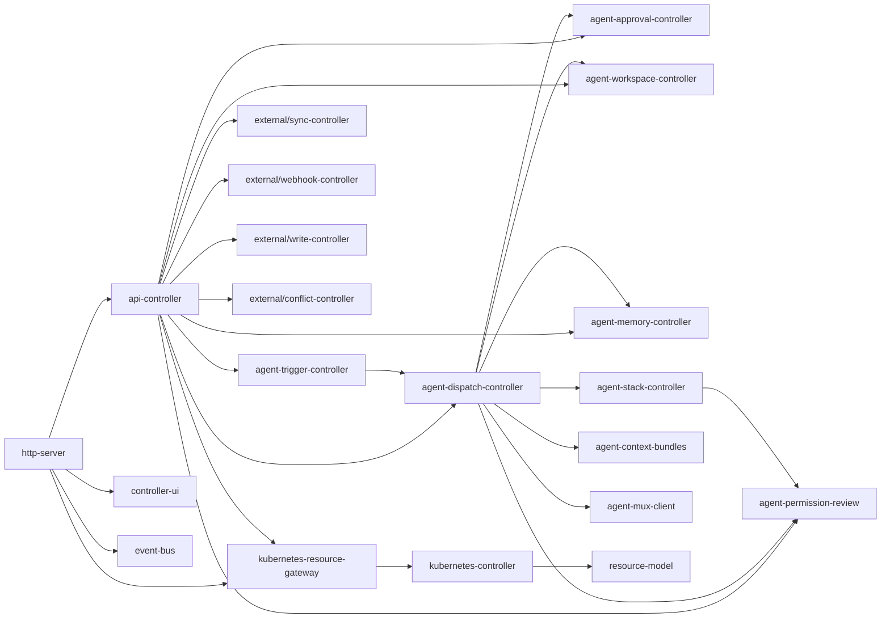
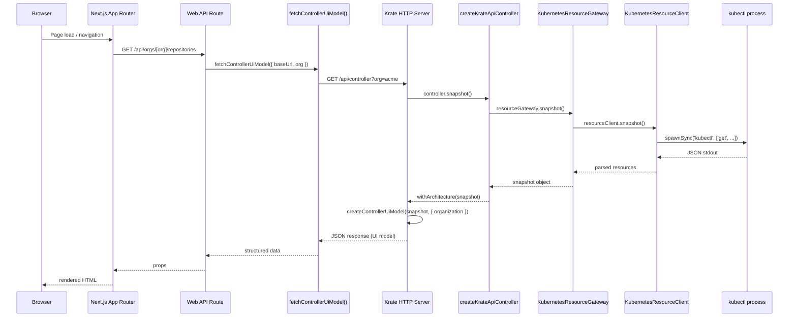
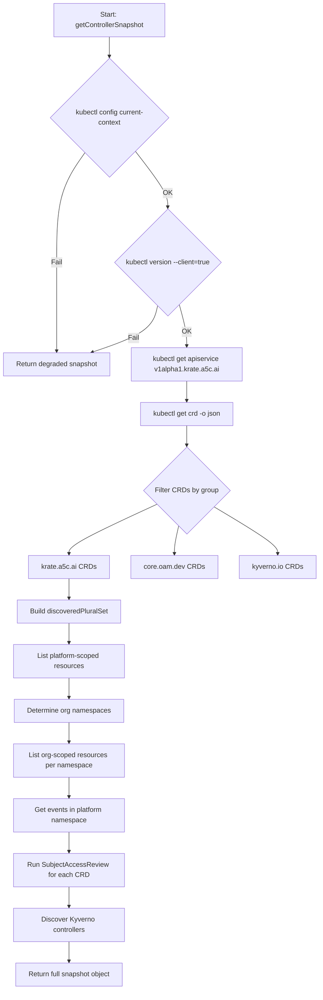
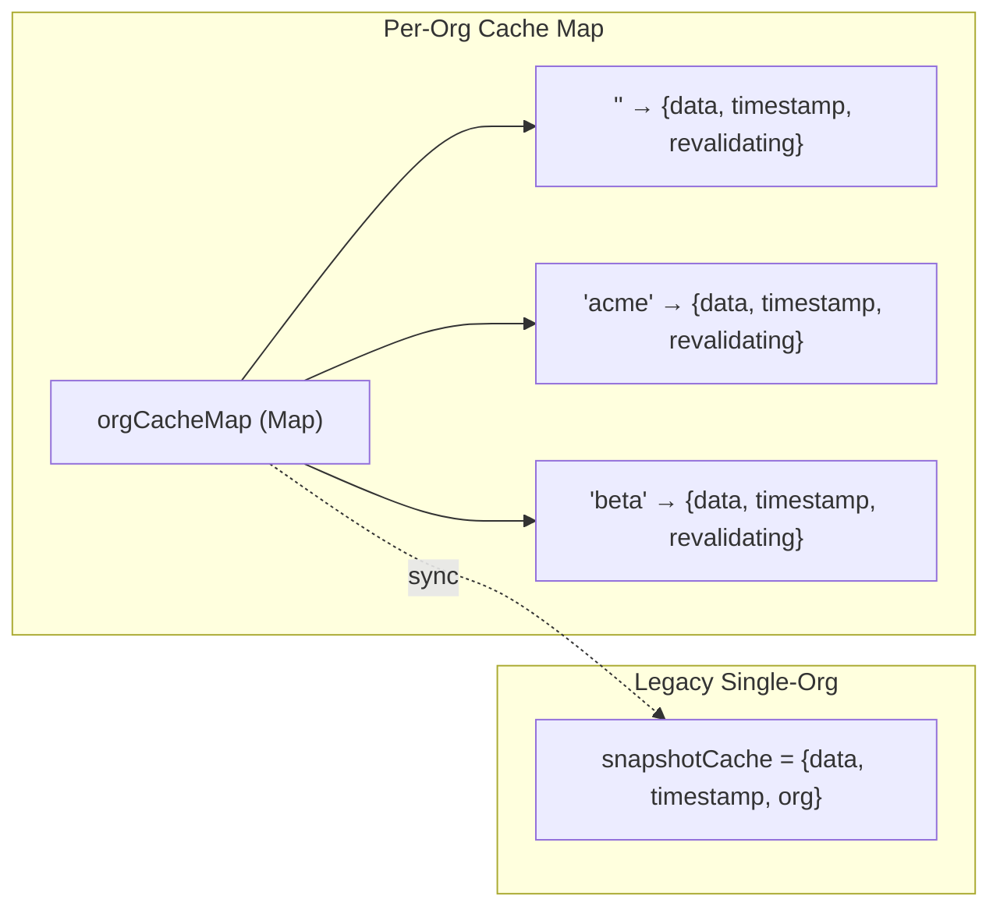
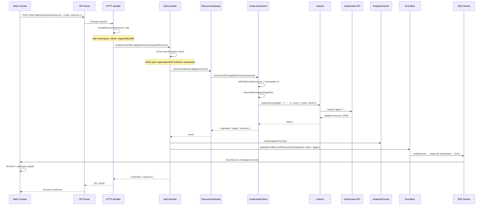
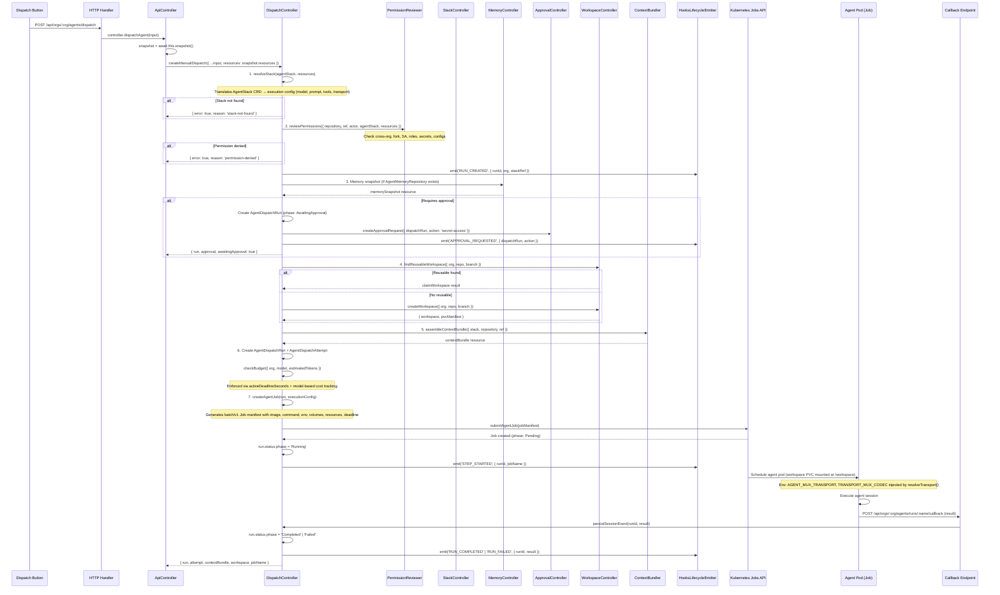
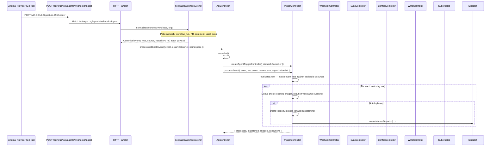
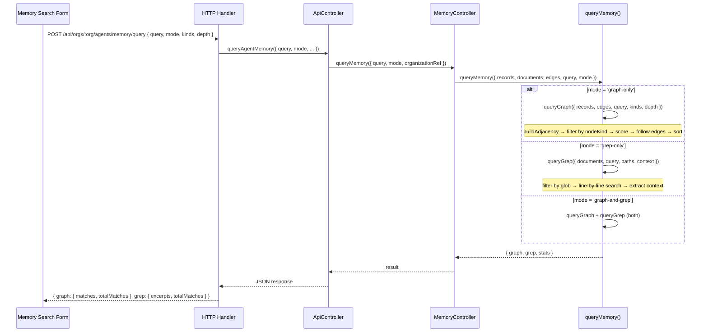
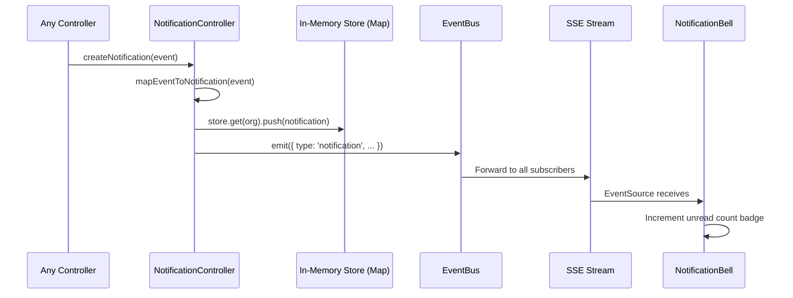

# Krate Architecture Specification v2

> Exhaustive architecture reference derived from implementation source code.
> Source: `packages/krate/core/src/`, `packages/krate/sdk/src/`, `packages/krate/web/`, `packages/krate/cli/`

---

## 1. System Overview

Krate is a Kubernetes-native Git forge runtime built as a monorepo with four packages:

| Package | NPM Name | Role | Path | Dependencies |
|---------|-----------|------|------|--------------|
| **core** | `@a5c-ai/krate` | Resource model, controllers, HTTP API server | `packages/krate/core/` | Zero external (Node.js built-ins only) |
| **sdk** | `@a5c-ai/krate-sdk` | Client SDK re-exporting core helpers for web/CLI consumers | `packages/krate/sdk/` | Re-exports from core |
| **cli** | `@a5c-ai/krate-cli` | CLI entrypoint and MCP server mode | `packages/krate/cli/` | Imports from core |
| **web** | `@a5c-ai/krate-web` | Next.js 16 + React 19 web console | `packages/krate/web/` | Imports from sdk |

**Design principles:**
- Pure ESM JavaScript (Node 20+), zero external runtime dependencies in core
- Kubernetes-first: all resources are K8s API objects (CRDs or aggregated)
- CRD-driven: 76 CustomResourceDefinitions under `krate.a5c.ai/v1alpha1`
- Controller pattern: each domain has a controller with explicit boundary declarations
- Intent-based: controllers produce manifests/specs but never execute kubectl directly

```mermaid
graph TB
    subgraph "Browser"
        WEB[Web Console<br/>Next.js 16 + React 19]
    end

    subgraph "SDK Layer"
        SDK_INDEX[sdk/src/index.js<br/>65+ re-exports]
        ATLAS[sdk/src/atlas-graph-client.js<br/>Stack layer catalog]
    end

    subgraph "Core Controllers"
        HTTP[http-server.js<br/>Node HTTP handler]
        API[api-controller.js<br/>Facade/orchestrator]
        STACK[agent-stack-controller.js]
        DISPATCH[agent-dispatch-controller.js]
        TRIGGER[agent-trigger-controller.js]
        WORKSPACE[agent-workspace-controller.js]
        APPROVAL[agent-approval-controller.js]
        MEMORY[agent-memory-controller.js]
        MEMQ[agent-memory-query.js]
        PERM[agent-permission-review.js]
        AUDIT[audit-controller.js]
        NOTIFY[notification-controller.js]
        RUNNER[runner-controller.js]
        EVENTBUS[event-bus.js]
        CACHE[snapshot-cache.js]
    end

    subgraph "Resource Layer"
        GATEWAY[kubernetes-resource-gateway.js]
        CLIENT[kubernetes-controller.js<br/>kubectl spawning]
        RESMODEL[resource-model.js<br/>76 kinds]
    end

    subgraph "External Subsystem"
        WEBHOOK[external/webhook-controller.js]
        SYNC[external/sync-controller.js]
        CONFLICT[external/conflict-controller.js]
        WRITE[external/write-controller.js]
        GITHUB_ADAPTER[external/github/]
    end

    subgraph "Infrastructure"
        K8S[Kubernetes API<br/>etcd CRD storage]
        PG[PostgreSQL<br/>Aggregated storage]
        GITEA[Gitea<br/>Git hosting]
    end

    WEB --> SDK_INDEX
    SDK_INDEX --> API
    HTTP --> API
    API --> GATEWAY
    API --> DISPATCH
    API --> TRIGGER
    API --> APPROVAL
    API --> MEMORY
    API --> WORKSPACE
    API --> SYNC
    API --> WEBHOOK
    API --> CONFLICT
    API --> WRITE
    DISPATCH --> PERM
    DISPATCH --> STACK
    DISPATCH --> WORKSPACE
    DISPATCH --> APPROVAL
    DISPATCH --> MEMORY
    GATEWAY --> CLIENT
    CLIENT --> K8S
    CLIENT --> PG
    GATEWAY --> GITEA
    EVENTBUS --> HTTP
```



---

## 2. Package Dependency Graph

### 2.1 Import Hierarchy (Strict)

```
web → sdk → core
cli → core
```

The web package NEVER imports directly from core. The SDK acts as the public API surface.

### 2.2 Core Internal Dependencies



### 2.3 Circular Dependency Prevention

- Controllers only import `resource-model.js` and their declared `delegatesTo` modules
- Every controller has a `BOUNDARY` constant declaring what it owns and what it must not own
- The api-controller is the only fan-out point that imports multiple controllers
- No controller imports the api-controller (prevents upward dependency)

---

## 3. Request Lifecycle

### 3.1 From Browser Click to Kubectl Apply



### 3.2 Function Call Chain (Exact)

1. `createKrateHttpHandler()` receives Node.js `IncomingMessage`
2. URL parsed: `new URL(request.url, 'http://localhost')`
3. Route matching via regex: `/^\/api\/orgs\/([^/]+)\/resources$/`
4. Org extracted from URL path segment
5. `createKrateApiController({ namespace: orgNamespaceName(org) })` instantiated per-request
6. Controller method called (e.g., `listResource`, `applyResource`)
7. Cross-org admission check in `applyResource()`: verifies `spec.organizationRef` matches namespace
8. `resourceGateway.apply(resource)` delegates to kubectl
9. `clearSnapshotCache()` invalidates stale data
10. `globalEventBus.emitResourceChange(kind, name, operation)` broadcasts SSE
11. JSON response written via `send(response, status, body)`

---

## 4. Snapshot Pipeline

### 4.1 `getControllerSnapshot()` Step by Step

Source: `packages/krate/core/src/kubernetes-controller.js` lines 352-497



### 4.2 Org Namespace Discovery

```javascript
function organizationNamespaces(organizations, bindings, fallbackNamespace) {
  // 1. Extract namespaceName from Organization specs
  // 2. Extract namespace from OrgNamespaceBinding specs
  // 3. Deduplicate with Set
  // 4. Fallback: KRATE_ADMIN_ORG, KRATE_ORG, or 'default'
}
```

### 4.3 In-Cluster Detection

Source: `inClusterKubectlConfig()` at line 724

When running inside a Kubernetes pod:
- Checks `KUBERNETES_SERVICE_HOST` and `KUBERNETES_SERVICE_PORT`
- Reads `/var/run/secrets/kubernetes.io/serviceaccount/token`
- Reads `/var/run/secrets/kubernetes.io/serviceaccount/ca.crt`
- Adds `--server`, `--certificate-authority`, `--token` args to all kubectl calls

### 4.4 kubectl Execution Model

```javascript
function runKubectl(args, options) {
  // Uses spawnSync (synchronous) for snapshot queries
  // Timeout: KRATE_KUBECTL_TIMEOUT_MS (default 3000ms)
  // Max buffer: KRATE_KUBECTL_MAX_BUFFER_BYTES (default 32MB)
  // windowsHide: true (prevents console flash on Windows)
  // encoding: 'utf8'
}
```

### 4.5 Environment Variables Affecting Snapshot

| Variable | Default | Purpose |
|----------|---------|---------|
| `KRATE_KUBECTL` | `kubectl` | Path to kubectl binary |
| `KRATE_NAMESPACE` | `krate-system` | Platform namespace |
| `KRATE_KUBECTL_TIMEOUT_MS` | `3000` | kubectl spawn timeout |
| `KRATE_KUBECTL_MAX_BUFFER_BYTES` | `33554432` | Max stdout buffer (32MB) |
| `KRATE_DISABLE_IN_CLUSTER_KUBECTL` | `false` | Skip in-cluster detection |
| `KUBECONFIG` | (none) | If set, disables in-cluster mode |
| `KUBERNETES_SERVICE_HOST` | (none) | In-cluster API server host |
| `KUBERNETES_SERVICE_PORT` | `443` | In-cluster API server port |
| `KRATE_SERVICE_ACCOUNT_DIR` | `/var/run/secrets/kubernetes.io/serviceaccount` | SA mount path |
| `KRATE_ORG` | `default` | Fallback org for namespace discovery |
| `KRATE_ADMIN_ORG` | (none) | Admin org for namespace discovery |

---

## 5. Stale-While-Revalidate Cache

Source: `packages/krate/core/src/snapshot-cache.js`

### 5.1 Cache Architecture



### 5.2 TTL Configuration

```javascript
export const CACHE_TTL_MS = Number(process.env.KRATE_SNAPSHOT_CACHE_TTL_MS || 30_000);
```

### 5.3 staleWhileRevalidate Algorithm

```javascript
async function staleWhileRevalidate(org, revalidateFn, swrOptions = {}) {
  const ttlMs = swrOptions.ttlMs ?? CACHE_TTL_MS;        // Fresh window: 30s
  const staleMs = swrOptions.staleMs ?? ttlMs * 5;       // Max stale: 150s

  // CASE 1: Fresh (< 30s old) → return immediately
  // CASE 2: Stale but usable (30s-150s) → return immediately, revalidate in background
  // CASE 3: Stale and revalidating → return stale data (another caller is refreshing)
  // CASE 4: No cache or too old (>150s) → block on revalidation
}
```

### 5.4 Cache Invalidation Triggers

`clearSnapshotCache()` is called on:
- `applyResource()` success
- `applyResourceForOrg()` success
- `deleteResource()` success
- `deleteResourceForOrg()` success

---

## 6. Authentication Flow

### 6.1 Complete OAuth Flow

Source: `packages/krate/core/src/auth.js`

```mermaid
sequenceDiagram
    participant User
    participant Browser
    participant LoginPage as /login page
    participant AuthRoute as /api/auth/github
    participant GitHub as GitHub OAuth
    participant CallbackRoute as /api/auth/callback/github
    participant AuthModule as auth.js
    participant K8s as Kubernetes

    User->>Browser: Click "Sign in with GitHub"
    Browser->>LoginPage: Navigate
    LoginPage->>AuthRoute: GET /api/auth/github
    AuthRoute->>AuthModule: buildAuthorizationRedirect({ provider, requestUrl })
    AuthModule-->>AuthRoute: { url, state, redirectUri }
    AuthRoute->>Browser: 302 Redirect to GitHub

    Browser->>GitHub: GET /login/oauth/authorize?client_id=...&redirect_uri=...&scope=read:user+user:email&state=...
    GitHub->>User: Show authorization prompt
    User->>GitHub: Authorize
    GitHub->>Browser: 302 Redirect to /api/auth/callback/github?code=ABC&state=...

    Browser->>CallbackRoute: GET /api/auth/callback/github?code=ABC&state=...
    CallbackRoute->>AuthModule: exchangeOAuthCodeForProfile({ provider, code, requestUrl })
    AuthModule->>GitHub: POST /login/oauth/access_token (code + client_secret)
    GitHub-->>AuthModule: { access_token: "gho_..." }
    AuthModule->>GitHub: GET /user (Authorization: Bearer gho_...)
    GitHub-->>AuthModule: { login, id, email, name }
    AuthModule->>AuthModule: normalizeProviderProfile(provider, profile)
    AuthModule-->>CallbackRoute: { provider, subject, email, displayName, username, groups, admin }

    CallbackRoute->>AuthModule: registerLoginProfile({ controller, namespace, profile })
    AuthModule->>K8s: applyResource(User)
    AuthModule->>K8s: applyResource(IdentityMapping)
    CallbackRoute->>AuthModule: createSessionCookie(config, profile, { secret })
    AuthModule-->>CallbackRoute: "krate_session=base64url.hmac; Path=/; HttpOnly; SameSite=Lax"
    CallbackRoute->>Browser: Set-Cookie + 302 to /orgs/[org]
```

### 6.2 Session Cookie Structure

```
krate_session = base64url(payload) . hmac_sha256_base64url(payload, secret)
```

Payload JSON:
```json
{ "provider": "github", "subject": "12345", "user": "octocat" }
```

### 6.3 Session Verification

```javascript
function parseSessionCookie(config, cookieValue, options) {
  // 1. Split on first '.' → [payload, signature]
  // 2. If signed + no secret: reject (null)
  // 3. If unsigned + secret configured: reject (null)
  // 4. If signed + secret: compute expected HMAC, timingSafeEqual
  // 5. If match: decode base64url → JSON.parse → extract user/subject/provider
  // 6. Return { cookieName, provider, subject, user } or null
}
```

### 6.4 Delegated Identity (Proxy Auth)

Headers examined:
- `x-forwarded-user` (configurable via `KRATE_AUTH_DELEGATED_USER_HEADER`)
- `x-forwarded-groups` (configurable via `KRATE_AUTH_DELEGATED_GROUPS_HEADER`)
- `x-forwarded-email` (configurable via `KRATE_AUTH_DELEGATED_EMAIL_HEADER`)

Local development auto-login:
- Active when `NODE_ENV !== 'production'` (or `KRATE_AUTH_DELEGATED_LOCAL_DEVELOPMENT=true`)
- Default user: `KRATE_AUTH_DELEGATED_LOCAL_USER` or `'local-developer'`
- Default groups: `KRATE_AUTH_DELEGATED_LOCAL_GROUPS` or `'krate:repo-admins'`

### 6.5 Admin Detection

Admin status is derived from group membership:
```javascript
admin: groups.includes('krate:platform-engineers') || groups.includes('krate:repo-admins')
```

### 6.6 All Auth Environment Variables

| Variable | Default | Purpose |
|----------|---------|---------|
| `KRATE_AUTH_COOKIE_NAME` | `krate_session` | Cookie name |
| `KRATE_SESSION_SECRET` | `''` | HMAC signing secret |
| `KRATE_AUTH_GITHUB_ENABLED` | `true` | Enable GitHub provider |
| `KRATE_AUTH_GITHUB_CLIENT_ID` | `''` | OAuth client ID |
| `KRATE_AUTH_GITHUB_CLIENT_SECRET` | `''` | OAuth client secret |
| `KRATE_AUTH_GITHUB_AUTHORIZATION_URL` | `https://github.com/login/oauth/authorize` | Auth endpoint |
| `KRATE_AUTH_GITHUB_TOKEN_URL` | `https://github.com/login/oauth/access_token` | Token endpoint |
| `KRATE_AUTH_GITHUB_USERINFO_URL` | `https://api.github.com/user` | Profile endpoint |
| `KRATE_AUTH_GITHUB_SCOPES` | `read:user user:email` | OAuth scopes |
| `KRATE_AUTH_SSO_ENABLED` | `false` | Enable OIDC provider |
| `KRATE_AUTH_SSO_PROVIDER_NAME` | `Workspace SSO` | Display label |
| `KRATE_AUTH_SSO_ISSUER_URL` | `''` | OIDC issuer |
| `KRATE_AUTH_SSO_CLIENT_ID` | `''` | OIDC client ID |
| `KRATE_AUTH_SSO_CLIENT_SECRET` | `''` | OIDC client secret |
| `KRATE_AUTH_SSO_AUTHORIZATION_URL` | `''` | OIDC auth endpoint |
| `KRATE_AUTH_SSO_TOKEN_URL` | `''` | OIDC token endpoint |
| `KRATE_AUTH_SSO_USERINFO_URL` | `''` | OIDC profile endpoint |
| `KRATE_AUTH_SSO_SCOPES` | `openid profile email groups` | OIDC scopes |
| `KRATE_AUTH_DELEGATED_IDENTITY_ENABLED` | `false` | Enable proxy auth |
| `KRATE_AUTH_DELEGATED_USER_HEADER` | `x-forwarded-user` | User header |
| `KRATE_AUTH_DELEGATED_GROUPS_HEADER` | `x-forwarded-groups` | Groups header |
| `KRATE_AUTH_DELEGATED_EMAIL_HEADER` | `x-forwarded-email` | Email header |
| `KRATE_AUTH_DELEGATED_LOCAL_DEVELOPMENT` | auto | Enable local dev fallback |
| `KRATE_AUTH_DELEGATED_LOCAL_USER` | `local-developer` | Dev username |
| `KRATE_AUTH_DELEGATED_LOCAL_EMAIL` | `''` | Dev email |
| `KRATE_AUTH_DELEGATED_LOCAL_GROUPS` | `krate:repo-admins` | Dev groups |
| `KRATE_ADMIN_ORG` | (none) | Bootstrap admin org |
| `KRATE_ADMIN_USERNAME` | (none) | Bootstrap admin user |

---

## 7. Resource Lifecycle

### 7.1 From UI Form Submit to SSE Update



### 7.2 scopeResource Function

```javascript
function scopeResource(resource, org) {
  const namespace = orgNamespaceName(org);  // 'krate-org-acme'
  return {
    ...resource,
    metadata: {
      ...(resource.metadata || {}),
      namespace,
      labels: {
        ...(resource.metadata?.labels || {}),
        'krate.a5c.ai/org': org,
        'krate.a5c.ai/namespace': namespace
      }
    },
    spec: { ...(resource.spec || {}), organizationRef: org }
  };
}
```

### 7.3 Cross-Org Admission

In `applyResource()`:
```javascript
const resourceOrg = resource.spec?.organizationRef;
const resourceNs = resource.metadata?.namespace;
if (resourceOrg) {
  const expectedNs = orgNamespaceName(resourceOrg);
  if (resourceNs && resourceNs !== expectedNs) {
    throw new Error(`Cross-org namespace mismatch`);
  }
}
```

In `deleteResourceForOrg()`:
```javascript
// Verify existing resource namespace matches org
if (!resourceNs || resourceNs !== orgNs) {
  throw new Error(`Cross-org denial`);
}
```

---

## 8. Agent Dispatch Lifecycle

### 8.1 Complete Flow (K8s Job-Based)

Source: `packages/krate/core/src/agent-dispatch-controller.js`

Agents are dispatched as Kubernetes `batch/v1` Jobs (not subprocesses or direct
Agent Mux HTTP calls). Each dispatch creates a Job manifest via `createAgentJob()`,
submits it to Kubernetes via `submitAgentJob()`, and waits for the agent pod to
POST its result to the callback endpoint.



### 8.2 K8s Job Manifest Structure

`createAgentJob(run, executionConfig)` produces a `batch/v1` Job manifest with
the following structure:

```javascript
{
  apiVersion: 'batch/v1',
  kind: 'Job',
  metadata: {
    name: `agent-${run.metadata.name}`,
    namespace: run.metadata.namespace,
    labels: {
      'krate.a5c.ai/org': org,
      'krate.a5c.ai/dispatch-run': run.metadata.name,
      'krate.a5c.ai/agent-job': 'true'
    }
  },
  spec: {
    activeDeadlineSeconds: budgetDeadline,  // budget enforcement
    backoffLimit: 0,                         // no automatic retry (krate handles retries)
    template: {
      spec: {
        serviceAccountName: executionConfig.serviceAccountName,
        restartPolicy: 'Never',
        containers: [{
          name: 'agent',
          image: executionConfig.agentImage,
          command: executionConfig.command,
          env: [
            { name: 'AGENT_MUX_TRANSPORT', value: resolvedTransport.transport },
            { name: 'TRANSPORT_MUX_CODEC',  value: resolvedTransport.codec },
            { name: 'KRATE_CALLBACK_URL',   value: callbackUrl },
            { name: 'KRATE_RUN_ID',         value: run.metadata.name },
            // ...stack-specific env vars
          ],
          resources: executionConfig.resourceRequests,
          volumeMounts: [{ name: 'workspace', mountPath: '/workspace' }]
        }],
        volumes: [{
          name: 'workspace',
          persistentVolumeClaim: { claimName: workspace.spec.pvcName }
        }]
      }
    }
  }
}
```

### 8.3 Transport Resolution and Codec Injection

`resolveTransport(stack, resources)` reads the `AgentTransportBinding` referenced
by the stack's adapter and produces the environment variables injected into the Job:

| Variable | Source | Example |
|----------|--------|---------|
| `AGENT_MUX_TRANSPORT` | `binding.spec.protocol` | `'websocket'` |
| `TRANSPORT_MUX_CODEC` | `binding.spec.codec ?? 'json'` | `'json'` |

The agent pod reads these variables at startup to configure its message framing
and connection lifecycle. No agent code changes are needed when switching transports.

### 8.4 Budget Enforcement

`checkBudget({ org, model, estimatedTokens })` runs before Job creation:

1. Load `AgentProviderConfig` for the stack's model/provider
2. Compute `estimateCost(model, estimatedTokens)` using model-based rate tables
3. Compare against `org.spec.budgetLimitUsd` or a default ceiling
4. If over budget: return `{ allowed: false, reason: 'budget-exceeded' }` — dispatch aborted
5. If within budget: set `activeDeadlineSeconds` on the Job spec proportional to the
   remaining budget at the model's token rate

This ensures agent pods are automatically terminated by Kubernetes if they run
longer than the budget allows, even without an explicit callback.

### 8.5 Callback-Based Result Collection

The agent pod calls `POST /api/orgs/:org/agents/runs/:name/callback` when the
session completes:

```
POST /api/orgs/{org}/agents/runs/{name}/callback
Authorization: Bearer <krate-run-token>
Content-Type: application/json

{
  "phase": "Succeeded" | "Failed",
  "exitCode": 0 | 1,
  "artifacts": [...],
  "costUsd": 0.042,
  "errorMessage": "..." // present on failure
}
```

`persistSessionEvent(runId, result)` applies the callback payload to the
`AgentDispatchRun` and `AgentSession` resources, then emits the appropriate
hooks lifecycle event.

### 8.6 Hooks Lifecycle Events

`createHooksLifecycleEmitter(bus)` wraps the internal event bus and emits
9 lifecycle events:

| Event | Trigger |
|-------|---------|
| `RUN_CREATED` | `createManualDispatch()` called |
| `RUN_QUEUED` | Run enters `Queued` phase (budget check pending) |
| `RUN_STARTED` | Job submitted to K8s, pod scheduled |
| `STEP_STARTED` | Agent pod reports a tool-use or reasoning step |
| `STEP_COMPLETED` | Agent pod reports step completion |
| `APPROVAL_REQUESTED` | `createApprovalRequest()` called |
| `APPROVAL_GRANTED` | `recordDecision()` with `Approved` |
| `APPROVAL_DENIED` | `recordDecision()` with `Denied` |
| `RUN_COMPLETED` | Callback received with `phase: Succeeded` |
| `RUN_FAILED` | Callback received with `phase: Failed`, or Job deadline exceeded |

These events flow to registered `WebhookSubscription` endpoints and the
notification system.

### 8.7 Permission Review Steps

1. Resolve AgentStack from resources via `resolveStack()`
2. Validate approvalMode (yolo/prompt/deny)
3. Cross-org denial: agent org vs repository org
4. Expand capabilities from stack spec (tools, MCP, skills, subagents)
5. Untrusted fork detection (`refs/pull/\d+/`)
6. Check AgentServiceAccount binding
7. Check AgentRoleBinding for subject
8. Check AgentSecretGrant for agent
9. Check AgentConfigGrant for agent
10. Compute decision: `allowed`, `requires-approval`, or `denied`

### 8.8 Decision Matrix

| approvalMode | Errors | Fork | Decision |
|-------------|--------|------|----------|
| `deny` | any | any | `denied` |
| `yolo` | none | false | `allowed` |
| `yolo` | none | true | `allowed` (warnings only) |
| `prompt` | none | false | `requires-approval` |
| `prompt` | none | true | `requires-approval` |
| any | has errors | any | `denied` |

---

## 9. External Sync Pipeline

### 9.1 Complete Flow



### 9.2 Webhook Event Normalization

Source: `normalizeWebhookEvent()` in `http-server.js`

| GitHub Action/Shape | Krate Event Type | Source Kind |
|--------------------|-----------------|-------------|
| `completed` + `workflow_run.conclusion=failure` | `ci-failure` | Pipeline |
| `opened` + `pull_request` | `pr-opened` | PullRequest |
| `created` + `comment` | `comment` | Issue/PullRequest |
| `labeled` | `label-added` | Issue/PullRequest |
| `opened` + `issue` (no PR) | `issue-created` | Issue |
| `ref` + `commits` | `push` | Repository |
| (fallback) | `webhook` | WebhookDelivery |

### 9.3 HMAC Verification

Source: `external/webhook-controller.js`

```javascript
verifyHmacSignature(body, signature) {
  // 1. Reject if no signature header
  // 2. Reject if not prefixed with 'sha256='
  // 3. Compute expected: 'sha256=' + createHmac('sha256', secret).update(body).digest('hex')
  // 4. timingSafeEqual(Buffer.from(expected), Buffer.from(signature))
  // 5. Return { valid: true/false, reason }
}
```

### 9.4 Sync Controller Ownership Modes

| Mode | Krate Writes | External Writes |
|------|-------------|-----------------|
| `bidirectional` | Allowed | Allowed |
| `external-owned` | Blocked | Allowed |
| `krate-owned` | Allowed | Blocked |

### 9.5 Watermark Tracking

- Per-binding watermark stored as ISO timestamp
- Only advances forward (new timestamp must be > current)
- Persisted as `ExternalSyncWatermark` CRD resource

---

## 10. Memory Query Pipeline

### 10.1 From Search Form to Results



### 10.2 Graph Scoring Algorithm

```javascript
function scoreRecord(record, lowerQuery) {
  const id = String(record.id || '').toLowerCase();
  const attrs = JSON.stringify(record.attributes || {}).toLowerCase();
  if (id.includes(lowerQuery)) return 2;   // ID match: higher priority
  if (attrs.includes(lowerQuery)) return 1; // Attribute match
  return 0;                                  // No match
}
```

### 10.3 Edge Traversal (BFS)

```javascript
function followEdges(startId, adjacency, maxDepth) {
  // BFS from startId up to maxDepth hops
  // visited Set prevents cycles
  // Returns flat array of all encountered edges
}
```

### 10.4 Grep Highlighting

Match output format:
```javascript
{
  path: 'docs/design.md',
  lineNumber: 42,
  line: 'The agent memory stores knowledge graphs...',
  highlighted: 'The agent **memory** stores knowledge graphs...',
  context: '...\nThe agent memory stores knowledge graphs...\n...',
  contextStart: 41,
  contextEnd: 43
}
```

---

## 11. Workspace Provisioning

### 11.1 PVC-Based Provisioning

Source: `packages/krate/core/src/agent-workspace-controller.js`

```mermaid
flowchart TD
    A[Dispatch trigger] --> B{Find reusable workspace?}
    B -->|Yes: same repo+branch+Ready| C[claimWorkspace]
    B -->|No| D[createWorkspace]

    C --> E[Mark phase=InUse, set runRef]
    D --> F[Generate workspace name]
    F --> G[Generate PVC manifest]
    G --> H[Create KrateWorkspace resource]

    E --> I[getMountSpec]
    H --> I

    I --> J[Return { volume, volumeMount }]
    J --> K[Attach to AgentDispatchRun.spec.mountSpec]
```

### 11.2 PVC Manifest Structure

```javascript
{
  apiVersion: 'v1',
  kind: 'PersistentVolumeClaim',
  metadata: {
    name: 'krate-ws-<workspace-name>',
    namespace: '<org-namespace>',
    labels: {
      'krate.a5c.ai/workspace': '<workspace-name>',
      'krate.a5c.ai/org': '<org>'
    }
  },
  spec: {
    storageClassName: 'standard',  // configurable via volumeSpec.storageClassName
    accessModes: ['ReadWriteOnce'],  // configurable
    resources: { requests: { storage: '10Gi' } }  // configurable via volumeSpec.capacity
  }
}
```

### 11.3 Codespace Pod Spec

When `launchCodespace()` is called:
- Image: `codercom/code-server:latest` (configurable)
- CPU: 1 core limit, 250m request
- Memory: 2Gi limit, 512Mi request
- Port: 8080
- Volume: PVC mount at `/workspace`
- Env: `KRATE_WORKSPACE`, `KRATE_ORG`, `GIT_AUTHOR_NAME`, `GIT_AUTHOR_EMAIL`
- Service: ClusterIP on port 8080
- URL pattern: `http://codespace-svc-<ws>.<namespace>.svc.cluster.local:8080`

### 11.4 Workspace Phase Transitions

```
Pending → Ready → InUse → Ready (release)
                        → Archived (archive)
                        → Terminating (delete)
Archived → Active (recover)
```

---

## 12. Notification Pipeline

Source: `packages/krate/core/src/notification-controller.js`

### 12.1 Event-to-Notification Mapping

| Source Event Type | Notification Type | Severity |
|-------------------|------------------|----------|
| `AgentDispatchRun` (completed) | `run-complete` | info |
| `AgentDispatchRun` (failed) | `run-complete` | error |
| `AgentApproval` (pending) | `approval-needed` | warning |
| `ExternalSyncConflict` | `conflict-detected` | warning |
| `KrateWorkspace` (claimed) | `workspace-ready` | info |
| (default) | `system` | info |

### 12.2 Notification Delivery Flow



### 12.3 User Preferences

Default preferences:
```javascript
{ runs: true, approvals: true, conflicts: true, workspaces: true, sound: false, desktop: false }
```

---

## 13. Event Bus and SSE Streaming

### 13.1 Event Bus Implementation

Source: `packages/krate/core/src/event-bus.js`

- Uses a `Set<Function>` for listeners (O(1) add/remove)
- `emit(event)` iterates all listeners synchronously
- `emitResourceChange(kind, name, operation)` adds timestamp
- Global singleton: `globalEventBus`

### 13.2 SSE Endpoint

Route: `GET /api/orgs/:org/agents/events/stream`

Response headers:
```
Content-Type: text/event-stream
Cache-Control: no-cache
Connection: keep-alive
X-Accel-Buffering: no
```

Protocol:
1. Initial: `data: {"type":"connected"}\n\n`
2. Every 30s: `data: {"type":"heartbeat"}\n\n`
3. On resource change: `data: {"type":"resource-change","kind":"...","name":"...","operation":"apply","timestamp":"..."}\n\n`
4. On client disconnect: `clearInterval(heartbeat)`, `globalEventBus.unsubscribe(writer)`

---

## 14. Async Utilities

Source: `packages/krate/core/src/async-controller.js`

### 14.1 Event Batcher

```javascript
createEventBatcher(handler, { maxBatchSize: 50, flushIntervalMs: 1000 })
```

Behavior:
- Accumulates events in array
- Flushes when `batch.length >= maxBatchSize` (fire-and-forget)
- Flushes on timer (setTimeout) when batch has items but below threshold
- `flush()` forces immediate flush (awaitable)
- `stop()` clears timer and buffer

### 14.2 Retry Policy

```javascript
createRetryPolicy({ maxRetries: 3, baseDelayMs: 1000, maxDelayMs: 30000, jitter: true })
```

Delay formula: `min(baseDelayMs * 2^attempt, maxDelayMs)` with optional full-jitter `[0, capped]`

### 14.3 Delivery Queue

```javascript
createDeliveryQueue(processor, { concurrency: 5, retryPolicy })
```

- In-memory ordered queue
- Up to `concurrency` items processed in parallel
- Each item retried per retryPolicy on failure
- `drain()` returns Promise that resolves when queue is empty and all active items complete
- `stop()` clears queue and resolves all drain waiters

### 14.4 Checkpointer

```javascript
createCheckpointer(storage = new Map())
```

Simple key-value store: `save(key, value)`, `load(key)`, `clear(key)`, `listKeys()`

---

## 15. Controller Boundary Declarations

Every controller exports a frozen boundary object. This serves as both documentation and runtime introspection.

| Controller | Source File | Role | Owns | Must Not Own |
|-----------|-------------|------|------|--------------|
| KubernetesResourceClient | `kubernetes-controller.js` | kubectl execution | command exec, API discovery, access checks, watch streams | HTTP routes, pages, forge DTOs |
| KrateKubernetesReconciler | `kubernetes-controller.js` | Resource reconciliation | repo status, identity projection, hosting intent, policy sync | HTTP routes, pages, API DTOs |
| KubernetesResourceGateway | `kubernetes-resource-gateway.js` | API port delegation | resource definitions, CRUD delegation, namespace scoping | HTTP routes, page flows, reconciliation |
| KrateApiController | `api-controller.js` | HTTP facade | validation, DTOs, errors, workflow affordances, UI snapshots | kubectl execution, reconciliation loops |
| AgentStackController | `agent-stack-controller.js` | Stack readiness | capability resolution, conditions, readiness, MCP health | secrets, dispatch execution, Mux sessions |
| AgentDispatchController | `agent-dispatch-controller.js` | Dispatch orchestration | dispatch creation, attempt lifecycle, session binding, workspace | secrets, UI rendering |
| AgentWorkspaceController | `agent-workspace-controller.js` | Workspace provisioning | workspace creation, PVC gen, git specs, mount specs, reuse, codespace | git execution, K8s API, secrets |
| AgentTriggerController | `agent-trigger-controller.js` | Event routing | normalization, rule matching, trigger records, dispatch initiation | event sourcing, webhook delivery |
| AgentApprovalController | `agent-approval-controller.js` | Approval gates | approval creation, decision recording, lookup, dedup | secrets, agent execution, UI |
| AgentMemoryQuery | `agent-memory-query.js` | Query execution | graph traversal, filtering, scoring, grep, context extraction | persistence, HTTP, K8s, secrets |
| WebhookController | `external/webhook-controller.js` | Inbound webhooks | HMAC validation, delivery records, dedup, event queue | resource persistence, ownership |
| SyncController | `external/sync-controller.js` | External sync | normalization, upsert, watermarks, ownership, tombstones | HMAC, webhook delivery |
| ConflictController | `external/conflict-controller.js` | Conflict detection | detection, resolution, superseded cleanup | write intent, sync scheduling |
| WriteController | `external/write-controller.js` | Write intents | creation, approval gate, retry, idempotency | conflict resolution, sync state |
| AuditController | `audit-controller.js` | Audit log | event recording, streaming, replay, metrics | identity, storage, git |
| RunnerController | `runner-controller.js` | Runner pools | pool validation, lifecycle, scheduling, pod specs, capacity | K8s API calls, actual pod creation |
| NotificationController | `notification-controller.js` | Notifications | creation, listing, read state, preferences | event dispatch, UI rendering, push |
| PermissionReviewer | `agent-permission-review.js` | Permission review | capability expansion, grant resolution, snapshot creation | secrets, K8s API, runtime execution |

---

## 16. Concurrency Model

### 16.1 Single-Threaded Event Loop

Krate core runs on Node.js's single-threaded event loop:
- All kubectl calls use `spawnSync` (blocking) during snapshot collection
- API request handling is async (Node HTTP server)
- Background revalidation uses `Promise.resolve().then(...)` (microtask)
- No worker threads or clustering in the core package

### 16.2 Concurrent Access Patterns

| Pattern | Mechanism |
|---------|-----------|
| Multiple orgs cached | Per-org Map entries, independent TTLs |
| SSE connections | Set of listener functions, one per connection |
| Background revalidation | `revalidating` flag prevents thundering herd |
| Event bus | Synchronous iteration over Set (no races) |
| Audit store | Append-only array, seq counter |
| Notification store | Per-org array, no locking needed |

---

## 17. Error Handling Strategy

### 17.1 HTTP Layer

```javascript
try {
  // Route matching and handler execution
} catch (error) {
  return send(response, 400, { error: 'bad_request', message: error.message });
}
```

All unhandled errors in route handlers become 400 responses.

### 17.2 Controller Layer

Controllers return error objects instead of throwing:
```javascript
{ error: true, reason: 'stack-not-found', message: 'AgentStack not found' }
```

### 17.3 kubectl Layer

- `allowFailure: true` — returns `{ ok: false }`, caller decides
- `allowFailure: false` — throws Error with `commandFailure()` message

### 17.4 Audit Event Failures

```javascript
function emitAuditEvent(resource, operation) {
  try { ... } catch { /* Audit failures must not crash apply operations */ }
}
```

### 17.5 Background Revalidation Failures

```javascript
try { const fresh = await revalidateFn(); ... }
catch { orgCacheMap.set(key, { ...current, revalidating: false }); }
```

---

## 18. Deployment Architecture

### 18.1 Container Topology

| Container | Port | Role |
|-----------|------|------|
| api | 3080 | HTTP API server (`krate serve`) |
| controllers | — | Background reconciliation (future) |
| web | 3000 | Next.js web console |
| webhook-worker | — | Inbound webhook processing |

### 18.2 CRD Management

- 76 CRDs under `krate.a5c.ai/v1alpha1`
- All use `x-kubernetes-preserve-unknown-fields: true`
- All namespaced
- Platform resources (Organization, OrgNamespaceBinding) in `krate-system`
- Org resources in `krate-org-<slug>` namespaces

### 18.3 Infrastructure Requirements

| Component | Purpose |
|-----------|---------|
| AKS (or compatible K8s) | Container orchestration |
| ACR (or registry) | Image storage |
| cert-manager | TLS provisioning |
| nginx ingress | HTTP routing |
| PostgreSQL | Aggregated resource storage |
| Gitea | Git hosting backend |
| Kyverno (optional) | Policy engine |
| KubeVela (optional) | Application delivery |

---

## 19. Data Storage Boundaries

| Storage Backend | Resource Count | Access Pattern |
|----------------|---------------|----------------|
| etcd (CRDs) | 44 CONFIG kinds | kubectl get/apply/delete |
| PostgreSQL | 32 AGGREGATED kinds | In-memory during dev, runtime queries |
| Gitea | Repository content | HTTP API, SSH |
| In-memory | Notifications, audit, runners | Per-process, non-persistent |
| Snapshot cache | Derived views | Stale-while-revalidate |

---

## 20. Configuration Reference

### 20.1 Core Server

| Variable | Default | Purpose |
|----------|---------|---------|
| `KRATE_NAMESPACE` | `krate-system` | Platform namespace |
| `KRATE_ORG` | `default` | Default organization |
| `KRATE_SNAPSHOT_CACHE_TTL_MS` | `30000` | Cache freshness TTL |
| `KRATE_GITEA_HTTP_URL` | (none) | Gitea API base URL |

### 20.2 External Integrations

| Variable | Default | Purpose |
|----------|---------|---------|
| `KRATE_KYVERNO_MODE` | auto | Kyverno integration mode |
| `KRATE_KYVERNO_ENABLED` | (none) | Enable BYO Kyverno |
| `KRATE_KYVERNO_NAMESPACE` | `kyverno` | Kyverno deployment namespace |
| `KRATE_KYVERNO_POLICY_NAMESPACE` | platform ns | Policy storage namespace |
| `KRATE_KUBEVELA_NAMESPACE` | `vela-system` | KubeVela system namespace |

### 20.3 Runtime Identity

| Variable | Default | Purpose |
|----------|---------|---------|
| `KRATE_SERVICE_ACCOUNT_DIR` | `/var/run/secrets/kubernetes.io/serviceaccount` | SA mount |
| `KRATE_SERVICE_ACCOUNT_TOKEN` | `<SA_DIR>/token` | Token file path |
| `KRATE_SERVICE_ACCOUNT_CA` | `<SA_DIR>/ca.crt` | CA cert path |

---

## 21. Resource Reconciliation Deep Dive

> Source: `packages/krate/core/src/kubernetes-controller.js`

### 21.1 KRATE_RESOURCES Array

The `KRATE_RESOURCES` array (exported at module level) defines every resource the Krate control plane manages. Each entry carries the following fields:

| Field | Type | Meaning |
|-------|------|---------|
| `kind` | string | PascalCase K8s kind (e.g. `'Organization'`) |
| `plural` | string | Lowercase plural used in kubectl (e.g. `'organizations'`) |
| `group` | string? | API group. Defaults to `krate.a5c.ai` when absent. KubeVela uses `core.oam.dev`, core K8s uses `''`. |
| `namespaced` | boolean | Whether the resource lives in a namespace (`true`) or is cluster-scoped (`false`) |
| `namespace` | string? | Fixed namespace override (e.g. `'krate-system'` for platform resources, `'vela-system'` for KubeVela defs) |
| `storage` | string | Backend store: `'etcd'`, `'postgres'`, `'kubevela'`, `'kyverno'`, `'kyverno-reports'`, or `'core'` |
| `platformScoped` | boolean? | When `true`, listed only from the platform namespace — not from per-org namespaces |

**Resource categories and counts:**

| Storage | Count | Examples |
|---------|-------|----------|
| etcd (Krate CRDs) | 46 | Organization, User, Team, Repository, AgentStack, AgentSubagent, AgentToolProfile, AgentMcpServer, AgentSkill, AgentTriggerRule, AgentContextLabel, KrateWorkspacePolicy, AgentServiceAccount, AgentRoleBinding, AgentSecretGrant, AgentConfigGrant, AgentAdapter, AgentTransportBinding, AgentProviderConfig, KrateProject, AgentGatewayConfig, AgentMemoryRepository, AgentMemorySource, AgentMemoryOntology, AgentMemoryAssociation, ExternalBackendProvider, ExternalBackendBinding, ExternalBackendSyncPolicy |
| postgres (aggregated) | 13 | PullRequest, Issue, Review, Pipeline, Job, WebhookDelivery, AgentDispatchRun, AgentDispatchAttempt, AgentSession, AgentContextBundle, KrateArtifact, AgentApproval, KrateWorkspace, AgentTriggerExecution, KrateWorkspaceRuntime, AgentSessionTranscript |
| kubevela | 11 | KubeVelaApplication, KubeVelaApplicationRevision, KubeVelaComponentDefinition, KubeVelaWorkloadDefinition, KubeVelaTraitDefinition, KubeVelaScopeDefinition, KubeVelaPolicyDefinition, KubeVelaPolicy, KubeVelaWorkflowStepDefinition, KubeVelaWorkflow, KubeVelaResourceTracker |
| kyverno / kyverno-reports | 10 | KyvernoPolicy, KyvernoClusterPolicy, KyvernoValidatingPolicy, KyvernoMutatingPolicy, KyvernoGeneratingPolicy, KyvernoDeletingPolicy, KyvernoImageValidatingPolicy, KyvernoPolicyException, PolicyReport, ClusterPolicyReport |
| core (K8s built-in) | 2 | Secret, ConfigMap — excluded from snapshot, accessed on-demand |

**Platform-scoped definitions** (only listed from `krate-system`):
- `Organization` (namespace: `KRATE_PLATFORM_NAMESPACE`)
- `OrgNamespaceBinding` (namespace: `KRATE_PLATFORM_NAMESPACE`)

### 21.2 getControllerSnapshot() — Step-by-Step

`getControllerSnapshot(options)` is the synchronous entrypoint (uses `spawnSync`) that produces the full cluster state snapshot.

#### Step 1: currentContextResult()

```javascript
function currentContextResult(options) {
  const inCluster = inClusterKubectlConfig(options.env);
  if (inCluster) return { ok: true, stdout: `${inCluster.context}\n`, ... };
  return runKubectl(['config', 'current-context'], { ...options, allowFailure: true });
}
```

Checks for in-cluster mode first (via `KUBERNETES_SERVICE_HOST` + service account files at `/var/run/secrets/kubernetes.io/serviceaccount/`). If found, returns synthetic result with context `'in-cluster'`. Otherwise runs `kubectl config current-context`.

**Failure mode:** Returns `{ ok: false }` — snapshot proceeds to build a degraded response with `kubectl.available: false`.

#### Step 2: versionResult

```javascript
runKubectl(['version', '--client=true', '-o', 'json'], { allowFailure: true })
```

Extracts `clientVersion.gitVersion` from JSON output. If both context and version fail, the snapshot is returned early with empty resource maps and `kubectl.available: false`.

#### Step 3: CRD Discovery Loop

```javascript
const crdResult = runKubectl(['get', 'crd', '-o', 'json'], { allowFailure: true });
const discoveredCrds = crdResult.ok
  ? parseKubernetesList(crdResult.stdout).items.filter((crd) =>
      [KRATE_API_GROUP, KUBEVELA_API_GROUP].includes(crd.spec?.group) ||
      KYVERNO_DISCOVERY_GROUPS.has(crd.spec?.group))
  : [];
const discoveredPluralSet = new Set(
  discoveredCrds.map((crd) => `${crd.spec?.group}/${crd.spec?.names?.plural}`)
);
```

Queries ALL cluster CRDs, then filters to only those belonging to `krate.a5c.ai`, `core.oam.dev`, `kyverno.io`, `policies.kyverno.io`, or `wgpolicyk8s.io`. The resulting `discoveredPluralSet` is used to decide which resources to actually query — avoids 404s for uninstalled CRDs.

#### Step 4: platformScopedDefinitions vs orgScopedDefinitions

```javascript
const platformScopedDefinitions = snapshotResources.filter((d) => d.platformScoped);
const orgScopedDefinitions = snapshotResources.filter((d) => !d.platformScoped);
```

Platform-scoped resources (Organization, OrgNamespaceBinding) are listed first from their fixed namespace. This is required because org namespaces are derived from the Organization/OrgNamespaceBinding resources.

#### Step 5: organizationNamespaces() — Fallback Chain

```javascript
function organizationNamespaces(organizations, bindings, fallbackNamespace) {
  // 1. Extract spec.namespaceName from Organization items
  // 2. Extract spec.namespace from OrgNamespaceBinding items
  // 3. Deduplicate into a Set
  // If non-empty → return those namespaces
  // 4. Fallback: KRATE_ADMIN_ORG → orgNamespaceName(adminOrg)
  // 5. Fallback: KRATE_ORG || 'default' → orgNamespaceName(defaultOrg)
  // 6. Final fallback: platformNamespace itself
}
```

The `orgNamespaceName(org)` function generates `krate-org-${slug}` from the org slug.

#### Step 6: Parallel Org-Scoped Resource Listing

For each org-scoped definition:
1. Skip if `shouldListSnapshotDefinition()` returns false (CRD not discovered and not krate.a5c.ai group)
2. Compute target namespaces: fixed namespace → use it alone; otherwise → all org namespaces
3. For each namespace, run `kubectl get <plural>.<group> -n <ns> -o json --ignore-not-found`
4. Flatten all items into `resources[definition.kind]`

#### Step 7: Event Collection

```javascript
runKubectl(['get', 'events', '-n', namespace, '-o', 'json', '--ignore-not-found'], { allowFailure: true })
```

Collects Kubernetes events from the platform namespace only (not org namespaces).

#### Step 8: Permission Matrix (canI Checks)

```javascript
const permissions = await Promise.all(
  snapshotResources
    .filter((d) => discoveredPluralSet.has(`${d.group || KRATE_API_GROUP}/${d.plural}`))
    .map(async (d) => ({
      kind: d.kind,
      plural: d.plural,
      verbs: Object.fromEntries(
        ['get', 'list', 'watch', 'create', 'update', 'patch', 'delete']
          .map((verb) => [verb, canI(verb, d, { kubectl, namespace, timeoutMs, env })])
      )
    }))
);
```

For every discovered CRD, runs `kubectl auth can-i <verb> <plural>.<group> -n <ns>` for all 7 standard verbs. Result is `true`/`false` per verb.

#### Step 9: Kyverno Discovery

`discoverKyverno()` is called with the discoveredPluralSet. It:
1. Filters `KYVERNO_RESOURCES` to only those with discovered CRDs
2. Lists each Kyverno resource from the Kyverno policy namespace
3. Lists Kyverno controller deployments from the kyverno namespace
4. Runs `canI` checks for Kyverno resources
5. Extracts policy reports and violations
6. Reports degraded conditions if CRDs exist but controllers are missing

#### Step 10: Return Shape

```typescript
{
  source: 'kubernetes',
  mode: 'kubernetes-api',
  namespace: string,                    // Platform namespace
  generatedAt: string,                  // ISO timestamp
  correlationId: string,                // UUID for request correlation
  kubectl: {
    binary: string,                     // kubectl path
    context: string | null,             // Current context name
    clientVersion: string | null,       // e.g. 'v1.28.3'
    available: boolean,                 // true if both context + version succeeded
    errors: string[]                    // Command failure messages
  },
  apiService: object | null,            // Raw APIService JSON for krate API
  crds: object[],                       // Discovered Krate/KubeVela/Kyverno CRDs
  resources: Record<string, object[]>,  // Map: kind → items array
  kyverno: object,                      // Full Kyverno discovery state
  events: object[],                     // K8s events from platform namespace
  permissions: object[],                // Per-kind verb permission map
  storage: object,                      // Storage boundary descriptions
  commands: object[]                    // Generated kubectl commands per kind
}
```

---

## 22. Controller-UI Model Construction

> Source: `packages/krate/core/src/controller-ui.js`

### 22.1 createControllerUiModel(source, options)

Transforms a raw Kubernetes snapshot into a UI-ready model consumed by the web console.

**Parameters:**
- `source` — Raw snapshot object (from `getControllerSnapshot()`) or a controller with `.snapshot()` method
- `options.organization` / `options.org` — Requested org slug

**Pipeline:**

```
normalizeSnapshot(source)
  → ensureOrganizations(snapshot.resources.Organization)
  → resolve activeOrg (by slug match or first)
  → filterResourceItemsForOrg() per kind
  → assemble domain views (agent, delivery, policy, identity)
  → compute metrics
  → format events
  → build validation checks
  → return full model
```

### 22.2 Organization Resolution

```javascript
function ensureOrganizations(organizations, platformNamespace) {
  if (organizations.length) return organizations.map((org) => ({
    name: org.metadata?.name,
    slug: org.spec?.slug || org.metadata?.name,
    displayName: org.spec?.displayName || slug,
    namespace: org.spec?.namespaceName || orgNamespaceName(slug),
    platformNamespace
  }));
  // Fallback: synthesize a 'default' org
  return [{ name: 'default', slug: 'default', displayName: 'Default org',
            namespace: 'krate-org-default', platformNamespace }];
}
```

Active org is selected by matching `requestedOrg` against slug or name, falling back to `organizations[0]`.

### 22.3 Resource Filtering by Org

```javascript
function filterResourceItemsForOrg(definition, items, org) {
  if (definition.kind === 'Organization') → filter by spec.slug match
  if (definition.kind === 'OrgNamespaceBinding') → filterByOrg (label/ref match)
  if (definition.namespace && !== orgNamespaceName(org)) → return all (system-level)
  default → filterByOrg (label/ref match)
}

function filterByOrg(items, org) {
  const orgNamespace = orgNamespaceName(org);
  return items.filter((item) =>
    item.spec?.organizationRef === org ||
    item.metadata?.labels?.['krate.a5c.ai/org'] === org ||
    item.metadata?.namespace === orgNamespace
  );
}
```

### 22.4 Agent View Assembly

The `agentView` object is constructed from 14+ filtered resource arrays:

```javascript
const agentView = {
  org: activeOrg?.slug,
  stacks:      { count, items: AgentStack[] },
  runs:        { count, items: AgentDispatchRun[], active: [...non-terminal] },
  rules:       { count, items: AgentTriggerRule[] },
  sessions:    { count, items: AgentSession[] },
  workspaces:  { count, items: KrateWorkspace[] },
  approvals:   { count, items: AgentApproval[], pending: [...phase=Pending] },
  adapters:    { count, items: AgentAdapter[] },
  providers:   { count, items: AgentProviderConfig[] },
  projects:    { count, items: KrateProject[] },
  gateway:     AgentGatewayConfig | null,
  transcripts: { count, items: AgentSessionTranscript[] },
  memoryRepositories: { count, items: AgentMemoryRepository[] },
  memorySnapshots:    { count, items: AgentMemorySnapshot[] },
  memoryImports:      { count, items: AgentRunMemoryImport[], pending: [...] }
};
```

### 22.5 Delivery View (KubeVela)

`createDeliveryView()` assembles:
- `installed` — boolean (any KubeVela definitions present)
- `counts` — applications, releases, components, workloads, traits, scopes, policies, automations, managedResources
- `capabilityCatalog` — names of installed component/trait/scope/policy/workflow-step definitions
- `applications[]` — enriched with services, workflow status, releases, managed resources, YAML
- `runtime` — releases, automations, policies, managedResources summaries

### 22.6 Policy Engine View

`createPolicyEngineView()` produces:
- `engine: 'kyverno'`, `mode`, `health` (disabled/ready/degraded)
- `profiles`, `templates`, `bindings`, `exceptionRequests` — summarized via `policySummary()`
- `kyvernoResources` — count per Kyverno kind
- `controllers[]` — deployment health (name, ready, replicas)
- `reports` — policyReports count, clusterPolicyReports count, results array
- `violations[]` — filtered results with fail/error/warn status

### 22.7 Identity View

`createIdentityView()` produces a fully-expanded view of:
- `counts` — users, teams, pendingInvites, mappings, repositoryGrants, sshKeys
- `providers[]` — name, label, type, enabled, phase
- `users[]` — with email, teams, admin flag, disabled state
- `teams[]` — with members, maintainers, repositoryGrants
- `invites[]` — with email, role, teams, phase, expiresAt
- `mappings[]` — with provider, subject, workspace/repository identity
- `permissions[]` — with repository, subject, permission level, revoked state
- `sshKeys[]` — with owner, scope, repository, revoked
- `reconciliation` — counts, phases, statuses, nextActions (human-readable intents)

### 22.8 Metrics

```javascript
metrics: {
  components, resources, events, auditEntries,
  users, teams, invites, repositories, pullRequests, issues, projects,
  pipelines, jobs, runnerPools, webhookDeliveries,
  policyViolations, policyBindings, deployments, releases,
  agentStacks, agentRuns, agentSessions,
  greenChecks, totalChecks
}
```

### 22.9 Events Formatting

Last 8 events are formatted as:
```javascript
{ type, storage: 'kubernetes', resource: 'Kind/namespace/name', actor, allowed: true, message }
```

---

## 23. HTTP Server Route Handlers

> Source: `packages/krate/core/src/http-server.js`

### 23.1 Server Factory

```javascript
export function createKrateHttpServer(options) {
  return createServer(createKrateHttpHandler(options));
}

export function createKrateHttpHandler({ runtime, controller }) {
  return async function handleKrateRequest(request, response) { ... };
}
```

All routes use regex pattern matching against `url.pathname`. JSON responses via `send(response, status, body)` with `content-type: application/json; charset=utf-8`.

### 23.2 Route Table

| Method | Pattern | Handler |
|--------|---------|---------|
| GET | `/healthz` | Returns `{ ok: true, project: 'Krate' }` |
| GET | `/api/controller?org=:org` | Full UI model via `createControllerUiModel(snapshot, { organization })` |
| GET/POST | `/api/orgs` | List orgs / create organization |
| GET/POST | `/api/orgs/:org/resources` | List resources by kind (query `?kind=`) / apply resource |
| GET/DELETE | `/api/orgs/:org/resources/:kind/:name` | Get or delete specific resource |
| GET/POST | `/api/orgs/:org/repositories` | List / create repositories |
| GET/DELETE | `/api/orgs/:org/repositories/:name` | Get / delete specific repository |
| GET/POST | `/api/orgs/:org/snapshot` | Get runtime snapshot / import snapshot |
| GET | `/api/orgs/:org/runtime-resources/:kind` | List runtime resources by kind |
| POST | `/api/orgs/:org/repositories/:name/objects` | Record git object |
| POST | `/api/orgs/:org/repositories/:name/search-index` | Enqueue search index |
| POST | `/api/orgs/:org/pullrequests` | Create pull request |
| POST | `/api/orgs/:org/pullrequests/:name/reviews` | Add review |
| POST | `/api/orgs/:org/pullrequests/:name/checks/complete` | Complete pipeline check |
| POST | `/api/orgs/:org/pullrequests/:name/merge` | Merge pull request |
| POST | `/api/orgs/:org/agents/approvals/:name/decide` | Approve/deny agent approval |
| POST | `/api/orgs/:org/agents/webhooks/ingest` | Webhook ingestion (GitHub/Gitea normalization) |
| POST | `/api/orgs/:org/agents/events/pipeline-failure` | Pipeline failure event |
| POST | `/api/orgs/:org/agents/events/comment` | Comment event |
| POST | `/api/orgs/:org/agents/events/label` | Label event |
| POST | `/api/orgs/:org/agents/triggers/process` | Evaluate event against trigger rules |
| POST | `/api/orgs/:org/agents/memory/query` | Memory graph+grep search |
| GET/POST | `/api/orgs/:org/secrets` | List / create secrets (AgentSecretGrant) |
| DELETE | `/api/orgs/:org/secrets/:name` | Delete secret grant |
| GET/POST | `/api/orgs/:org/secret-grants` | List / create secret grants |
| POST | `/api/orgs/:org/external/sync` | Trigger external sync for binding |
| POST | `/api/orgs/:org/external/conflicts/:name/resolve` | Resolve external sync conflict |
| POST | `/api/orgs/:org/external/write-intents/:name/approve` | Approve write intent |
| POST | `/api/orgs/:org/external/write-intents/:name/cancel` | Cancel write intent |
| GET | `/api/orgs/:org/agents/events/stream` | **SSE endpoint** |

### 23.3 SSE Endpoint Implementation

```javascript
const sseMatch = url.pathname.match(/^\/api\/orgs\/([^/]+)\/agents\/events\/stream$/);
if (request.method === 'GET' && sseMatch) {
  response.writeHead(200, {
    'Content-Type': 'text/event-stream',
    'Cache-Control': 'no-cache',
    'Connection': 'keep-alive',
    'X-Accel-Buffering': 'no',  // Disable nginx buffering
  });
  response.write('data: {"type":"connected"}\n\n');

  const writer = (event) => {
    response.write(`data: ${JSON.stringify(event)}\n\n`);
  };
  globalEventBus.subscribe(writer);

  const interval = setInterval(() => {
    response.write('data: {"type":"heartbeat"}\n\n');
  }, 30000);  // 30-second heartbeat

  request.on('close', () => {
    clearInterval(interval);
    globalEventBus.unsubscribe(writer);
  });
}
```

**Key behaviors:**
- Sends `{"type":"connected"}` immediately on connection
- Subscribes a writer function to `globalEventBus`
- Sends heartbeat every 30 seconds to keep connection alive through proxies
- On client disconnect: clears interval and unsubscribes from event bus
- No CORS headers (handled by proxy or web framework)

### 23.4 Webhook Event Normalization

`normalizeWebhookEvent(body, org)` maps raw GitHub/Gitea payloads:

| Condition | Normalized Type |
|-----------|-----------------|
| `action='completed'` + `workflow_run.conclusion='failure'` | `ci-failure` |
| `action='opened'` + `pull_request` present | `pr-opened` |
| `action='created'` + `comment` present | `comment` |
| `action='labeled'` | `label-added` |
| `action='opened'` + `issue` (no PR) | `issue-created` |
| `ref` + `commits` present | `push` |
| fallback | `webhook` |

### 23.5 Error Handling

All routes are wrapped in a try/catch. Unhandled errors return:
```json
{ "error": "bad_request", "message": "<error.message>" }
```
with status 400. Unmatched routes return 404:
```json
{ "error": "not_found", "method": "GET", "path": "/unknown" }
```

---

## 24. Async Snapshot Architecture

> Source: `packages/krate/core/src/kubernetes-controller-async.js`

### 24.1 runKubectlAsync(args, options)

Promise-based kubectl wrapper using `child_process.spawn`. Returns the same shape as the sync `runKubectl`:

```typescript
{
  ok: boolean,
  status: number | null,
  signal: string | null,
  stdout: string,
  stderr: string,
  error: string | null,
  command: string        // Reconstructed command string for diagnostics
}
```

**Timeout handling:**
- Timer fires after `timeoutMs` (default 3000ms from `KRATE_KUBECTL_TIMEOUT_MS`)
- Sends SIGTERM to the child process
- If `allowFailure: true` → resolves with `{ ok: false, error: 'kubectl timed out...' }`
- If `allowFailure: false` → rejects with Error

**stdin:** If `options.input` is provided, writes to child stdin then closes it.

### 24.2 getControllerSnapshotAsync(options) — Parallel Execution Strategy

Three-phase parallel execution:

**Phase 1:** Context + version in parallel
```javascript
const [contextResult, versionResult] = await Promise.all([
  inClusterContext || runKubectlAsync(['config', 'current-context'], ...),
  runKubectlAsync(['version', '--client=true', '-o', 'json'], ...)
]);
```

**Phase 2:** API service + CRD discovery in parallel
```javascript
const [apiServiceResult, crdResult] = await Promise.all([
  runKubectlAsync(['get', 'apiservice', KRATE_API_VERSIONED_GROUP, ...]),
  runKubectlAsync(['get', 'crd', '-o', 'json'], ...)
]);
```

**Phase 3:** All resource kinds in parallel
```javascript
// First: platform-scoped (to discover org namespaces)
const platformResults = await Promise.all(
  platformScopedDefs.map((definition) => runKubectlAsync([...]))
);
// Derive org namespaces from results
const orgNamespaces = resolveOrgNamespaces(resources.Organization, ...);

// Then: all org-scoped resources in parallel (each definition across all namespaces)
const orgResults = await Promise.all(
  orgScopedDefs.map(async (definition) => {
    const itemArrays = await Promise.all(
      namespaces.map((ns) => runKubectlAsync([...]))
    );
    return { definition, items: itemArrays.flat() };
  })
);
```

**Error fallback:** On any unexpected error, imports and falls back to the synchronous `getControllerSnapshot()`:
```javascript
catch (error) {
  const { getControllerSnapshot } = await import('./kubernetes-controller.js');
  return getControllerSnapshot(options);
}
```

### 24.3 getPartialSnapshot(kinds, options)

Fetches only the requested resource kinds. Used by pages that need a subset (e.g. only `AgentStack` + `AgentSession`).

```javascript
export async function getPartialSnapshot(kinds = [], options = {}) {
  // 1. Resolve each kind string to a KRATE_RESOURCES definition (skip unknown)
  // 2. If any org-scoped kind is needed, pre-fetch Organization + OrgNamespaceBinding
  //    to compute orgNamespaces
  // 3. Fetch all requested definitions in parallel (across all applicable namespaces)
  // 4. Return { source: 'kubernetes', mode: 'partial', namespace, generatedAt, resources }
}
```

Return shape is minimal — no kubectl metadata, no permissions, no events. Just `resources: Record<kind, items[]>`.

### 24.4 watchResourceChanges(callback, options)

Lightweight watch that invalidates the snapshot cache on any change.

```javascript
export function watchResourceChanges(callback, options = {}) {
  const watchKinds = options.kinds || ['Organization', 'AgentStack', 'AgentSession'];
  const children = [];  // Array of spawned child processes

  for (const kind of watchKinds) {
    const child = spawn(kubectl, [...args, '--watch', '-o', 'json'], ...);
    let buffer = '';
    child.stdout.on('data', (chunk) => {
      buffer += chunk.toString();
      // Parse newline-delimited JSON objects
      while ((newlineIdx = buffer.indexOf('\n')) !== -1) {
        const item = safeJson(line);
        if (item) {
          clearSnapshotCache();  // Invalidate ALL cached snapshots
          callback(kind, item);  // User callback (errors swallowed)
        }
      }
    });
    children.push(child);
  }

  return { stop() { children.forEach(c => c.kill('SIGTERM')); } };
}
```

**Key behaviors:**
- Default watched kinds: Organization, AgentStack, AgentSession
- Uses `--watch -o json` for streaming JSON from kubectl
- Parses newline-delimited JSON (not JSON array)
- On any valid object: calls `clearSnapshotCache()` (see §25)
- Returns `{ stop }` cleanup handle for graceful shutdown

### 24.5 Differences from Sync Version

| Aspect | Sync (`getControllerSnapshot`) | Async (`getControllerSnapshotAsync`) |
|--------|------|------|
| Process execution | `spawnSync` | `spawn` + Promise |
| Resource listing | Sequential loop | `Promise.all` parallel |
| Permission checks | Inline `canI` per resource | Skipped (returns `[]`) |
| Kyverno discovery | Full `discoverKyverno()` | Returns `emptyKyverno()` stub |
| Error recovery | Throws or returns degraded | Falls back to sync version |
| Event collection | Included | Included (async) |

---

## 25. Snapshot Cache Architecture

> Source: `packages/krate/core/src/snapshot-cache.js`

### 25.1 Data Structures

```javascript
// Per-org cache: Map<string, CacheEntry>
const orgCacheMap = new Map();

// CacheEntry shape:
{ data: object, timestamp: number, revalidating: boolean }

// Legacy single-org cache (backward compatibility with controller-client.js):
let snapshotCache = { data: null, timestamp: 0, org: null };
```

### 25.2 Constants

```javascript
export const CACHE_TTL_MS = Number(process.env.KRATE_SNAPSHOT_CACHE_TTL_MS || 30_000);
```

Default: 30 seconds. Configurable via environment.

### 25.3 staleWhileRevalidate(org, revalidateFn, swrOptions)

Full algorithm:

```javascript
export async function staleWhileRevalidate(org, revalidateFn, swrOptions = {}) {
  const ttlMs = swrOptions.ttlMs ?? CACHE_TTL_MS;          // Fresh window (default 30s)
  const staleMs = swrOptions.staleMs ?? ttlMs * 5;         // Max staleness (default 150s)
  const entry = orgCacheMap.get(org ?? '');
  const now = Date.now();

  const isFresh = entry?.data && (now - entry.timestamp) < ttlMs;
  const isStale = entry?.data && (now - entry.timestamp) < staleMs;

  // Case 1: Fresh — return immediately, no revalidation
  if (isFresh) return entry.data;

  // Case 2: Stale + not already revalidating — return stale, background refresh
  if (isStale && !entry.revalidating) {
    orgCacheMap.set(key, { ...entry, revalidating: true });
    Promise.resolve().then(async () => {
      try {
        const fresh = await revalidateFn();
        setOrgCache(fresh, org);  // Updates both orgCacheMap and legacy cache
      } catch {
        // Clear revalidating flag so future requests can retry
        orgCacheMap.set(key, { ...current, revalidating: false });
      }
    });
    return entry.data;  // Return stale immediately
  }

  // Case 3: Stale + already revalidating — return stale (another caller is refreshing)
  if (isStale && entry.revalidating) return entry.data;

  // Case 4: No usable cache — block on revalidation
  const fresh = await revalidateFn();
  setOrgCache(fresh, org);
  return fresh;
}
```

### 25.4 Cache API Summary

| Function | Behavior |
|----------|----------|
| `getOrgCache(org)` | Returns `CacheEntry` or `null` |
| `setOrgCache(data, org)` | Stores entry with `Date.now()` timestamp, clears `revalidating` |
| `clearOrgCache(org)` | Removes single org entry; clears legacy if matching |
| `clearSnapshotCache()` | Clears ALL orgs + legacy cache |
| `isCacheFresh(org, ttlMs?)` | `(Date.now() - entry.timestamp) < ttlMs` |
| `cachedOrgs()` | Returns `[...orgCacheMap.keys()]` for introspection |
| `setSnapshotCache(data, org)` | Legacy API: updates both stores |
| `getSnapshotCache()` | Legacy API: returns `{ data, timestamp, org }` |

### 25.5 Background Revalidation

The revalidation promise is fire-and-forget (`Promise.resolve().then(async () => {...})`). On error:
- The `revalidating` flag is cleared so the next caller can try again
- The stale data remains available until `staleMs` expires
- No retries — the next request triggers a new revalidation attempt

---

## 26. Auth System Deep Dive

> Source: `packages/krate/core/src/auth.js`

### 26.1 createAuthProviderConfig(env)

Parses environment variables into a provider configuration object:

```javascript
return {
  session: { cookieName: env.KRATE_AUTH_COOKIE_NAME || 'krate_session' },
  delegatedIdentity: {
    enabled: env.KRATE_AUTH_DELEGATED_IDENTITY_ENABLED === 'true',
    userHeader: env.KRATE_AUTH_DELEGATED_USER_HEADER || 'x-forwarded-user',
    groupsHeader: env.KRATE_AUTH_DELEGATED_GROUPS_HEADER || 'x-forwarded-groups',
    emailHeader: env.KRATE_AUTH_DELEGATED_EMAIL_HEADER || 'x-forwarded-email',
    localDevelopment: {
      enabled: delegatedLocalDevelopmentEnabled(env),  // true unless NODE_ENV=production
      user: env.KRATE_AUTH_DELEGATED_LOCAL_USER || 'local-developer',
      email: env.KRATE_AUTH_DELEGATED_LOCAL_EMAIL || '',
      groups: env.KRATE_AUTH_DELEGATED_LOCAL_GROUPS || 'krate:repo-admins'
    }
  },
  providers: {
    github: { id: 'github', label: 'GitHub', type: 'github', enabled, clientId, clientSecret, authorizationUrl, tokenUrl, userInfoUrl, scopes },
    sso:    { id: 'sso', label: '<configurable>', type: 'oidc', enabled, issuerUrl, clientId, clientSecret, authorizationUrl, tokenUrl, userInfoUrl, scopes }
  }
};
```

**Provider enablement:**
- GitHub: enabled unless `KRATE_AUTH_GITHUB_ENABLED=false`
- SSO: enabled only when `KRATE_AUTH_SSO_ENABLED=true`

### 26.2 listEnabledAuthProviders(config)

```javascript
Object.values(config.providers).filter((p) => p.enabled && p.clientId && p.authorizationUrl)
```

Returns only providers that are both enabled AND have credentials configured.

### 26.3 buildAuthorizationRedirect({ provider, requestUrl, state })

1. Validates provider is enabled with clientId and authorizationUrl
2. Constructs `redirectUri` = `${protocol}://${host}/api/auth/callback/${provider.id}`
3. Builds authorization URL with query params: `response_type=code`, `client_id`, `redirect_uri`, `scope`, `state`
4. Returns `{ url, state, redirectUri }`

State token generation: `Math.random().toString(36).slice(2) + Date.now().toString(36)`

### 26.4 exchangeOAuthCodeForProfile({ provider, code, requestUrl, fetchImpl })

1. POSTs to `provider.tokenUrl` with `grant_type=authorization_code`, `code`, `redirect_uri`, `client_id`, `client_secret`
2. Extracts `access_token` from JSON response
3. GETs `provider.userInfoUrl` with `Authorization: Bearer <token>`
4. Normalizes profile via `normalizeProviderProfile(provider, profile)`

**Profile normalization:**
- GitHub: extracts `login`, `id`, `email`, `name`; groups = `[]`
- OIDC/SSO: extracts `sub`, `email`, `preferred_username`, `groups` (comma-split if string)
- Admin detection: groups include `krate:platform-engineers` or `krate:repo-admins`

### 26.5 registerLoginProfile({ controller, namespace, profile })

1. Determines org from `KRATE_ADMIN_ORG || KRATE_ORG || 'default'`
2. Detects bootstrap admin: compares profile username/email against `KRATE_ADMIN_USERNAME`
3. Calls `mapLoginProfileToKrateIdentity()` to produce User + IdentityMapping resources
4. Applies both via `controller.applyResource()`
5. Returns `{ identity, user, mapping, userResult, mappingResult }`

### 26.6 createSessionCookie(config, profile, options)

```javascript
// 1. Build JSON payload
const payload = Buffer.from(JSON.stringify({
  provider: profile.provider,
  subject: profile.subject,
  user: profile.username || profile.email
})).toString('base64url');

// 2. Sign if KRATE_SESSION_SECRET is set
if (secret) {
  const signature = createHmac('sha256', secret).update(payload).digest('base64url');
  value = `${payload}.${signature}`;
} else {
  value = payload;  // Unsigned (development mode)
}

// 3. Return Set-Cookie header value
return `${cookieName}=${value}; Path=/; HttpOnly; SameSite=Lax`;
```

### 26.7 parseSessionCookie(config, cookieValue, options)

```javascript
// 1. Detect signature presence (indexOf('.'))
// 2. Reject: signed cookie + no secret, or unsigned cookie + secret configured
// 3. If signed: extract payload + signature, verify with HMAC-SHA256 + timingSafeEqual
// 4. Decode: JSON.parse(Buffer.from(payload, 'base64url'))
// 5. Return { cookieName, provider, subject, user } or null on any failure
```

**Security properties:**
- Constant-time comparison via `timingSafeEqual`
- Rejects mismatched length buffers before comparison
- Silent failure (returns null) — no error messages leaked

### 26.8 mapLoginProfileToKrateIdentity(profile)

Creates two Krate CRD resources:

**User resource:**
```javascript
createResource('User', { name: userName, namespace, labels: { role } }, {
  organizationRef, displayName, email, username, teams, admin, disabled: false
}, { phase: 'Active', lastLoginProvider, groups })
```

**IdentityMapping resource:**
```javascript
createResource('IdentityMapping', { name: `${provider}-${userName}`, namespace }, {
  organizationRef, user, provider, subject, email,
  workspaceIdentity: { name, uid, groups },    // From mapOidcIdentity()
  repositoryIdentity: { username, email }
}, { phase: 'Synced' })
```

### 26.9 profileFromDelegatedHeaders(headers, config, options)

For reverse-proxy authentication (e.g. OAuth2 Proxy, Authelia):
1. Reads user from configured header (`x-forwarded-user` by default)
2. Falls back to local development profile if no header and localhost request
3. Reads email from email header
4. Reads groups from groups header (comma-separated string → array)
5. Admin detection: same group check as OAuth flow
6. Returns profile with `delegatedIdentitySource: 'proxy-header' | 'local-development'`

### 26.10 normalizeName(value)

```javascript
String(value || 'user').toLowerCase()
  .replace(/[^a-z0-9-]+/g, '-')    // Non-alphanumeric → dash
  .replace(/^-+|-+$/g, '')          // Trim leading/trailing dashes
  .slice(0, 63)                      // K8s name length limit
  || 'user'                          // Fallback if empty after normalization
```

### 26.11 KRATE_SESSION_SECRET Flow

| Scenario | Cookie Format | Verification |
|----------|---------------|--------------|
| No secret (dev) | `base64url(json)` | Accepts any base64url payload |
| Secret set (prod) | `base64url(json).hmac_sha256_base64url` | Rejects unsigned, verifies HMAC |
| Signed cookie + no secret | — | Rejected (returns null) |
| Unsigned cookie + secret | — | Rejected (returns null) |

---

## 27. Event Bus Architecture

> Source: `packages/krate/core/src/event-bus.js`

### 27.1 createEventBus() — Factory

```javascript
export function createEventBus() {
  const listeners = new Set();
  return { subscribe(fn), unsubscribe(fn), emit(event), emitResourceChange(kind, name, operation) };
}
```

### 27.2 globalEventBus — Module-Level Singleton

```javascript
export const globalEventBus = createEventBus();
```

Shared across the entire Node.js process. Imported by:
- `http-server.js` — SSE endpoint subscribes writer functions
- `api-controller.js` — emits after `applyResource()` / `deleteResource()`

### 27.3 Listener Management

- `subscribe(fn)` — adds to `Set<Function>` (deduplication via reference equality)
- `unsubscribe(fn)` — removes from Set

### 27.4 emit(event) — Synchronous Broadcast

```javascript
emit(event) {
  for (const fn of listeners) {
    fn(event);  // Synchronous invocation — no error boundary
  }
}
```

All subscribers are called synchronously in iteration order. A throwing subscriber would propagate to the emitter.

### 27.5 emitResourceChange(kind, name, operation)

Convenience wrapper producing structured events:

```javascript
{
  type: 'resource-change',
  kind: string,          // e.g. 'Repository', 'AgentDispatchRun'
  name: string,          // Resource metadata.name
  operation: string,     // 'apply' | 'delete'
  timestamp: string      // ISO 8601
}
```

### 27.6 Integration Flow

```
api-controller.applyResource()
  → globalEventBus.emitResourceChange('Repository', 'my-repo', 'apply')
    → SSE writer in http-server.js
      → response.write('data: {"type":"resource-change",...}\n\n')
        → Browser EventSource receives event
```

### 27.7 Memory Model

- `listeners` is a `Set` — no persistence, no durability
- Events are fire-and-forget — if no subscribers exist, events are dropped
- No event replay or history — late subscribers miss past events
- No backpressure — slow subscribers block the emit loop

---

## 28. Gitea Service Layer

> Source: `packages/krate/core/src/gitea-service.js`, `packages/krate/core/src/gitea-backend.js`

### 28.1 createGiteaService(options) — High-Level Service

```javascript
export function createGiteaService(options = {}) {
  const giteaUrl = options.giteaUrl || process.env.KRATE_GITEA_HTTP_URL;
  if (!giteaUrl) return null;  // Callers must check and fall back to mock
  const backend = createGiteaBackend({ baseUrl: giteaUrl, token, fetchImpl });
  return { available: true, baseUrl, listTree, getBlob, listBranches, getFileContent, createRepository };
}
```

**Returns `null`** when `KRATE_GITEA_HTTP_URL` is not set — this is the availability check. Web routes that need tree/blob data try Gitea first, then fall back to mock responses.

### 28.2 Service Methods

| Method | Gitea API Endpoint | Returns |
|--------|-------------------|---------|
| `listTree(org, repo, ref, path)` | `GET /api/v1/repos/{owner}/{repo}/contents/{path}?ref={ref}` | `[{ path, type: 'blob'|'tree', size, sha, name }]` or `null` (404) |
| `getBlob(org, repo, ref, path)` | `GET /api/v1/repos/{owner}/{repo}/raw/{path}?ref={ref}` | Raw text content or `null` (404) |
| `listBranches(org, repo)` | `GET /api/v1/repos/{owner}/{repo}/branches` | `[{ name, sha, protected }]` or `null` |
| `getFileContent(org, repo, ref, path)` | `GET /api/v1/repos/{owner}/{repo}/contents/{path}?ref={ref}` | `{ path, content, size, sha, encoding, lastCommit }` or `null` |
| `createRepository(org, name, opts)` | Delegates to `backend.createRepository()` | Gitea API response |

**Error handling:**
- 404 → returns `null` (graceful degradation)
- Other non-OK status → throws `Error('Gitea GET <path> failed with <status>')`

### 28.3 createGiteaBackend(options) — Low-Level HTTP Client

```javascript
export function createGiteaBackend({ baseUrl, token, fetchImpl }) {
  async function request(method, path, body) {
    const response = await fetchImpl(`${root}/api/v1${path}`, { method, headers: {...}, body? });
    if (!response.ok) throw new Error(`Gitea ${method} ${path} failed with ${response.status}`);
    return response.status === 204 ? null : response.json();
  }
  return { role: 'gitea-backend', baseUrl, ...methods };
}
```

**Backend methods (all use `request()` internally):**

| Method | HTTP | Gitea API Path |
|--------|------|----------------|
| `createOrganization({ name, fullName, description, visibility })` | POST | `/orgs` |
| `createUser({ username, email, fullName, password, mustChangePassword })` | POST | `/admin/users` |
| `editUser({ username, email, fullName, active, admin })` | PATCH | `/admin/users/{username}` |
| `addUserSshKey({ title, key, readOnly })` | POST | `/user/keys` |
| `createRepository({ owner, name, private, defaultBranch, description })` | POST | `/orgs/{owner}/repos` or `/user/repos` |
| `addDeployKey({ owner, repo, title, key, readOnly })` | POST | `/repos/{owner}/{repo}/keys` |
| `addCollaborator({ owner, repo, username, permission })` | PUT | `/repos/{owner}/{repo}/collaborators/{username}` |
| `addTeamRepository({ org, team, repo, owner, permission })` | PUT | `/teams/{team}/repos/{owner}/{repo}` |
| `createTeam({ org, name, permission, units })` | POST | `/orgs/{org}/teams` |
| `addTeamMember({ team, username })` | PUT | `/teams/{team}/members/{username}` |
| `protectBranch({ owner, repo, branch, approvals, statusChecks })` | POST | `/repos/{owner}/{repo}/branch_protections` |
| `createIssue({ owner, repo, title, body, labels, assignees })` | POST | `/repos/{owner}/{repo}/issues` |
| `createPullRequest({ owner, repo, title, head, base, body })` | POST | `/repos/{owner}/{repo}/pulls` |
| `createWebhook({ owner, repo, url, events, secret })` | POST | `/repos/{owner}/{repo}/hooks` |

### 28.4 Authentication

All requests include `Authorization: token <token>` header when `token` is provided (from `KRATE_GITEA_TOKEN` environment variable).

---

## 29. Notification Controller

> Source: `packages/krate/core/src/notification-controller.js`

### 29.1 Event-to-Notification Mapping

| Event Type | Event Status/Condition | Notification Type | Severity |
|------------|----------------------|-------------------|----------|
| `AgentDispatchRun` | `status='completed'` | `run-complete` | info |
| `AgentDispatchRun` | `status='failed'` | `run-complete` | error |
| `AgentDispatchRun` | other status | `run-complete` | info |
| `AgentApproval` | `status='pending'` | `approval-needed` | warning |
| `ExternalSyncConflict` | any | `conflict-detected` | warning |
| `KrateWorkspace` | `claimed=true` | `workspace-ready` | info |
| fallback | any | `system` | info |

### 29.2 Notification Shape

```javascript
{
  id: string,           // crypto.randomUUID()
  type: string,         // 'run-complete' | 'approval-needed' | 'conflict-detected' | 'workspace-ready' | 'system'
  title: string,        // Human-readable title
  message: string,      // Detailed message
  severity: string,     // 'info' | 'warning' | 'error'
  resourceRef: any,     // Optional reference to the triggering resource
  createdAt: string,    // ISO 8601 timestamp
  read: boolean,        // Read state (default false)
  org: string           // Organization slug
}
```

### 29.3 Storage Model

```javascript
const store = new Map();        // org → notifications[]  (in-memory, no persistence)
const prefsStore = new Map();   // userId → preferences object
```

### 29.4 API Methods

| Method | Signature | Behavior |
|--------|-----------|----------|
| `createNotification(event)` | `(object) → notification` | Maps event → notification, pushes to org store |
| `listNotifications(org, opts)` | `(string, { unreadOnly?, limit?, since? })` | Sort by createdAt desc, apply filters, cap to limit (default 20) |
| `markAsRead(notificationId)` | `(string) → boolean` | Scans all org stores, sets `read=true`, returns success |
| `markAllAsRead(org)` | `(string) → number` | Marks all unread in org, returns count |
| `getUnreadCount(org)` | `(string) → number` | `.filter(n => !n.read).length` |
| `getPreferences(userId)` | `(string) → prefs` | Returns merged defaults + stored prefs |
| `updatePreferences(userId, prefs)` | `(string, object) → prefs` | Deep-merge into stored prefs |

### 29.5 Default Preferences

```javascript
{ runs: true, approvals: true, conflicts: true, workspaces: true, sound: false, desktop: false }
```

---

## 30. Runner Controller

> Source: `packages/krate/core/src/runner-controller.js`

### 30.1 validateRunnerPool(resource)

Validates a RunnerPool resource:

| Check | Error Reason | Message |
|-------|--------------|---------|
| resource is null/undefined | `missing-resource` | resource is required |
| no `metadata.name` | `missing-name` | metadata.name is required |
| no `spec.organizationRef` | `missing-org` | spec.organizationRef is required |
| `warmReplicas` not non-negative int | `invalid-min-replicas` | must be non-negative integer |
| `maxReplicas` not positive int | `invalid-max-replicas` | must be positive integer |
| `warmReplicas > maxReplicas` | `replicas-conflict` | must not exceed maxReplicas |

Returns `{ valid: true, name, organizationRef, warmReplicas, maxReplicas, image, labels }` on success.

### 30.2 getPoolStatus(pool)

```javascript
return {
  poolName,
  idle: runners.filter(status === 'Idle').length,
  active: runners.filter(status === 'Running').length,
  terminating: runners.filter(status === 'Terminating').length,
  total: poolRunners.length,
  desired: pool.spec.warmReplicas,
  maxReplicas: pool.spec.maxReplicas,
  phase: total === 0 ? 'Empty' : active > 0 ? 'Active' : 'Idle',
  scaling: total < desired ? 'ScalingUp' : total > max ? 'ScalingDown' : 'Stable'
};
```

### 30.3 getCapacity(pool)

```javascript
return {
  poolName,
  maxReplicas,
  used: runners.filter(status === 'Running').length,
  available: Math.max(0, maxReplicas - used),
  utilizationPct: Math.round((used / maxReplicas) * 100)
};
```

### 30.4 createRunner(pool, runRef)

1. Generates runner ID: `runner-${poolName}-${Date.now()}-${random5chars}`
2. Determines initial status: `'Running'` if runRef provided, `'Idle'` otherwise
3. Calls `generatePodSpec()` to build the K8s Pod manifest
4. Stores in in-memory `runners` Map
5. If runRef → stores in `jobAssignments` Map

### 30.5 generatePodSpec({ runnerId, pool }, workspace)

Produces a complete K8s Pod manifest:

```javascript
{
  apiVersion: 'v1',
  kind: 'Pod',
  metadata: {
    name: `runner-${runnerId}`,
    namespace: pool.metadata.namespace || 'krate-org-default',
    labels: {
      'krate.a5c.ai/runner': runnerId,
      'krate.a5c.ai/pool': poolName,
      'krate.a5c.ai/org': organizationRef
    }
  },
  spec: {
    serviceAccountName: spec.serviceAccount || 'krate-runner',
    restartPolicy: 'Never',
    containers: [{
      name: 'runner',
      image: spec.image || 'ubuntu:24.04',
      env: [
        { name: 'KRATE_ORG', value: organizationRef },
        { name: 'KRATE_RUN_ID', value: runId },
        { name: 'KRATE_WORKSPACE_PATH', value: '/workspace' }
      ],
      volumeMounts: workspace ? [{ name: 'workspace', mountPath: '/workspace' }] : [],
      resources: {
        limits: spec.resourceLimits || { cpu: '2', memory: '4Gi' },
        requests: spec.resourceRequests || { cpu: '500m', memory: '1Gi' }
      }
    }],
    volumes: workspace ? [{
      name: 'workspace',
      persistentVolumeClaim: { claimName: `krate-ws-${runId}` }
    }] : []
  }
}
```

### 30.6 scheduleJob(pool, job)

1. Check if job already assigned → return existing runner (reused=true)
2. Find idle runner in pool → assign it (status → Running)
3. Check capacity → if none available, return `{ error: true, reason: 'no-capacity' }`
4. Create new runner via `createRunner(pool, jobRef)`

### 30.7 terminateRunner(runnerId)

1. Look up runner in Map
2. Remove job assignment if any
3. Set status to `'Terminating'`, record `terminatedAt`
4. Remove from runners Map

---

## 31. External Backend Pipeline

> Source: `packages/krate/core/src/external/`

### 31.1 Provider Registration (provider-resource-factory.js)

```javascript
export function createDefaultProviderRegistry() {
  const registry = createProviderRegistry();       // Map<type, adapter>
  registry.register('github', buildGitHubAdapterDescriptor());
  return registry;
}
```

The GitHub adapter descriptor exposes factory methods (`createForge`, `createIssueTracker`, `createCicd`) for credential-bound instances, plus stub credential-free interfaces.

**Provider Registry API:**
- `register(type, adapter)` — stores adapter by type key
- `get(type)` → adapter or null
- `list()` → `[...adapters.keys()]`

**Adapter validation contract** (from `provider-adapter.js`):
- Required: `descriptor()`, `health()`, `normalizeWebhook(payload)`, `verifyWebhook(request)`
- At least one of: `issueTracking`, `cicd`, `gitForge`

### 31.2 Webhook Ingestion (webhook-controller.js)

```javascript
export function createWebhookController({ secret }) {
  const deliveries = new Map();   // deliveryId → record
  const subscribers = [];          // event handlers
  return { verifyHmacSignature, createDeliveryRecord, recordDelivery, isDuplicate, onEvent, processDelivery };
}
```

**verifyHmacSignature(body, signature):**
- Requires `sha256=` prefix
- Computes `sha256=` + HMAC-SHA256(secret, body).hex()
- Constant-time comparison via `timingSafeEqual` on the full strings (not just digests)
- Returns `{ valid: boolean, reason: string|null }`

**processDelivery({ deliveryId, eventType, payload, rawBody }):**
1. Dedup check: `if (isDuplicate(deliveryId)) → { queued: 0, duplicate: true }`
2. Create delivery record with timestamp
3. Store in `deliveries` Map
4. Emit to all subscribers
5. Return `{ queued: subscriberCount, duplicate: false, deliveryId }`

### 31.3 Event Normalization (sync-controller.js)

```javascript
normalizeEvent(rawEvent) → {
  eventType,
  action: rawEvent.action || 'unknown',
  nativeId,
  providerRef,
  resourceKind,
  data: rawEvent.data || {},
  receivedAt: rawEvent.receivedAt || now,
  canonicalAt: now
}
```

### 31.4 Resource Upsert (sync-controller.js)

```javascript
upsertResource({ kind, localName, namespace, spec, externalEnvelope }) → resource
```

The `externalEnvelope` contains:
- `nativeId` — provider's identifier (e.g. GitHub issue number)
- `url` — canonical URL on the provider
- `etag` — version marker for conflict detection
- `providerRef` — which ExternalBackendProvider this came from

On upsert:
- `firstSyncedAt` is preserved from existing resource
- `lastSyncedAt` is always updated to now
- Stored in internal `resources` Map keyed by `${namespace}/${kind}/${localName}`
- Fire-and-forget `persistFn(resource)` called

### 31.5 Watermark Tracking (sync-controller.js)

```javascript
updateWatermark(bindingRef, timestamp)
// Only advances if new timestamp > current (monotonic)
// Persists as ExternalSyncWatermark CRD resource

getWatermark(bindingRef) → string | null
```

Per-binding state stored in `watermarks` Map. Prevents re-processing of already-synced events.

### 31.6 Ownership Modes (sync-controller.js)

```javascript
applyOwnershipMode({ ownershipMode, operation, origin }) → { allowed, reason }
```

| Mode | Krate Write | External Write |
|------|-------------|----------------|
| `bidirectional` | allowed | allowed |
| `external-owned` | **blocked** | allowed |
| `krate-owned` | allowed | **blocked** |
| unknown | blocked | blocked |

### 31.7 Conflict Detection (conflict-controller.js)

```javascript
detectConflict({ resourceRef, fieldPath, localValue, externalValue, namespace, organizationRef })
```

- If `localValue === externalValue` → `{ conflict: null }` (no conflict)
- If different → creates `ExternalSyncConflict` resource with phase `'Open'`
- Conflict name: `conflict-${resourceRef}-${fieldPath}-${timestamp}`

### 31.8 Conflict Resolution (conflict-controller.js)

```javascript
resolveConflict({ conflictName, strategy, resolvedValue, resources })
```

| Strategy | Chosen Value | New Phase |
|----------|-------------|-----------|
| `prefer-external` | `spec.externalValue` | `Resolved` |
| `prefer-krate` | `spec.localValue` | `Resolved` |
| `manual` | `resolvedValue` param (required) | `Resolved` |
| `ignore` | undefined | `Ignored` |

**Superseded check:** `supersededCheck({ resourceRef, fieldPath, resources })` marks all Open conflicts for the same field as `'Superseded'` when a new sync event arrives.

### 31.9 Write Intents (write-controller.js)

**Phase lifecycle:**

```
PendingApproval → ReadyToSend → Sending → Succeeded
                                        ↘ Retrying → Sending (loop, up to maxRetries)
                                                   ↘ Failed
PendingApproval → Rejected
```

**createWriteIntent({ interfaceKey, operation, payload, resourceRef, requiresApproval, maxRetries }):**
- Generates idempotency key via `getIdempotencyKey()`
- Initial phase: `PendingApproval` if `requiresApproval`, else `ReadyToSend`

**approveWriteIntent({ intentName, approvedBy, resources }):**
- Validates current phase is `PendingApproval`
- Transitions to `ReadyToSend` with approver + timestamp

**executeWriteIntent({ intentName, resources, executor, onPhaseChange }):**
- Validates current phase is `ReadyToSend`
- Calls `executor()` (an async function that performs the external API call)
- On success: phase → `Succeeded` with `externalResult`
- On failure: retries up to `maxRetries`, phase cycles through `Retrying`
- After exhausting retries: phase → `Failed` with `lastError`

### 31.10 Idempotency Key Generation (write-controller.js)

```javascript
export function getIdempotencyKey({ interfaceKey, operation, resourceRef, payload }) {
  const canonical = JSON.stringify({ interfaceKey, operation, resourceRef, payload }, sortedKeys);
  // djb2 hash algorithm
  let hash = 5381;
  for (let i = 0; i < canonical.length; i++) {
    hash = ((hash << 5) + hash) ^ canonical.charCodeAt(i);
    hash = hash >>> 0;  // Keep 32-bit unsigned
  }
  return `idem-${interfaceKey}-${operation}-${hash.toString(16)}`;
}
```

Deterministic — same inputs always produce the same key. Used to prevent duplicate write operations.

### 31.11 Persistence Callbacks

All controllers (sync, conflict, write) accept an optional `persistFn`:

```javascript
function persist(resource) {
  if (typeof persistFn === 'function') {
    Promise.resolve(persistFn(resource)).catch(() => {});  // Fire-and-forget
  }
}
```

The persistFn is called with a fully-formed K8s-style CRD resource. Errors are swallowed — the caller wires monitoring separately if needed.

### 31.12 GitHub Adapter (external/github/)

**auth.js — JWT Signing and Token Exchange:**

```javascript
// createGitHubJwt({ appId, privateKey, expiresInSeconds })
// - RS256 for PEM keys (production)
// - HS256 fallback for non-PEM keys (test mode)
// - Returns: header.payload.signature (base64url encoded)

// exchangeInstallationToken({ appJwt, installationId, fetchImpl })
// - POST https://api.github.com/app/installations/{id}/access_tokens
// - Returns: { token, expiresAt }
```

**git-forge.js — GitHubGitForge class:**

| Method | GitHub API |
|--------|-----------|
| `listRepositories()` | GET `/installation/repositories` |
| `getPullRequest({ repo, pullNumber })` | GET `/repos/{owner}/{repo}/pulls/{number}` |
| `createPullRequest({ repo, title, head, base, body })` | POST `/repos/{owner}/{repo}/pulls` |
| `mergePullRequest({ repo, pullNumber, mergeMethod, commitTitle })` | PUT `/repos/{owner}/{repo}/pulls/{number}/merge` |
| `listRefs({ repo })` | GET `/repos/{owner}/{repo}/branches` + `/tags` (parallel) |
| `syncDeployKeys({ repo, desiredKeys })` | GET+DELETE+POST `/repos/{owner}/{repo}/keys` |
| `syncBranchProtection({ repo, branch, ... })` | PUT `/repos/{owner}/{repo}/branches/{branch}/protection` |

**issue-tracking.js — GitHubIssueTracking class:**

| Method | GitHub API |
|--------|-----------|
| `listIssues({ repo, state })` | GET `/repos/{owner}/{repo}/issues?state={state}` |
| `createIssue({ repo, title, body, labels })` | POST `/repos/{owner}/{repo}/issues` |
| `updateIssue({ repo, issueNumber, title, body, labels })` | PATCH `/repos/{owner}/{repo}/issues/{number}` |
| `closeIssue({ repo, issueNumber })` | PATCH `/repos/{owner}/{repo}/issues/{number}` (state: closed) |
| `listComments({ repo, issueNumber })` | GET `/repos/{owner}/{repo}/issues/{number}/comments` |
| `createComment({ repo, issueNumber, body })` | POST `/repos/{owner}/{repo}/issues/{number}/comments` |

**cicd.js — GitHubCicd class:**

| Method | GitHub API |
|--------|-----------|
| `listWorkflowRuns({ repo, workflowId? })` | GET `/repos/{owner}/{repo}/actions/runs` or `/actions/workflows/{id}/runs` |
| `listJobs({ repo, runId })` | GET `/repos/{owner}/{repo}/actions/runs/{id}/jobs` |
| `rerunWorkflow({ repo, runId })` | POST `/repos/{owner}/{repo}/actions/runs/{id}/rerun` |
| `cancelWorkflow({ repo, runId })` | POST `/repos/{owner}/{repo}/actions/runs/{id}/cancel` |
| `createCheck({ repo, name, headSha, status, conclusion, detailsUrl, output })` | POST `/repos/{owner}/{repo}/check-runs` |
| `updateCheck({ repo, checkRunId, status, conclusion, output })` | PATCH `/repos/{owner}/{repo}/check-runs/{id}` |

All GitHub classes use `X-GitHub-Api-Version: 2022-11-28` header and Bearer token auth.
