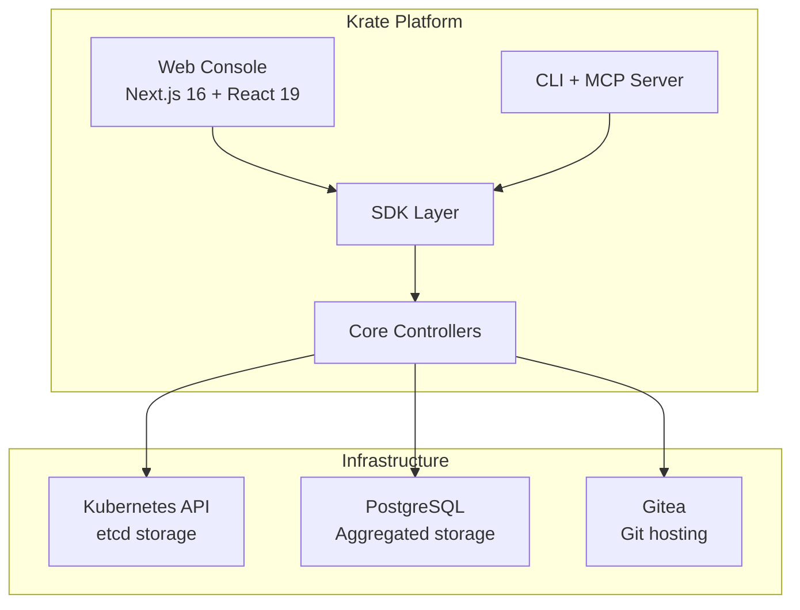
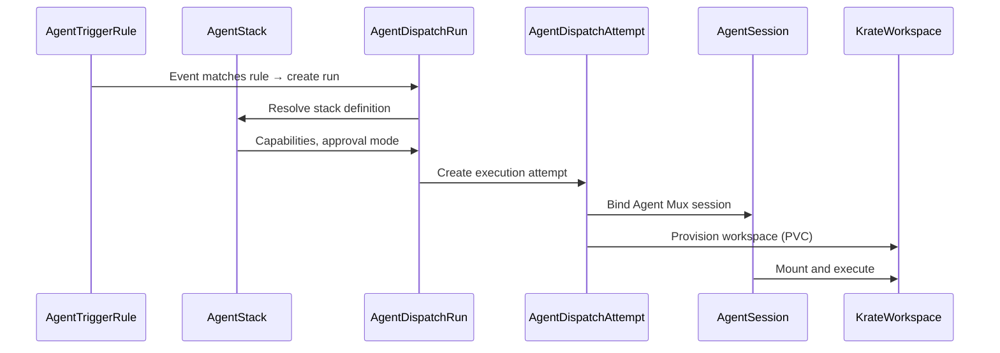
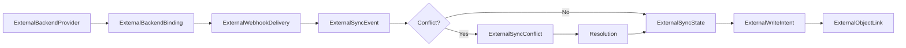
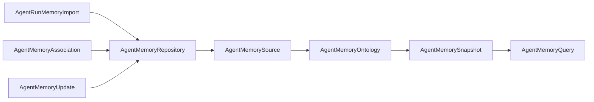

# Krate Architecture Specification v2

> Derived from implementation. Last updated from source analysis.

## 1. System Overview

Krate is a Kubernetes-native Git forge runtime built as a monorepo with four packages:

| Package | NPM Name | Role | Path |
|---------|-----------|------|------|
| **core** | `@a5c-ai/krate` | Resource model, controllers, HTTP API server | `packages/krate/core/` |
| **sdk** | `@a5c-ai/krate-sdk` | Client SDK re-exporting core helpers for web/CLI consumers | `packages/krate/sdk/` |
| **cli** | `@a5c-ai/krate-cli` | CLI entrypoint and MCP server mode | `packages/krate/cli/` |
| **web** | `@a5c-ai/krate-web` | Next.js 16 + React 19 web console | `packages/krate/web/` |

**Design principles:**
- Pure ESM JavaScript (Node 20+), zero external runtime dependencies in core
- Kubernetes-first: all resources are K8s API objects (CRDs or aggregated)
- CRD-driven: 75 CustomResourceDefinitions under `krate.a5c.ai/v1alpha1`
- Controller pattern: each domain has a controller with explicit boundary declarations



---

## 2. Data Model

### 2.1 Storage Split

Krate manages **76 resource kinds** across two storage backends:

- **CONFIG storage (etcd)**: 44 kinds — organizational configuration, policies, agent definitions. Stored as Kubernetes CRDs.
- **AGGREGATED storage (postgres)**: 32 kinds — operational data, event records, runtime state. Stored in PostgreSQL.

Source: `packages/krate/core/src/resource-model.js`

### 2.2 Resource Schema

Every resource follows the Kubernetes object model:

```javascript
{
  apiVersion: 'krate.a5c.ai/v1alpha1',
  kind: '<ResourceKind>',
  metadata: {
    name: '<unique-name>',
    namespace: 'krate-org-<org>',
    labels: { 'krate.a5c.ai/org': '<org>' },
    annotations: {}
  },
  spec: { /* kind-specific specification */ },
  status: { /* reconciled status */ }
}
```

### 2.3 Domain Organization

| Domain Context | CONFIG Kinds | AGGREGATED Kinds | Purpose |
|----------------|-------------|------------------|---------|
| **identity** | Organization, OrgNamespaceBinding, User, Team, Invite, IdentityMapping, AuthProvider, AgentServiceAccount, AgentRoleBinding, AgentSecretGrant, AgentConfigGrant | — | Users, teams, identity, RBAC |
| **data-plane** | Repository, SSHKey, RepositoryPermission, RefPolicy | — | Repository management |
| **control-plane** | BranchProtection | PullRequest, Issue, Review | Code review lifecycle |
| **policy** | PolicyProfile, PolicyTemplate, PolicyBinding, PolicyExceptionRequest | — | Kyverno policy management |
| **agents** | AgentStack, AgentSubagent, AgentToolProfile, AgentMcpServer, AgentSkill, AgentTriggerRule, AgentContextLabel, KrateWorkspacePolicy, AgentAdapter, AgentTransportBinding, AgentProviderConfig, KrateProject, AgentGatewayConfig, AgentMemoryRepository, AgentMemorySource, AgentMemoryOntology, AgentMemoryAssociation | AgentDispatchRun, AgentDispatchAttempt, AgentSession, AgentContextBundle, KrateArtifact, AgentApproval, AgentTriggerExecution, AgentCapabilityRequirement, WorkItemSessionLink, WorkItemWorkspaceLink, AgentSessionTranscript, AgentSessionAttachment, KrateWorkspaceRuntime, AgentMemorySnapshot, AgentMemoryQuery, AgentMemoryUpdate, AgentRunMemoryImport | Agent orchestration |
| **workspaces** | KrateWorkspace | — | Git workspace management |
| **external-backends** | ExternalBackendProvider, ExternalBackendBinding, ExternalBackendSyncPolicy, ExternalProviderCapabilityManifest | ExternalWebhookDelivery, ExternalSyncEvent, ExternalSyncState, ExternalWriteIntent, ExternalSyncConflict, ExternalObjectLink | External system integration |
| **runners-ci** | RunnerPool | Pipeline, Job | CI/CD execution |
| **hooks-events** | WebhookSubscription | WebhookDelivery | Webhook management |
| **web-ui** | View, Selector | — | Saved views and selectors |

---

## 3. Control Plane

Source: `packages/krate/core/src/kubernetes-controller.js`, `kubernetes-controller-async.js`, `kubernetes-resource-gateway.js`

### 3.1 Resource Reconciliation

The control plane uses kubectl to interact with the Kubernetes API server. Resources are reconciled through:

1. **kubectl get** — list/get resources by kind and namespace
2. **kubectl apply** — create/update resources declaratively
3. **kubectl delete** — remove resources

The `createKubernetesResourceGateway()` provides an async wrapper over kubectl operations.

### 3.2 Namespace Scoping

```
Namespace pattern: krate-org-{orgSlug}
```

Each organization gets an isolated Kubernetes namespace (`krate-org-<org>`). The `orgNamespaceName(org)` helper (from `org-scoping.js`) computes the namespace name.

Platform-scoped resources (Organization, OrgNamespaceBinding) live in `krate-system` namespace.

### 3.3 Org Isolation

- `OrgNamespaceBinding` maps one organization to exactly one tenant namespace
- All org-scoped resources carry `metadata.labels['krate.a5c.ai/org']`
- API routes extract org from URL path and scope controllers to that namespace

### 3.4 Stale-While-Revalidate Cache

Source: `packages/krate/core/src/snapshot-cache.js`

```javascript
CACHE_TTL_MS = 30_000  // 30 seconds, configurable via KRATE_SNAPSHOT_CACHE_TTL_MS
```

- Per-org cache map stores `{ data, timestamp, revalidating }`
- Returns stale data immediately while refreshing in background
- Prevents kubectl overhead on repeated snapshot requests

---

## 4. Data Plane

### 4.1 Aggregated Resources

Stored in PostgreSQL (in-memory for development):

| Kind | Purpose |
|------|---------|
| PullRequest | Review unit with source/target refs, checks, merge lifecycle |
| Issue | Project-scoped work item with labels, comments, backend sync |
| Review | Approval/comment/change-request for a pull request |
| Pipeline | CI pipeline run state, trust tier, steps, resume point |
| Job | Executable CI step with service-account scope |

### 4.2 Git Layer (Gitea)

Source: `packages/krate/core/src/gitea-service.js`, `gitea-backend.js`

- Repository storage and hosting
- Branch management (create, list, delete)
- Tree/blob API for code browsing
- SSH key reconciliation with repository access

### 4.3 Search Index

The HTTP API exposes `POST /api/orgs/:org/repositories/:repo/search-index` to enqueue search indexing for a repository.

---

## 5. Agent Orchestration

Source: `packages/krate/core/src/agent-stack-controller.js`, `agent-dispatch-controller.js`, `agent-workspace-controller.js`, `agent-trigger-controller.js`, `agent-approval-controller.js`

### 5.1 Lifecycle Flow



### 5.2 Stack Definition

`AgentStack` defines a reusable agent with:
- Base agent and adapter selection
- Model and prompt configuration
- MCP servers, skills, subagents
- Tool profiles and approval mode
- Runner policy and runtime identity

### 5.3 Trigger System

`AgentTriggerRule` routes events to stacks based on:
- CI failures (`pipeline-failure`)
- Webhook events
- Comments on issues/PRs
- Label additions
- Cron schedules
- Manual dispatch

### 5.4 Supporting Resources

| Resource | Role |
|----------|------|
| AgentAdapter | Transport type, capabilities matrix, auth requirements |
| AgentTransportBinding | Endpoint, protocol, auth, health, reconnect policy |
| AgentProviderConfig | Model provider with API base, auth, rate limits |
| AgentGatewayConfig | Agent Mux gateway connection settings |
| AgentContextBundle | Immutable prompt/context snapshot |
| AgentApproval | Human approval gate for tools, secrets, write-back |
| AgentSessionTranscript | Chat transcript with message nodes and cost |

---

## 6. External Backend Pipeline

Source: `packages/krate/core/src/external/`

### 6.1 Pipeline Architecture



### 6.2 Controllers

| Controller | File | Responsibility |
|-----------|------|----------------|
| WebhookController | `external/webhook-controller.js` | HMAC-SHA256 verification, dedup, async event queue |
| SyncController | `external/sync-controller.js` | Sync event processing, state management, watermarks |
| ConflictController | `external/conflict-controller.js` | Conflict detection, resolution strategies |
| WriteController | `external/write-controller.js` | Write intent queuing, approval, execution |
| ProviderAdapter | `external/provider-adapter.js` | Provider-specific translation |

### 6.3 GitHub Adapter

Source: `packages/krate/core/src/external/github/`

- `auth.js` — GitHub App authentication, installation tokens
- `git-forge.js` — Repository, branch, PR operations
- `issue-tracking.js` — Issues, labels, comments
- `cicd.js` — Actions, workflows, check runs
- `index.js` — Unified GitHub adapter facade

---

## 7. Memory System

Source: `packages/krate/core/src/agent-memory-controller.js`, `agent-memory-query.js`, `agent-memory-import.js`, `agent-memory-repository-source-controller.js`

### 7.1 Pipeline



### 7.2 Query Engine

Source: `packages/krate/core/src/agent-memory-query.js`

Three query modes:
- **graph-only** — Graph traversal with adjacency, depth, nodeKind filtering, relevance scoring
- **grep-only** — Full-text grep with context extraction
- **graph-and-grep** — Combined query execution

```javascript
queryGraph({ records, edges, query, kinds, depth })
queryGrep({ documents, query, contextLines })
queryMemory({ records, documents, edges, query, mode, kinds, depth, contextLines })
```

### 7.3 Memory Import

`AgentRunMemoryImport` imports curated babysitter run metadata into org memory with redaction and review controls.

---

## 8. Authentication Model

Source: `packages/krate/core/src/auth.js`

### 8.1 Providers

| Provider | Type | Configuration |
|----------|------|---------------|
| GitHub | OAuth 2.0 | `KRATE_AUTH_GITHUB_*` env vars |
| SSO | OIDC | `KRATE_AUTH_SSO_*` env vars |
| Delegated | Header-based | `KRATE_AUTH_DELEGATED_*` env vars |

### 8.2 Session Management

- Cookie name: `krate_session` (configurable via `KRATE_AUTH_COOKIE_NAME`)
- Format: `base64url(payload).hmac_sha256_signature`
- HMAC secret: `KRATE_SESSION_SECRET`
- Timing-safe comparison for signature verification
- `HttpOnly; SameSite=Lax` cookie attributes

### 8.3 Delegated Identity

For environments with upstream proxy authentication:
- `x-forwarded-user` header (user identity)
- `x-forwarded-groups` header (group memberships)
- `x-forwarded-email` header (email address)
- Local development fallback with configurable defaults

### 8.4 Auth Middleware

All mutating API routes require authentication. The session cookie is parsed and verified on each request. Admin detection uses group membership (`krate:platform-engineers`, `krate:repo-admins`).

---

## 9. Deployment Architecture

### 9.1 Helm Chart

The Krate Helm chart deploys multi-container pods:

| Container | Role |
|-----------|------|
| api | HTTP API server (port 3080) |
| controllers | Background reconciliation controllers |
| web | Next.js web console |
| webhook-worker | Inbound webhook processing |

### 9.2 Infrastructure Requirements

- **AKS** (Azure Kubernetes Service) or compatible K8s cluster
- **ACR** (Azure Container Registry) for image storage
- **cert-manager** for TLS certificate provisioning
- **nginx ingress** controller for HTTP routing
- **PostgreSQL** for aggregated resource storage
- **Gitea** for Git hosting backend

### 9.3 CRD Management

75 CRDs are defined under `krate.a5c.ai/v1alpha1`. All use:
- `x-kubernetes-preserve-unknown-fields: true` for spec extensibility
- Namespaced scope (platform resources in `krate-system`)
- Labels for org association

---

## 10. Performance Architecture

### 10.1 Caching Strategy

| Layer | Mechanism | TTL |
|-------|-----------|-----|
| Snapshot cache | Stale-while-revalidate | 30s (configurable) |
| Per-org cache | Map-based, independent revalidation | 30s |
| kubectl | Async spawn with output buffering | Per-request |

### 10.2 Async Patterns

Source: `packages/krate/core/src/async-controller.js`

| Utility | Purpose |
|---------|---------|
| `createEventBatcher` | Accumulates events, flushes by size or interval |
| `createRetryPolicy` | Exponential backoff with jitter |
| `createDeliveryQueue` | Ordered async delivery with error isolation |
| `createCheckpointer` | Progress checkpoints for long-running operations |

### 10.3 Event Bus

Source: `packages/krate/core/src/event-bus.js`

- Global singleton (`globalEventBus`)
- Pub/sub pattern: `subscribe(fn)`, `unsubscribe(fn)`, `emit(event)`
- SSE streaming via `/api/orgs/:org/agents/events/stream`
- 30s heartbeat for connection keepalive

---

## 11. Security Model

### 11.1 Session Security

- HMAC-SHA256 signing of session cookies
- `timingSafeEqual` for signature comparison (prevents timing attacks)
- Signed cookies rejected when no secret configured
- Unsigned cookies rejected when secret is configured

### 11.2 API Security

- Auth middleware on all mutating routes
- Org scoping prevents cross-tenant access
- Namespace isolation in Kubernetes

### 11.3 Webhook Security

- HMAC-SHA256 verification for inbound webhooks
- Timing-safe signature comparison
- Deduplication by delivery ID

### 11.4 Kubernetes RBAC

- ClusterRole for Krate CRD access
- ServiceAccount binding per agent (`AgentServiceAccount`)
- `AgentRoleBinding` for managed RBAC projection
- `AgentSecretGrant` / `AgentConfigGrant` for explicit secret access

### 11.5 CRD Extensibility

All CRDs use `x-kubernetes-preserve-unknown-fields: true` allowing spec evolution without CRD version bumps.
