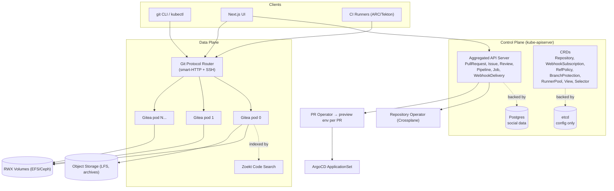

# Krate

**A Kubernetes-native Git forge where repos, PRs, CI, and policy share one identity model, one RBAC system, and one declarative API.**

---

## TL;DR

Most "Kubernetes-native" forges are monoliths in a Helm chart. Krate is different: it extends the Kubernetes API itself. Pull requests, issues, pipelines, and runners are real Kubernetes resources, governed by native RBAC, queryable with `kubectl`, and policy-controlled by the existing admission-webhook ecosystem (Kyverno, Gatekeeper).

The bet: platform engineering teams already run Argo, Crossplane, ARC, and Kyverno. A forge that *natively composes* with that stack — instead of bolting on integrations — eliminates an entire layer of glue, an entire RBAC system, and an entire class of CVEs.

---

## What was wrong with the naive spec

The original "K8s-native forge" idea has three architectural traps that kill it before MVP:

**1. etcd is not your database.** Storing every issue, PR, and comment as a CRD sounds elegant, but etcd has a 1.5MB per-object limit and degrades past ~8GB total. A medium-sized org (10k issues × 100 comments × 2KB) takes the cluster's control plane down. CRDs are an *API contract*, not a storage engine.

**2. One PVC per repository doesn't scale.** AWS EBS allows ~25 volumes per node; GCE PD has similar limits. A node hosting 1,000 repos on dedicated PVCs is mathematically impossible. The CSI story works only with ReadWriteMany filesystems or Gitea-managed RWX layout.

**3. Scale-to-zero on `git-receive` breaks real workflows.** Cold-starting on `git push` adds 3–8s of latency, and webhook fan-out doesn't always retry cleanly. *Pull* is the path that benefits from elastic scaling, not push.

The refined design fixes all three.

---

## Architecture: control plane / data plane



### Control plane

Exposes a Kubernetes-style API. `Repository`, `WebhookSubscription`, `RefPolicy`, `BranchProtection`, `RunnerPool`, `View`, and `Selector` are CRDs (low-cardinality, declarative). `PullRequest`, `Issue`, `Review`, `Pipeline`, `Job`, and `WebhookDelivery` are served by an **Aggregated API Server** (like `metrics-server`) — same kubectl semantics, but backed by Postgres instead of etcd. This is the single highest-stakes architectural decision.

### Data plane

Three separable services. The *Gitea backend* terminates smart-HTTP and SSH and owns repository hosting, deploy keys, branch protection, collaborators/teams, and webhooks. Krate controllers reconcile `Repository` resources into Gitea integration plans, while *Code Search* (Zoekt) runs as a separate indexing service over repository events.

### Scaling profile

- `git-upload-pack` (reads): HPA on request rate, 1→N.
- `git-receive-pack` (writes): warm minimum 1 Gitea backend replica; KEDA bursts on backlog.
- Search indexers: scale independently.

### Identity

OIDC for humans, federated to K8s `User`/`Group`. For CI, **Workload Identity**: runner pods get a projected ServiceAccount token, scoped to `(repo, ref, pipeline_id)`. **No PATs, ever.** Want to push to a registry? Bind the SA to the registry's RoleBinding. The CI system has no special privileges — it has whatever you grant the SA.

---

## Runners: a first-class system

ARC is the *executor*, not the runner system. Krate has its own runner abstraction that composes with ARC, Tekton, or Buildkite Agent underneath. Identity, caching, cost attribution, and untrusted-code isolation are forge concerns.

### Resources

- **`RunnerPool`** (CRD): image, resources, node selector, scaling policy, allowed repos, **trust tier** (`trusted` | `untrusted`), cache backend.
- **`Pipeline`** (Aggregated API): a single CI invocation. References a `RunnerPool` and a workflow file.
- **`Job`** (Aggregated API): a single step within a pipeline; owns one runner pod.

### Four problems the model fixes structurally

**Cold start vs cost.** Pools have `warmReplicas` and `maxReplicas`. KEDA scales between them on queue depth. Trusted pools default to warm=2; untrusted (fork PRs) default to warm=0 — pay cold-start latency for safety.

**Untrusted code execution.** A PR from a fork *must* run in an `untrusted` pool with a ServiceAccount that has zero secrets and no cluster API access. Enforced by an admission policy on `Pipeline` create — the controller refuses to schedule untrusted code on a trusted pool. Most common security incident in CI; making it un-bypassable kills the bug class.

**Caching.** BuildKit cache mount per pool, backed by S3. Shared across runs of the same repo, never across pools. No "is my cache poisoned" debugging because cache scope is structural.

**Identity.** No PATs. Each Job pod gets a projected ServiceAccount token scoped to `(repo, ref, pipeline_id)`. The CI system has whatever privileges its SA has — nothing more.

### Runners UI

Three screens carry 90% of the weight:

**Pool dashboard** (org-level). Live grid of pools: warm/total replicas, queue depth, p50/p95 wait time, last-hour cost. Click → spec, recent runs, scaling timeline. Killer feature: a *"Why is this slow?"* link that surfaces the bottleneck (queue saturation? image pull? node pressure?) by querying pod events.

**Live run view** (per pipeline) — the screen people live in:

```
┌─────────────────────────────────────────────────────────────────┐
│  Pipeline #4127  ·  feature/auth-refactor  ·  ⏱ 2m 14s          │
│  [Cancel]  [Rerun failed]  [Rerun from step ▾]   [</>  YAML]    │
├──────────────────┬──────────────────────────────────────────────┤
│  Steps           │  Logs: build > test > integration            │
│                  │                                              │
│  ✓ checkout      │  + go test ./...                             │
│  ✓ deps          │  ok   github.com/krate/api    0.142s         │
│  ✓ build         │  ok   github.com/krate/auth   0.318s         │
│  ⟳ test          │  --- FAIL: TestTokenExchange (0.04s)         │
│    ↳ unit        │      auth_test.go:142: expected 200, got 401 │
│    ↳ integration │  FAIL  github.com/krate/auth                 │
│  ◯ deploy        │                                              │
│  ◯ notify        │  [📋 Copy failure]  [🔍 Find similar runs]   │
│                  │                                              │
│  Pod: krate-     │  ──────  Live tail  ──────                   │
│  runner-trusted- │                                              │
│  7c4f9 →         │                                              │
│  [kubectl logs]  │                                              │
└──────────────────┴──────────────────────────────────────────────┘
```

Log streaming uses the K8s `Pod.log` watch endpoint piped through SSE. *"Find similar runs"* is a label-selector query: `kubectl get pipelines -l failure.signature=auth_test:142`. *"Rerun from step"* creates a new `Pipeline` with a `resumeFrom` field — controller skips earlier steps and rehydrates cache.

**Pool editor.** Split view: left = form (image, resources, scaling), right = the YAML it produces, live-updating. Save shows "this is equivalent to `kubectl apply -f -`" with the manifest. Same screen offers *"Save to repo"* — opens a PR against your platform-config repo.

---

## Hooks: three layers, not one

"Hooks" gets conflated. Krate has three distinct hook surfaces, each with a different mechanism:

### Layer 1 — Server-side Git hooks (`pre-receive`, `update`, `post-receive`)

Run *inside* the receive-pack process; can't be CRDs (Git doesn't know what etcd is). Model: `RefPolicy` CRD declares the rule (require commit signing, block force-push to main, require linear history). A controller compiles policies into a config map mounted into Gitea backend pods; receive-pack evaluates them in-process. Custom hooks run in a sandboxed **WASM runtime** — no shelling out, no supply-chain risk.

### Layer 2 — Outbound webhooks (HTTP delivery to Slack, Jenkins, etc.)

`WebhookSubscription` CRD per repo or org. Delivery via NATS JetStream (K8s-native, durable queue) with exponential backoff and HMAC signing. Every delivery becomes a `WebhookDelivery` resource — queryable, replayable, observable through the same `kubectl get` machinery as everything else.

### Layer 3 — Admission webhooks on the control plane (the elegant part)

Because PRs and Issues are real Kubernetes resources, **any** `ValidatingAdmissionWebhook` or `MutatingAdmissionWebhook` works on them. **Kyverno and OPA Gatekeeper work out of the box for PR policy.** Block PRs with empty descriptions? Kyverno policy. Require two reviewers from different teams? CEL expression. You inherit the entire Kubernetes policy ecosystem for free.

### Hooks UI

Per-repo Hooks tab unifies all three layers in one explorer:

```
Hooks affecting this repository
─────────────────────────────────────────────────────────────────
GIT REFS (pre-receive, update, post-receive)
  ✓ require-signed-commits      RefPolicy/org-defaults    [edit]
  ✓ block-force-push-main       RefPolicy/protected       [edit]
  ⚠ lint-on-push                RefPolicy/this-repo       [3 fails today]

OUTBOUND WEBHOOKS
  ✓ slack-engineering           push, pull_request        [deliveries →]
  ✗ jenkins-legacy              push                      [12 failed in 1h ⚠]

ADMISSION POLICIES (on PullRequest, Issue)
  ✓ require-pr-description      Kyverno: ClusterPolicy    [view]
  ✓ block-wip-merges            Kyverno: ClusterPolicy    [view]
  + Add policy   [Browse Kyverno templates]
```

**Webhook delivery log** — the page everyone secretly wants and no forge does well. Every delivery: request headers, body, response, latency, retry chain. *"Replay"* re-fires with current secrets. Filter via `kubectl get webhookdeliveries -l status=failed,subscription=jenkins-legacy --since=1h`.

**Policy authoring.** If Kyverno is installed, the UI deep-links to its policies. If not, a built-in editor with form mode (templates) and CEL mode (raw expressions). A *"Violations"* panel shows current PRs that *would* fail the policy if it were enforcing — roll out in audit mode first.

---

## UX scope

### Personas

- **Developer** — lives in PR review, run debugging, code browse. Wants speed.
- **Platform engineer** — manages pools, policies, hooks, identity. Wants control and auditability.
- *Repo admin* is mostly a developer with extra settings access; not a separate IA tier.

### Information architecture

**Top-level (org-scoped):**

| Section | Primary use |
|---|---|
| Repositories | Browse, search, create |
| Inbox | Cross-repo PRs/issues/runs needing me |
| Runs | Cross-repo CI activity |
| Runners | Pool dashboard + live runs |
| Hooks & Policies | All three hook layers |
| Insights | Lead time, runner cost, hook health |
| Settings | Identity, storage, Gitea backend defaults |

**Per-repo:** Code · Pull Requests · Issues · Runs · Hooks · Settings.

### Six flows that must be excellent

1. **Open and review a PR.** Three-pane: file tree / diff / conversation. Inline comments thread. Suggested edits commit-with-one-click. Keyboard-first (j/k/n/p). Right rail shows the PR's `Pipeline` runs, linked to live run view.

2. **Debug a failing run.** Live run view with step navigation, log streaming, "find similar failures."

3. **Configure a runner pool.** Form + YAML split, GitOps export.

4. **Add a webhook and verify it works.** Create form → *"Send test delivery"* → see it in the log within seconds, with response.

5. **Write a PR policy.** Pick a template → preview violations on existing PRs → enable in audit mode → graduate to enforce. The audit→enforce gradient *is* the UX, not just a flag.

6. **Cross-repo triage.** Inbox view with saved filters. Filters persist as `Selector` CRDs — a team's "P0 bug triage view" is a YAML file you can commit and share.

### Front-end stack (Next.js 15, App Router)

Three principles:

**Direct-to-API, no intermediate backend.** Server Components fetch from the Aggregated API Server using `@kubernetes/client-node`. There is no separate "forge backend" — the control plane *is* the backend.

**Real-time via the Watch API.** Every list view opens a Watch stream from the API server, piped to the browser via Server-Sent Events from a Route Handler. PR state, comments, CI status — all stream in without polling. Free, because the K8s API gives it to you.

**GitOps-transparent UI.** Every mutating action shows the equivalent YAML inline and offers *"Copy as kubectl"*.

Auth model: **NextAuth** handles OIDC login, then exchanges the OIDC token for a Kubernetes ServiceAccount token via the TokenRequest API. Every API call from a Server Component carries the user's K8s identity, so RBAC enforcement happens at the API server — not in app code. Zero permission logic to write or audit.

```
┌─────────────────────────────────────────────────────────────┐
│  Browser                                                    │
│  ├─ Server Components (RSC stream from K8s API)             │
│  ├─ SSE client (Watch events → optimistic UI)               │
│  └─ Monaco/CodeMirror for diff + code view                  │
└──────────────┬──────────────────────────────────────────────┘
               │ HTTPS
┌──────────────▼──────────────────────────────────────────────┐
│  Next.js (Edge runtime where possible)                      │
│  ├─ /repos/[…]      → Server Component, kubectl-equivalent  │
│  ├─ /api/watch/orgs/[org]/*    → Route Handler, K8s Watch → SSE        │
│  ├─ /api/git-proxy  → Streams smart-HTTP to Gitea backend   │
│  └─ NextAuth (OIDC) ↔ TokenRequest API for SA exchange      │
└──────────────┬──────────────────────────────────────────────┘
               │ K8s API (Aggregated)            │ Git smart-HTTP
               ▼                                 ▼
        Control Plane                       Data Plane
```

---

## "GitOps-transparent UX" — concretely

Three patterns, applied uniformly:

**1. Every mutating action has a `</>` button** in the same screen position. Click: side panel shows (a) the resulting YAML, (b) the kubectl command equivalent, (c) *"Copy as `kubectl apply`"*, (d) *"Open PR against config repo."* Click "Apply" in the panel and the action runs through the same code path as the form button — the panel isn't a translation layer, it's the truth and the form is the rendering of it.

**2. Every detail page has a YAML tab** next to the rendered view. Lens/Headlamp parity, native.

**3. Every saved view is a resource.** Inbox filter, dashboard layout, custom column set — all stored as `View` / `Selector` CRDs. Your team's triage dashboard is `git clone`-able. No competitor has this because no competitor's UI state lives in the same store as the domain data.

**4. Activity log entries are kubectl commands.** "Bob merged PR #42" expands to: `kubectl patch pullrequest/42 --type=merge -p '{"spec":{"merged":true}}'` — copyable, replayable, auditable. The audit log isn't generated from events; it's a literal command history.

---

## Why this wins (positioning)

The pitch isn't "Gitea on Kubernetes." It's: **the only forge where your repos, PRs, CI, and infrastructure share one identity model, one RBAC system, and one declarative API.**

Three moats:

- **Platform engineers want this.** Internal developer platforms are the buyer. They already run Argo, Crossplane, ARC, Kyverno. A forge that natively composes with them eliminates integration glue.
- **Multi-tenancy is namespace-shaped.** Tenant isolation is a solved K8s problem. Other forges reinvent it badly.
- **No new permission system.** The single biggest source of breach incidents at competitors is auth bugs. Inheriting K8s RBAC removes an entire class of CVEs from the roadmap.

---

## Roadmap

| Capability | v0.1 (6 wks) | v0.2 | v0.3 |
|---|---|---|---|
| Repos, PRs, Issues (Aggregated API) | ✓ | | |
| Single-Gitea backend data plane | ✓ | | |
| Next.js UI: code, PR review, run view | ✓ | | |
| Outbound webhooks + delivery log | ✓ | | |
| Admission webhooks (Kyverno-compatible) | ✓ (free) | | |
| External CI via ARC | ✓ | | |
| Native `RunnerPool` + live run view | | ✓ | |
| `RefPolicy` (server-side git hooks, WASM) | | ✓ | |
| Gitea backend horizontal scale-out | | ✓ | |
| `View` / `Selector` CRDs (saved triage) | | ✓ | |
| Code search (Zoekt) | | | ✓ |
| Multi-cluster federation | | | ✓ |

**The MVP demo:** a single `kubectl apply -f kyverno-pr-policy.yaml` blocks a PR — and the same policy shows up in the UI's Hooks tab without anyone wiring it. That's the moment people get it.

### 6-week MVP plan

- **W1–2.** Aggregated API Server with `Repository` + `PullRequest`, Postgres-backed, working `kubectl get/create`.
- **W3.** Single-Gitea backend data plane: `git-upload-pack` and `git-receive-pack` served by Gitea with Repository Operator creating repositories through the Gitea API.
- **W4.** Next.js skeleton — login, repo list, file view, PR list (RSC + Watch SSE).
- **W5.** PR creation flow, inline diff, comment thread.
- **W6.** Workload Identity for CI, demo with ARC running a real workflow.

Ship as a public Helm chart. The story writes itself: `helm install krate; kubectl create -f my-repo.yaml; git push`.

---

## Open decisions

1. **Aggregated API Server vs pure CRDs.** Highest-stakes call; everything downstream depends on it. AAS is correct; commit early.
2. **Runner abstraction: executor-pluggable or ARC-only for MVP?** Pluggable is correct long-term but doubles week-2 complexity.
3. **Bundle Kyverno in the install, or BYO?** Bundling is friendlier; BYO keeps install lean.
4. **Name.** "Krate" is the project name used by this implementation package and documentation set.

